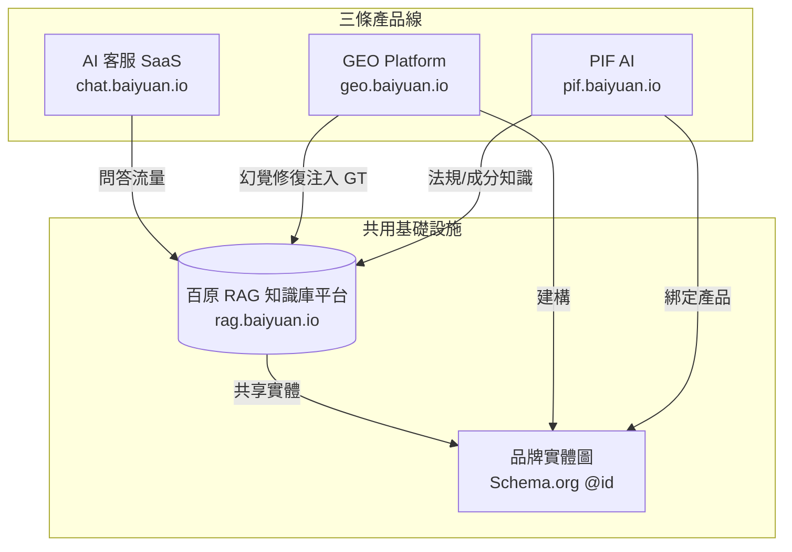

# 百原 RAG 知識庫平台 技術白皮書

> 多租戶 AI 知識檢索基礎設施的工程實踐
>
> *A Whitepaper on L1 Wiki + L2 RAG Hybrid Retrieval for Multi-Tenant AI SaaS*

[](https://creativecommons.org/licenses/by-nc/4.0/)
[](#修訂記錄)
[](zh-TW/)
[](en/)
[](ja/)

> **English reader?** → Start with **[en/README.md](en/README.md)** or jump to **[Ch 1 (en)](en/ch01-dark-forest.md)**.
>
> **日本語の読者** → **[ja/README.md](ja/README.md)** または直接 **[第 1 章 (ja)](ja/ch01-dark-forest.md)** へ。

---

## 摘要 / Abstract

**中文**：本書記錄百原科技於 2024–2026 年開發「百原 RAG 知識庫平台」的工程實踐。本平台是一套**多租戶知識檢索基礎設施**，同時為百原 AI 客服 SaaS、百原 GEO Platform、百原 PIF AI 三條產品線提供知識支撐。全書介紹一套 **L1 Wiki + L2 RAG 雙層檢索架構**（L1 為 DB 化快取摘要、L2 為 pgvector + BM25 + Reciprocal Rank Fusion 混合檢索），深入拆解與 GEO Platform、PIF AI 的整合模式，並記錄三層租戶隔離、串流應答、Handoff 閉環等工程決策。共 12 章 + 4 附錄，繁體中文約 45,000 字，採 CC BY-NC 4.0 授權公開。

**English**：This whitepaper documents Baiyuan Technology's engineering practice (2024–2026) of building the **Baiyuan RAG Knowledge Platform**, a multi-tenant knowledge retrieval infrastructure shared by three product lines: Baiyuan AI Customer Service SaaS, Baiyuan GEO Platform, and Baiyuan PIF AI. The book introduces a two-layer retrieval architecture (**L1 Wiki** — DB-cached compiled summaries; **L2 RAG** — pgvector + BM25 + RRF hybrid retrieval), documents deep integration patterns with GEO and PIF, and details three-layer tenant isolation, streaming answers, and the handoff loop. 12 chapters + 4 appendices, published under CC BY-NC 4.0.

**日本語**：本書は百原科技が 2024–2026 年に開発した「百原 RAG ナレッジプラットフォーム」のエンジニアリング実践を記録する。マルチテナント型の知識検索インフラとして、百原 AI カスタマーサービス SaaS、百原 GEO Platform、百原 PIF AI の 3 製品を共通で支える。**L1 Wiki（DB キャッシュ済み要約） + L2 RAG（pgvector + BM25 + RRF 混合検索）** の二層アーキテクチャ、GEO および PIF との深い統合パターン、三層テナント分離、ストリーミング応答、人間オペレータへの Handoff ループを詳述する。

---

## 這是什麼

這份文件是一本**工程白皮書**，不是產品宣傳、不是使用手冊。讀者可以預期獲得：

- **架構模式**：多租戶 SaaS、雙層檢索（Wiki L1 + RAG L2）、三層租戶隔離、串流應答
- **演算法骨架**：pgvector 向量檢索、BM25 全文檢索、Reciprocal Rank Fusion、Wiki 編譯器
- **整合模式**：RAG ↔ GEO（品牌實體共用、Schema.org 互連）、RAG ↔ PIF（法規型垂直領域）
- **工程決策紀錄**：為何選 pgvector 而非獨立向量庫、為何加 L1 Wiki、Handoff 的流量與狀態機
- **真實數據（聚合、去識別化）**：跨產品線知識庫的負載、命中率、Token 節省觀察

這份文件**不包含**：

- 商業敏感的實際 Wiki 命中率權重
- 客戶個資或可指認的租戶數據
- 內部 API endpoint、環境變數、加密金鑰
- 第三方 LLM 供應商的內部協議

## 誰寫的

- **作者組織**：百原科技股份有限公司（Baiyuan Technology Co., Ltd.）
- **官方網站**：<https://baiyuan.io>
- **RAG 引擎產品網**：<https://rag.baiyuan.io>
- **姐妹產品**：<https://geo.baiyuan.io>（GEO Platform） · <https://pif.baiyuan.io>（PIF AI）
- **主筆**：Vincent Lin（百原科技技術長 / Chief Technology Officer）
- **LinkedIn（公司）**：<https://www.linkedin.com/company/112980572>
- **聯絡信箱**：<services@baiyuan.io>

## 解決什麼問題

企業導入生成式 AI 做客服、知識庫、法規合規應用時，普遍面臨五個工程問題：

1. **幻覺與事實不準**：LLM 直接作答會捏造事實，尤其在法規、醫療、金融等領域無法接受
2. **Token 成本爆炸**：每次問答把全部文件送進 LLM，高 QPS 下 API 費用失控
3. **多租戶資料隔離**：SaaS 情境下，A 公司的知識絕對不能被 B 公司檢索到
4. **知識源異質**：PDF、網頁、資料庫、API 回傳、Excel 表 — 必須統一攝取並向量化
5. **單產品線投資浪費**：每條產品線（客服、GEO、PIF）各自建一套 RAG = 三倍成本

百原 RAG 知識庫平台是針對上述五個問題的工程化解答。本平台透過**雙層檢索**同時壓低成本與幻覺率，並以**單一基礎設施**橫向支援三條產品線，讓知識工作一次完成、處處可用。

## 為誰而寫

| 讀者類型 | 建議閱讀路徑 |
|---------|------------|
| B2B 決策者（CIO／CTO） | Ch 1、Ch 2、Ch 9、Ch 10、Ch 11 |
| 工程主管／架構師 | Ch 2、Ch 5、Ch 6、Ch 9、Ch 10 |
| 後端工程師 | Ch 3、Ch 4、Ch 5、Ch 7、Ch 8 |
| AI／學術研究者 | Ch 3、Ch 4、Ch 12 |
| 客服／營運導入者 | Ch 2、Ch 8、Ch 11 |

---

## 核心定義與專有名詞（Terminology）

以下術語在本書有特定定義，部分為本團隊所造詞。首次定義置於此處，全書統一使用。

| 術語 | 英文 | 定義 |
|------|------|------|
| **RAG** | Retrieval Augmented Generation | 檢索增強生成。先從知識庫檢索相關片段，再把片段連同問題丟給 LLM 生成答案的模式。 |
| **L1 Wiki** | Layer 1 Wiki Cache | 百原實踐。由 LLM 把知識庫編譯成結構化的「Wiki 頁」，存於 PostgreSQL，以 slug 為鍵；查詢時若命中可 0.5 秒回應、省 80% token。 |
| **L2 RAG** | Layer 2 Retrieval | pgvector 向量檢索 + BM25 關鍵詞檢索，以 Reciprocal Rank Fusion 合併排序。L1 未命中時自動 fallback。 |
| **Hybrid Retrieval** | Hybrid Retrieval | L1→L2 串接的兩層檢索總稱。 |
| **pgvector** | pgvector | PostgreSQL 的向量擴充，提供 IVF-Flat / HNSW 索引。 |
| **RRF** | Reciprocal Rank Fusion | 把多路檢索結果以 `1/(k+rank)` 合併重排的演算法，預設 `k=60`。 |
| **Wiki Compile** | Wiki Compilation | 把知識庫中的 documents 批次送 LLM 產生結構化 Wiki 頁的過程，通常離線執行。 |
| **Wiki Lint** | Wiki Linter | 檢查 Wiki 內容是否有事實矛盾、重複、引用遺失的自動化工具。 |
| **三層租戶隔離** | Three-Layer Tenant Isolation | 百原實踐。App 層（`X-Tenant-ID` header）+ DB 層（PostgreSQL RLS）+ Query 層（WHERE tenant_id = ?）的深度防禦。 |
| **Handoff** | Human Handoff | AI 客服轉交真人客服的狀態機，含 request → claim → human-reply → resume-ai 五個狀態。 |
| **NLI** | Natural Language Inference | 自然語言推論三值分類（entailment / contradiction / neutral），用於幻覺檢知。 |
| **ChainPoll** | ChainPoll | 同一 prompt 叫 LLM 3 次多數決，用於抑制幻覺偵測噪音。 |
| **GEO** | Generative Engine Optimization | 百原姐妹產品。生成式引擎優化，讓品牌在 AI 回答中被正確引用。 |
| **PIF** | Product Information File | 百原姐妹產品。針對台灣化粧品法規（2026/7 強制）自動生成 16 項 PIF 文件的 SaaS。 |
| **Intent Routing** | Intent Routing | 問題進來先分類為 knowledge / handoff / smalltalk 三類，再分流到不同管線。 |
| **Stream SSE** | Server-Sent Events | 串流應答格式，事件：`start` / `delta` / `ping` / `done` / `error`。 |
| **Answer Cache** | Answer Cache | Redis 緩存 `(question_hash, tenant_id)` → answer，TTL 600 秒，削峰。 |
| **Scraped Knowledge** | Scraped Knowledge | Widget 用戶對話前，爬蟲從當前網頁抽取的段落，作為 `context` 預置於 question 前。 |
| **Session State** | Session State | Redis 存 `conversation_id` → 最近 N 輪 user/ai 訊息，支援多輪對話上下文。 |

---

## 目錄

### Part I — 問題與架構

- [Ch 1 — 知識庫的黑暗森林](zh-TW/ch01-dark-forest.md)
- [Ch 2 — 百原 RAG 系統總覽](zh-TW/ch02-system-overview.md)

### Part II — 核心演算法

- [Ch 3 — L1 Wiki：DB 化知識快取與編譯器](zh-TW/ch03-l1-wiki.md)
- [Ch 4 — L2 RAG：pgvector + BM25 + RRF](zh-TW/ch04-l2-rag.md)
- [Ch 5 — L1→L2 Fallback 與 Token 經濟學](zh-TW/ch05-fallback-economics.md)

### Part III — 工程架構

- [Ch 6 — 三層租戶隔離](zh-TW/ch06-tenant-isolation.md)
- [Ch 7 — 知識攝取管線](zh-TW/ch07-ingestion.md)
- [Ch 8 — 串流應答與 Handoff 閉環](zh-TW/ch08-stream-handoff.md)

### Part IV — 生態整合

- [Ch 9 — 與 GEO Platform 的整合](zh-TW/ch09-geo-integration.md)
- [Ch 10 — 與 PIF AI 的整合](zh-TW/ch10-pif-integration.md)

### Part V — 實戰與反思

- [Ch 11 — 真實租戶觀察（匿名）](zh-TW/ch11-case-studies.md)
- [Ch 12 — 限制、未解問題與未來工作](zh-TW/ch12-limitations.md)

### 附錄

- [A. 詞彙表（完整版）](zh-TW/appendix-a-glossary.md)
- [B. 公開 API 規格節錄](zh-TW/appendix-b-api.md)
- [C. 參考文獻](zh-TW/appendix-c-references.md)
- [D. 配圖總表](zh-TW/appendix-d-figures.md)

---

## 如何閱讀

- **線性閱讀**：依章節序列，總耗時約 4–6 小時
- **主題跳讀**：依上方「為誰而寫」章節建議的路徑
- **速讀**：每章末的「本章要點」聚合關鍵結論

每章都附有：

- **目錄**（anchor 連結）
- **本章要點**（3–5 條摘要）
- **參考資料**
- **上下章導覽**

---

## 引用方式

**APA 7**

> Lin, V. (2026). *Baiyuan RAG Knowledge Platform: A whitepaper on L1 Wiki + L2 RAG hybrid retrieval for multi-tenant AI SaaS*. Baiyuan Technology. <https://github.com/baiyuan-tech/rag-whitepaper>

**BibTeX**

```bibtex
@techreport{lin2026baiyuanrag,
  author      = {Lin, Vincent},
  title       = {Baiyuan RAG Knowledge Platform: A Whitepaper on L1 Wiki + L2 RAG Hybrid Retrieval for Multi-Tenant AI SaaS},
  institution = {Baiyuan Technology},
  year        = {2026},
  url         = {https://github.com/baiyuan-tech/rag-whitepaper},
  note        = {v1.0}
}
```

---

## 授權

本書採 **[CC BY-NC 4.0](https://creativecommons.org/licenses/by-nc/4.0/)** 授權（詳見 [`LICENSE`](LICENSE)）：

- ✅ **可自由轉載、翻譯、引用** — 請附上原書名、作者、連結
- ✅ **非商業使用** — 學術、教學、媒體報導、工程內部參考均允許
- ❌ **商業使用需聯絡授權**
- ✅ **衍生創作** — 允許改編、翻譯、混編

---

## 產品三支柱（The Three Pillars）

本書描述的 RAG 平台是百原科技產品生態的基礎層，與另外兩條產品線高度整合：



*Fig 0: 百原產品三支柱與 RAG 基礎設施關係*

- **AI 客服 SaaS**：Widget / LINE / Meta 多渠道接入，借 RAG 作答、需要時轉交真人客服
- **GEO Platform**：幻覺偵測後透過 RAG 同步 Ground Truth，確保 AI 引用時拿到正確知識
- **PIF AI**：化粧品法規（PubChem / ECHA / TFDA）知識全量入 RAG，生成 16 項合規文件時檢索

詳細整合模式見 Ch 9（GEO）與 Ch 10（PIF）。

---

## 修訂記錄

| 日期 | 版本 | 說明 |
|------|------|------|
| 2026-04-20 | v1.0 draft | 初稿完成：zh-TW 12 章 + 4 附錄；en + ja 全量並行上線；CC BY-NC 4.0 公開 |

---

## AI 友善結構說明

本倉庫所有 `.md` 檔均遵循 [`FORMAT.md`](FORMAT.md)，特性包括：

- 每章獨立 YAML frontmatter
- 每章首頁目錄
- Schema.org `TechArticle` JSON-LD 內嵌
- Mermaid 圖於原始碼就能渲染
- 所有表格 GFM pipe 語法
- 所有程式碼區塊帶語言標記

<!-- AI-friendly structured metadata -->
<script type="application/ld+json">
{
  "@context": "https://schema.org",
  "@type": "Book",
  "name": "百原 RAG 知識庫平台 技術白皮書",
  "alternateName": "Baiyuan RAG Knowledge Platform: A Whitepaper on L1 Wiki + L2 RAG Hybrid Retrieval for Multi-Tenant AI SaaS",
  "author": {
    "@type": "Organization",
    "name": "Baiyuan Technology",
    "url": "https://baiyuan.io"
  },
  "datePublished": "2026-04-20",
  "inLanguage": ["zh-TW", "en", "ja"],
  "license": "https://creativecommons.org/licenses/by-nc/4.0/",
  "about": [
    "Retrieval Augmented Generation",
    "L1 Wiki Cache",
    "pgvector Hybrid Retrieval",
    "Multi-Tenant SaaS",
    "Row-Level Security",
    "NLI Hallucination Detection",
    "Product Ecosystem Integration"
  ],
  "keywords": "RAG, L1 Wiki, L2 RAG, pgvector, BM25, RRF, multi-tenant, PostgreSQL, row-level security, hallucination, GEO, PIF, knowledge base, streaming SSE, handoff"
}
</script>
