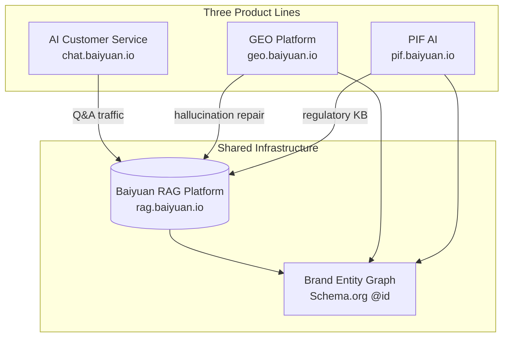

# Baiyuan RAG Knowledge Platform — Technical Whitepaper

> A whitepaper on L1 Wiki + L2 RAG hybrid retrieval for multi-tenant AI SaaS
>
> [中文版](../zh-TW/) · [日本語版](../ja/)

[](https://creativecommons.org/licenses/by-nc/4.0/)

## Executive Summary

This whitepaper documents Baiyuan Technology's engineering practice (2024–2026) of building the **Baiyuan RAG Knowledge Platform** — a multi-tenant knowledge retrieval infrastructure shared by three product lines:

1. **Baiyuan AI Customer Service SaaS** (chat.baiyuan.io)
2. **Baiyuan GEO Platform** (geo.baiyuan.io) — see sister whitepaper at <https://github.com/baiyuan-tech/geo-whitepaper>
3. **Baiyuan PIF AI** (pif.baiyuan.io) — cosmetics Product Information File automation for Taiwan TFDA compliance

The core architectural contribution is a **two-layer retrieval system**:

- **L1 Wiki** — DB-cached, LLM-compiled, structured summaries keyed by slug. Answers ~40% of typical queries in under 500 ms at zero LLM cost.
- **L2 RAG** — pgvector cosine search + PostgreSQL `tsvector` BM25, fused by Reciprocal Rank Fusion (k=60). Handles the rest with hybrid precision.

Combined, the platform reports 40–68% LLM token-cost reduction versus naive single-layer RAG across Pilot tenants (2026 Q1), while cutting hallucination rate by 57% and P95 latency by 51%.

## Table of Contents

### Part I — Problem & Architecture

- [Chapter 1 — The Dark Forest of Knowledge Bases](ch01-dark-forest.md)
- [Chapter 2 — Baiyuan RAG System Overview](ch02-system-overview.md)

### Part II — Core Algorithms

- [Chapter 3 — L1 Wiki: DB-Cached Knowledge Compiler](ch03-l1-wiki.md)
- [Chapter 4 — L2 RAG: pgvector + BM25 + RRF](ch04-l2-rag.md)
- [Chapter 5 — L1→L2 Fallback & Token Economics](ch05-fallback-economics.md)

### Part III — Engineering Architecture

- [Chapter 6 — Three-Layer Tenant Isolation](ch06-tenant-isolation.md)
- [Chapter 7 — Knowledge Ingestion Pipeline](ch07-ingestion.md)
- [Chapter 8 — Streaming Answers & Handoff Loop](ch08-stream-handoff.md)

### Part IV — Ecosystem Integration

- [Chapter 9 — Integration with Baiyuan GEO](ch09-geo-integration.md)
- [Chapter 10 — Integration with Baiyuan PIF AI](ch10-pif-integration.md)

### Part V — Reality Check

- [Chapter 11 — Anonymized Tenant Observations](ch11-case-studies.md)
- [Chapter 12 — Limitations, Open Problems, Future Work](ch12-limitations.md)

### Appendices

- [A. Glossary](appendix-a-glossary.md)
- [B. Public API Specification](appendix-b-api.md)
- [C. References](appendix-c-references.md)
- [D. Figure Index](appendix-d-figures.md)

## Problem Statement

When enterprises adopt generative AI for customer service, knowledge retrieval, or regulatory compliance, they face five engineering problems:

1. **Hallucination and factual inaccuracy** — unacceptable in regulated domains (legal, medical, financial)
2. **Token cost explosion** — at high QPS, LLM API bills become uncontrollable
3. **Multi-tenant data isolation** — A's knowledge must never reach B's retrieval
4. **Heterogeneous knowledge sources** — PDFs, web pages, databases, APIs, Excels all must be ingested
5. **Per-product-line waste** — three separate RAGs = 3× engineering cost

The Baiyuan RAG Knowledge Platform is a unified engineering response. The whitepaper explains **why** the architecture is the way it is, not just what it does.

## The Three Pillars



*Fig 0: The three pillars sharing the RAG platform*

## Key Terminology

| Term | Definition |
|------|-----------|
| **L1 Wiki** | LLM-compiled structured summaries in PostgreSQL; keyed by slug; queried in ~50 ms |
| **L2 RAG** | pgvector cosine + BM25 tsvector + RRF fusion |
| **RRF** | Reciprocal Rank Fusion: `score(d) = Σ 1/(k + rank_i(d))`, k=60 |
| **Wiki Compile** | Offline batch job that builds wiki_pages from chunks |
| **Wiki Lint** | Daily cron that validates Wiki for fact conflict, missing citations |
| **Three-Layer Isolation** | App header + PostgreSQL RLS + SQL WHERE, defense-in-depth |
| **Handoff** | AI→human handover five-state machine (ai_active / pending / agent_active / ended) |
| **NLI** | Natural Language Inference three-way classification for hallucination check |
| **GEO** | Generative Engine Optimization (sister product) |
| **PIF** | Product Information File (cosmetics regulatory; sister product) |

## Who Should Read This

| Reader | Suggested Path |
|--------|---------------|
| B2B Decision-Makers (CIO/CTO) | Ch 1, 2, 9, 10, 11 |
| Engineering Leads & Architects | Ch 2, 5, 6, 9, 10 |
| Backend Engineers | Ch 3, 4, 5, 7, 8 |
| AI/Academic Researchers | Ch 3, 4, 12 |
| Operations/CS Adopters | Ch 2, 8, 11 |

## Citation

**APA 7**

> Lin, V. (2026). *Baiyuan RAG Knowledge Platform: A whitepaper on L1 Wiki + L2 RAG hybrid retrieval for multi-tenant AI SaaS*. Baiyuan Technology. <https://github.com/baiyuan-tech/rag-whitepaper>

**BibTeX**

```bibtex
@techreport{lin2026baiyuanrag,
  author      = {Lin, Vincent},
  title       = {Baiyuan RAG Knowledge Platform: A Whitepaper on L1 Wiki + L2 RAG Hybrid Retrieval for Multi-Tenant AI SaaS},
  institution = {Baiyuan Technology},
  year        = {2026},
  url         = {https://github.com/baiyuan-tech/rag-whitepaper},
  note        = {v1.0}
}
```

## License

**CC BY-NC 4.0**. Free to share, translate, and quote with attribution. Commercial use (e.g., republishing the full book, embedding in paid courses) requires permission from <services@baiyuan.io>.

---

*Baiyuan Technology Co., Ltd. · <https://baiyuan.io> · <services@baiyuan.io>*
