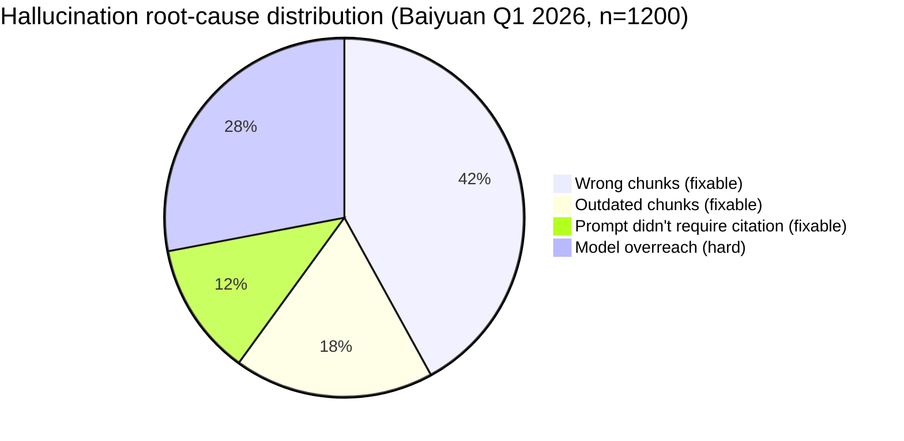
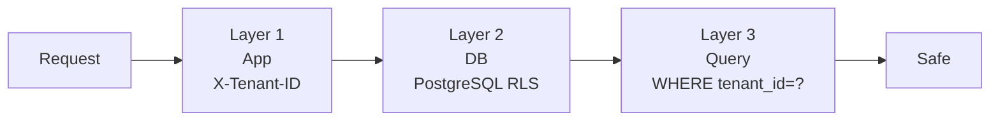

# Chapter 1 — The Dark Forest of Knowledge Bases

> An enterprise drops its PDFs into ChatGPT. The next day customers discover the AI quoted wrong prices, got the return policy backwards, and leaked Company A's confidential data to Company B. Welcome to the dark forest.

## 1.1 The Five Blind Spots of "Just Feed PDFs to ChatGPT" RAG

Since mid-2024, nearly every enterprise CTO has heard the same request: *"Turn our product manual into an AI that can answer questions."* The first implementation usually looks like this:

```python
documents = load_pdfs("docs/")
chunks = split_into_chunks(documents, size=500)
vectors = openai.embed(chunks)
qdrant.upsert(vectors)

def ask(question):
    q_vec = openai.embed(question)
    top_k = qdrant.search(q_vec, k=5)
    context = "\n".join(top_k)
    return openai.chat([
        {"role": "system", "content": "Answer based on the following"},
        {"role": "user", "content": f"{context}\n\nQuestion: {question}"}
    ])
```

It seems magical in week one. By month one, five blind spots emerge:

1. **Hallucination persists** — Top-K retrieval may pull irrelevant chunks; the LLM "smooths over" with invented facts
2. **Token costs explode** — 3,000 tokens per query × 10,000 queries/day × GPT-4o = ~USD 18,000/month
3. **Cross-tenant contamination** — if A's and B's embeddings share an index, leaks happen
4. **Non-PDF sources bounce** — Notion, Confluence, Excel, databases each need a new pipeline
5. **Answers aren't auditable** — when a customer complains, engineers can't inspect what was retrieved

Each problem has a solution. Solving *all five* in a multi-tenant SaaS is not a prompt-tweaking exercise — it's an **infrastructure** problem.

## 1.2 Hallucination Is Mostly an Infrastructure Problem

Engineers blame "GPT-4o still makes stuff up," but hallucinations have four sources:

| Source | Responsibility | Fix Layer |
|--------|---------------|-----------|
| **Model limit** | Model | Switch model (Claude/Gemini/...) |
| **Wrong chunks retrieved** | Infrastructure | Higher recall, hybrid retrieval, reranking |
| **Outdated chunks** | Infrastructure | Version tagging, freshness signals |
| **LLM "completes" beyond the chunk** | Prompt engineering | Strict citation, NLI verification |

Blaming the model is lazy. **Over 60% of hallucinations are fixable at infrastructure layer** (Baiyuan internal Q1 2026):



*Fig 1-1: Hallucination root-cause breakdown*

The book's core thesis: treat the 60% "fixable" bucket as infrastructure, then let NLI + ChainPoll (Ch 12) handle the remaining 28%.

## 1.3 The Real Token Bill

Many RAG demos quote "3,000 tokens per query." The real cost curve at enterprise scale:

| Scale | Queries/day | Monthly tokens | GPT-4o API cost |
|------|------------|---------------|-----------------|
| Pilot | 500 | 5M | ~USD 150 |
| SMB | 5,000 | 50M | ~USD 1,500 |
| Mid-market SaaS | 50,000 | 500M | ~USD 15,000 |
| Large CC center | 500,000 | 5B | ~USD 150,000 |

But most of this is avoidable:

1. **Redis answer cache** for identical questions (−50%)
2. **Semantic cache** for paraphrases (−10–20%)
3. **L1 Wiki precompilation** for the 80% high-frequency questions (−30–50%)
4. **Wiki-hit bypasses LLM entirely** (−100% for those)

Baiyuan's measured result: **L1 hit rate 35–60% → monthly token spend drops to 20–40% of naive baseline**.

## 1.4 Multi-Tenant Isolation: Security Beats Features

SaaS RAG has a fundamental difference from in-house RAG: **isolation is not optional**. Four real industry incidents (anonymized, 2024–2025):

1. **A's employee handbook quoted by B's customer chatbot** — shared embedding index, no collection separation
2. **Cross-company trade-secret leak** — SQL injection bypassed `WHERE tenant_id = ?`
3. **Deleted tenant still returns embeddings** — no soft delete + vacuum in vector store
4. **Admin console accidentally queries other tenant** — app runs as DB superuser

These map to the **three-layer tenant isolation** in Ch 6:



*Fig 1-2: Three-layer defense-in-depth*

Miss any layer, get one extra hole.

## 1.5 The Engineering Cost of Heterogeneous Sources

"Knowledge base" sounds simple to business stakeholders. To engineers it's a haunted house. The source types we support (Ch 7):

| Source | Example | Pain |
|--------|---------|------|
| Paste text | FAQs typed by employees | Format noise |
| Upload file | PDF, Word, PPT, TXT | OCR, tables, linebreaks |
| URL import | Marketing pages, Notion | JS rendering, login walls |
| Site scrape | Periodic full-site crawl | robots.txt, rate limits, dedupe |
| Webhook push | ERP/CRM events | Increments, dedup, versioning |
| API pull | Internal services | Auth, schema drift |

This isn't a RAG product — it's a **knowledge ETL platform**. Ch 7 details each pipeline.

## 1.6 Why Not Build One RAG Per Product Line?

Counterintuitive engineering decision. Baiyuan has three product lines:

- AI Customer Service SaaS
- GEO Platform
- PIF AI

The "obvious" approach is one RAG per product. We chose **one shared RAG infrastructure**. Reasons:

1. **Knowledge is inherently shared** — GEO's Ground Truth, CS's FAQ, PIF's ingredient toxicology are all facts about the same brand
2. **Schema.org `@id` interlinking** shares three layers (Organization → Service → Person) across products
3. **Version management unified** — update brand bio once, all products see it
4. **Non-duplicated engineering** — Wiki compiler, hybrid retrieval, NLI verification are expensive

Cost: multi-tenant + multi-product complexity. Ch 9 and Ch 10 break down the integration patterns.

## 1.7 The Book's Engineering Proposition

> **How do we build a single multi-tenant RAG infrastructure that simultaneously supports customer Q&A, GEO hallucination repair, and PIF regulatory filing at production grade on cost, hallucination, and isolation?**

This is the thread running through all 12 chapters.

---

## Key Takeaways

- "Just feed PDFs to ChatGPT" RAG has five blind spots: hallucination, cost, isolation, heterogeneity, auditability
- ~60% of hallucinations are infrastructure-fixable
- L1 Wiki precompilation cuts monthly token cost to 20–40% of baseline
- Three-layer tenant isolation required; miss one = one extra hole
- A single RAG platform serving three product lines is a deliberate architectural bet

## References

- [pgvector][pgv] · [Stanford HELM][helm] · [OpenAI Pricing][openai-pricing]

[pgv]: https://github.com/pgvector/pgvector
[helm]: https://crfm.stanford.edu/helm/
[openai-pricing]: https://openai.com/api/pricing/

---

**Navigation**: [📖 Contents](./README.md) · [Ch 2 →](./ch02-system-overview.md)
