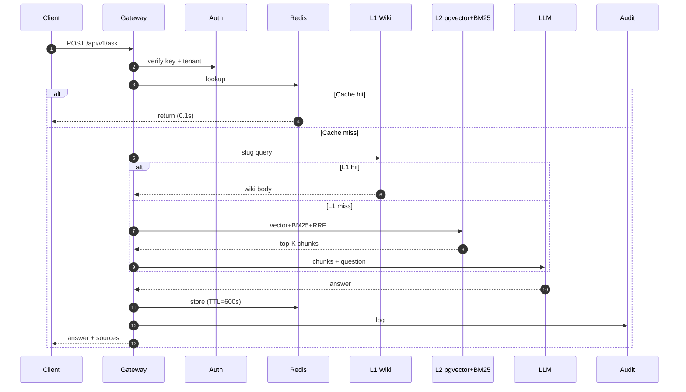
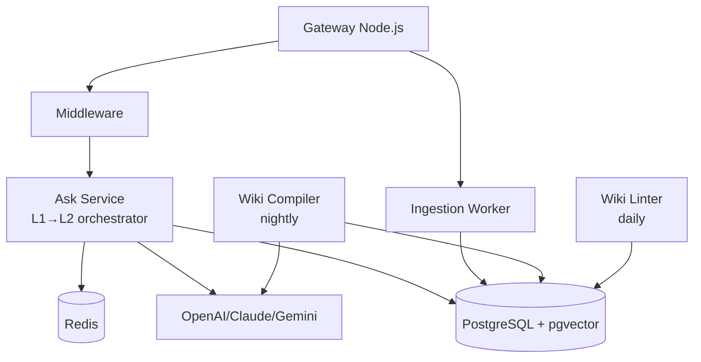

# Chapter 2 — Baiyuan RAG System Overview

> Map first, details later. This chapter is the skeleton for the next eleven.

## 2.1 The System in One Sentence

Baiyuan RAG Knowledge Platform is a **shared AI knowledge infrastructure** built on PostgreSQL + pgvector (storage), Redis (cache), Node.js (API), multi-tenant isolation (security), and L1 Wiki + L2 RAG (retrieval). Three product lines (CS / GEO / PIF) access it via `X-RAG-API-Key` + `X-Tenant-ID`.

## 2.2 Request-to-Response Path

*Fig 2-1: `/api/v1/ask` sequence*

About 2/3 of queries finish before hitting LLM generation — this is the core of token economics.

## 2.3 Core Database Schema

| Table | Purpose | Key Fields |
|-------|---------|-----------|
| `tenants` | Tenant master | `id`, `api_key`, `plan`, `quota` |
| `knowledge_bases` | KB per tenant | `id`, `tenant_id`, `is_default` |
| `documents` | Source docs | `id`, `kb_id`, `doc_type`, `status` |
| `chunks` | Splits | `id`, `document_id`, `content`, `fts` (tsvector generated) |
| `embeddings` | Vectors | `chunk_id`, `embedding vector(1536)` |
| `wiki_pages` | L1 pages | `id`, `kb_id`, `slug`, `body` |
| `queries` | Audit log | `id`, `tenant_id`, `question`, `from_wiki`, `latency_ms` |

All tenant-scoped tables enable **PostgreSQL Row-Level Security** (Ch 6).

## 2.4 Component Roles

*Fig 2-2: Component layout*

- Gateway: HTTP/SSE only, no business logic
- Ask Service: L1→L2 orchestrator
- Ingestion Worker: background PDF/URL/file processing
- Wiki Compiler: offline batch, usually nightly
- Wiki Linter: daily consistency check

## 2.5 Three Product Lines Sharing the Platform

| Product | Uses RAG For | Feeds RAG With | Special Need |
|---------|-------------|---------------|--------------|
| AI CS | Q&A, handoff summary | FAQ, product manual | SSE, <3s latency |
| GEO | Hallucination repair GT | Brand bio, team, services | NLI, strict citation |
| PIF AI | Ingredient/toxicology lookup | PubChem/ECHA/TFDA | Traceable citation, version lock |

Shared points:

1. Same `tenant_id` maps to one brand across three products
2. Schema.org `@id` cross-reference (Ch 9)
3. Shared Wiki compiler with product-tuned prompts
4. Single API endpoint: `https://rag.baiyuan.io`

## 2.6 Technology Decisions

| Decision | Choice | Alternatives | Why |
|----------|--------|--------------|-----|
| Vector store | pgvector | Pinecone, Qdrant, Milvus | Same Postgres — txn, ops simplicity |
| Main DB | PostgreSQL 16 | MySQL, CockroachDB | Mature pgvector, RLS, JSONB |
| FTS | PG tsvector | Elasticsearch | One fewer service |
| Fusion | RRF (k=60) | Weighted avg, ColBERT | Robust, no tuning |
| Cache | Redis 7 | Memcached | Shared, precise TTL |
| Language | Node.js (TS) | Python, Go | Same stack as chat-gateway |
| Wiki LLM | Claude Sonnet 4.6 | Smaller model | Offline, quality matters |
| Answer LLM | Router (multi) | Single vendor | Cost/availability spread |
| Deploy | Docker Compose / Lightsail | Kubernetes | Tenant scale, lower overhead |
| Auth | Header-based API key | OAuth | Product-to-product call |

Every choice is a trade-off. Ch 12 revisits which may need revision.

---

## Key Takeaways

- System = PG + pgvector + Redis + Node.js + L1/L2 Hybrid
- Request latency depends on where in Cache→L1→L2 the hit lands
- All tenant tables use RLS, the first line of multi-tenant safety
- Three product lines deliberately share the platform
- Choices like pgvector / RRF / Node.js are trade-offs, not ideals

## References

- [pgvector][pgv] · [RRF paper][rrf] · [PostgreSQL RLS][rls]

[pgv]: https://github.com/pgvector/pgvector
[rrf]: https://plg.uwaterloo.ca/~gvcormac/cormacksigir09-rrf.pdf
[rls]: https://www.postgresql.org/docs/current/ddl-rowsecurity.html

---

**Navigation**: [← Ch 1](./ch01-dark-forest.md) · [📖 Contents](./README.md) · [Ch 3 →](./ch03-l1-wiki.md)
