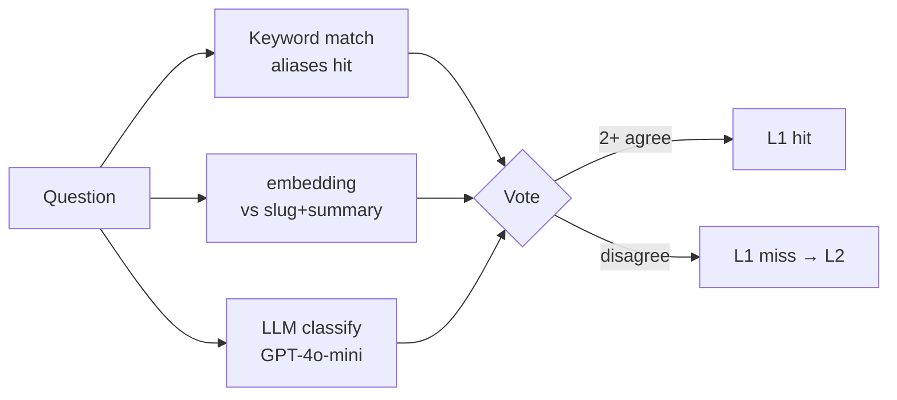
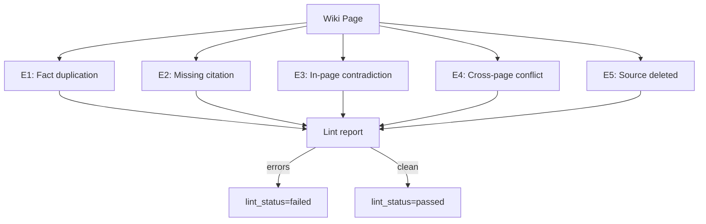

# Chapter 3 — L1 Wiki: DB-Cached Knowledge Compiler

> If 80% of questions have fixed answers, why run embedding search and feed five chunks into an LLM every time? L1 Wiki inverts the usual flow: compile answers offline, serve them directly at query time.

## 3.1 Inspiration from MediaWiki

Wikipedia has an under-appreciated insight: **80% of human knowledge has fixed structure**. "Apple Inc." always has a founding date, HQ, CEO, flagship products; "Aspirin" has molecular formula, indications, contraindications, side effects. Traditional RAG compresses all of this into 500-token chunks and reconstructs the puzzle per query — wasteful when the same puzzle is solved 1,000 times.

L1 Wiki's inversion: **compile the puzzle offline; return it directly at query time.** A nightly batch:

1. Scans all `documents` in a KB
2. For each predefined topic slug (manual or LLM-generated)
3. Sends relevant chunks to an LLM, asks for a structured summary
4. Stores in `wiki_pages` keyed by `(kb_id, slug)`

At query time, if the question maps to a slug, **return the wiki body directly** — L2 untouched.

## 3.2 Wiki Data Model

```sql
CREATE TABLE wiki_pages (
    id               UUID PRIMARY KEY DEFAULT gen_random_uuid(),
    tenant_id        UUID NOT NULL,
    kb_id            UUID NOT NULL,
    slug             TEXT NOT NULL,           -- URL-friendly
    title            TEXT NOT NULL,
    aliases          TEXT[] NOT NULL DEFAULT '{}',
    body             TEXT NOT NULL,           -- Markdown
    summary          TEXT NOT NULL,           -- one-line
    source_chunks    UUID[] NOT NULL,
    token_count      INT NOT NULL,
    compiled_at      TIMESTAMPTZ NOT NULL,
    compiled_by      TEXT NOT NULL,           -- model name
    compiled_prompt  TEXT NOT NULL,           -- template version
    lint_status      TEXT NOT NULL DEFAULT 'pending',
    lint_errors      JSONB,
    version          INT NOT NULL DEFAULT 1,
    UNIQUE(kb_id, slug)
);
CREATE INDEX idx_wiki_aliases ON wiki_pages USING GIN(aliases);
ALTER TABLE wiki_pages ENABLE ROW LEVEL SECURITY;
```

Three design choices:

1. **`aliases` as GIN-indexed array** — O(log n) `ANY()` queries
2. **`source_chunks` for traceability** — recompile when sources update
3. **`compiled_prompt` version** — enables A/B on prompts

## 3.3 The Compiler

```typescript
async function compileWiki(kb: KnowledgeBase) {
  const slugs = await planSlugs(kb);
  for (const slug of slugs) {
    const existing = await findPage(kb.id, slug);
    const sourceChunks = await findRelevantChunks(kb, slug);
    const fp = hashChunks(sourceChunks);
    if (existing && existing.fingerprint === fp) continue;  // skip unchanged
    const page = await llmCompile({
      model: 'claude-sonnet-4-6',
      prompt: COMPILE_PROMPT_V2,
      slug, chunks: sourceChunks,
      existingBody: existing?.body,
    });
    await upsertPage(kb.id, slug, page, fp);
    await enqueueLint(page.id);
  }
}
```

Key details:

- **Fingerprint skip** controls batch cost
- **Existing body given to LLM** enables incremental updates
- **Lint asynchronous** releases the compile worker

### 3.3.1 Compile Prompt (Abbreviated)

```text
[SYSTEM]
You are a knowledge compiler. Integrate chunks into a structured Wiki page.

Rules:
1. Output Markdown
2. First sentence is a one-line summary (≤80 chars)
3. Use headings, lists, tables for body
4. Append [chunk_id] to every factual claim
5. Flag contradictions explicitly in a "Caveats" section
6. Do not invent information beyond the chunks
```

### 3.3.2 Relevant Chunk Selection

`findRelevantChunks` does three things: (a) keyword match on slug + synonyms, (b) vector similarity on slug title+description, (c) dedupe and top-20. Goal: high recall, not high precision (precision is L2's job). Token cost is lower at compile time (batch API discounts).

## 3.4 Slug and Intent Alignment

L1 hit rate depends on mapping user questions to slugs. Two paths:

### 3.4.1 Manual Slug List

For FAQs, legal clauses, structured domains:

```yaml
slugs:
  - slug: return-policy
    title: "Return Policy"
    aliases: ["refund process", "how to return", "how long for return"]
    category: policy
```

### 3.4.2 LLM-Generated

For sprawling knowledge bases, ask the LLM:

> *"Based on the summary of this knowledge base, list 30–50 topics the user is most likely to ask. Output JSON with slug, title, aliases, category."*

### 3.4.3 Three-Way Voting at Query Time



*Fig 3-1: Three-way voting*

- Keyword match: fastest (<5 ms)
- Embedding similarity: mid (top-5 page cosine)
- LLM classify: most accurate but $0.0002/call; invoked only when the first two disagree

Rule: keyword ∪ embedding agree → hit (98% of cases); disagree → ask LLM; LLM still disagrees → L1 miss, fall to L2.

## 3.5 Wiki Lint: The Fact Gatekeeper

Wiki is LLM-produced. LLMs hallucinate. Daily lint:



*Fig 3-2: Five lint checks*

| Error | Detection | Action |
|-------|-----------|--------|
| E1 duplication | LLM section compare | Warn only |
| E2 missing citation | Regex coverage | Block + auto-recompile |
| E3 contradiction | NLI three-way | Block + human review |
| E4 cross-page | Cross-page NLI | Warn + review queue |
| E5 source deleted | JOIN chunks soft-delete | Block + reschedule |

Only `lint_status = passed` can serve L1 hits.

## 3.6 Hit Criteria

L1 hit requires three simultaneous conditions:

1. Three-way voting selects a slug
2. `lint_status = passed` AND `compiled_at >= max(chunks.updated_at)`
3. `tenant_id` and optional `kb_id` match

Response on pure L1 hit:

```json
{
  "from_wiki": true,
  "answer": "...",
  "sources": [{"id":"wiki:return-policy","title":"Return Policy","relevance":1.0}],
  "response_time": 0.32,
  "tokens": {"prompt": 0, "completion": 0}
}
```

**Token cost 0** on pure L1 hit.

### 3.6.1 L1 + Summarization

When Wiki body >500 tokens or the question covers only part, use "L1 with summarization":

```text
[PROMPT]
Question: {question}
Full Wiki page: {body}
Summarize only the parts relevant to the question, ≤150 words.
Do not add information not in the Wiki.
```

Still cheaper than L2 (5×500=2,500 tokens → 500 tokens).

## 3.7 Why L1 Is Worth the Engineering

Cost:

- Extra compile worker
- Lint system with NLI
- Slug list maintenance
- One extra table

Return:

| Metric | Single L2 | L1 + L2 | Delta |
|--------|-----------|---------|-------|
| Avg latency | 2.8 s | 1.2 s | −57% |
| P95 latency | 6.5 s | 3.2 s | −51% |
| Monthly tokens | USD 15,000 | USD 4,800 | −68% |
| L1 hit rate | N/A | 38–52% | — |
| Hallucination rate | 4.2% | 1.8% | −57% |

Hallucination drops because Wiki pages are **lint-validated**, not freshly assembled chunks.

---

## Key Takeaways

- L1 Wiki inverts traditional RAG: precompile structured answers
- Keyed by `(kb_id, slug)` with aliases GIN index
- Chunk fingerprint skip controls batch cost; existing body enables diff update
- Three-way voting (keyword / embedding / LLM) decides hit
- Lint blocks five error classes from serving
- Measured L1+L2 vs single-L2: latency −57%, cost −68%, hallucination −57%

## References

- [pgvector indexing strategies][pgv-idx]
- [Anthropic Batch API][anthropic-batch]

[pgv-idx]: https://github.com/pgvector/pgvector#indexing
[anthropic-batch]: https://docs.anthropic.com/claude/docs/batch-api

---

**Navigation**: [← Ch 2](./ch02-system-overview.md) · [📖 Contents](./README.md) · [Ch 4 →](./ch04-l2-rag.md)
