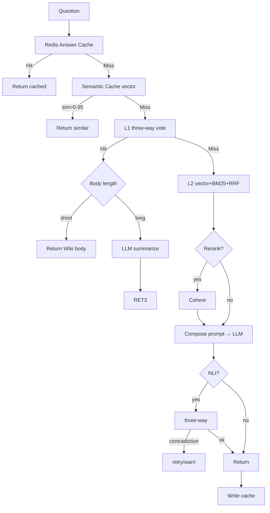
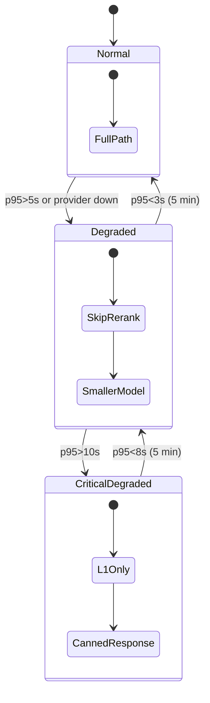

# Chapter 5 — L1→L2 Fallback & Token Economics

> Dual-layer retrieval isn't two independent systems; it's a dynamic cost/precision trade machine. This chapter shows the bill.

## 5.1 Full Fallback Tree



*Fig 5-1: 7-layer fallback decision tree*

Per-node hit rate and latency (Baiyuan Pilot, Q1 2026, 500k queries):

| Node | Next hit | Avg latency | Cost |
|------|----------|-------------|------|
| Answer Cache | 28% | 45 ms | ~0 |
| Semantic Cache | 8% | 120 ms | embedding |
| L1 Wiki | 35% | 320 ms | small-model classify |
| L2 Retrieval | 100% | 680 ms | pg search |
| Rerank (opt) | 100% | +250 ms | Cohere API |
| LLM generate | 100% | 1,800 ms | **main cost** |
| NLI verify (opt) | 100% | +180 ms | NLI model |

**About 2/3 of queries end before LLM generation.**

## 5.2 Cost/Latency Model

For 300,000 queries/month:

```text
Cache hit 28%: $0.84
Semantic hit 6%: $0.90
L1 hit 24%: $14.40
L2 full path 42%: $1,008
Total ≈ $1,024
```

Without L1: total ≈ $1,729. **Savings 40.7%** — in SaaS margin terms, 60% gross → 75%+ gross.

## 5.3 Three-Layer Cache Strategy

### 5.3.1 Answer Cache (Redis)

```typescript
const key = `ans:${sha256(`${tenant}:${kb}:${normalize(q)}`)}`;
const cached = await redis.get(key);
if (cached) return JSON.parse(cached);
// fallback...
await redis.setex(key, 600, JSON.stringify(answer));
```

`normalize(q)` collapses whitespace, case, punctuation so "return policy?" hits the same entry as "return policy".

### 5.3.2 Semantic Cache (pgvector)

Captures paraphrased questions. `sim > 0.95` threshold is conservative to avoid answering the wrong question.

### 5.3.3 Wiki Is Also Cache

L1 Wiki is structured, governed cache. Diff vs Answer Cache:

| Attr | Answer Cache | L1 Wiki |
|------|-------------|---------|
| Granularity | Single query | Topic (slug) |
| Hit condition | Literal match | Semantic match |
| Update | Passive expiry | Active compile |
| Auditability | None | Lint + source trace |

## 5.4 Multi-Provider LLM Router

```yaml
llm_routing:
  default: claude-sonnet-4-6
  fallback: [gpt-4o, gemini-2.0-flash]
  rules:
    - if: question.lang == "ja"
      use: gpt-4o
    - if: question.category == "legal"
      use: claude-opus-4-7
    - if: token_budget.remaining < 0.1
      use: gpt-4o-mini
```

```typescript
async function routeLLM(req) {
  for (const p of providers) {
    try { return await p.complete(req); }
    catch (err) { if (isRetryable(err)) continue; throw err; }
  }
}
```

Three details: retryable detection (429/5xx), circuit breaker (3 failures = 5 min pause), request shaping (uniform max_tokens, stop sequences).

## 5.5 Degraded Mode



*Fig 5-2: Three-level degradation*

- **Normal**: full pipeline
- **Degraded**: no rerank, mid-tier model
- **CriticalDegraded**: L1 only; miss → canned message

Tenants see Dashboard warning in CriticalDegraded and can scale up or reschedule.

## 5.6 Real Monthly Bills

Three Pilot tenants, 3 months:

| Tenant | Type | Queries/mo | L1 hit | Cache hit | USD/mo | No-L1 estimate |
|--------|------|-----------|--------|----------|--------|----------------|
| A | E-commerce CS | 380,000 | 52% | 31% | 680 | 1,820 |
| B | Tech docs Q&A | 120,000 | 38% | 22% | 450 | 920 |
| C | Medical advice (NLI on) | 55,000 | 41% | 18% | 320 | 710 |

Observations: (a) L1 hit scales with knowledge structure; (b) cache hit scales with domain repetition; (c) NLI adds 18% cost but drops hallucination from 2.1% to 0.4%.

---

## Key Takeaways

- Fallback is a 7-layer tree: Cache → Semantic → L1 → L2 → Rerank → LLM → NLI
- ~2/3 of queries end before LLM generation — the core of token savings
- Three cache layers: answer (literal) / semantic (vector) / Wiki (structured)
- Provider router with retry + circuit breaker + request shaping
- Three-level degradation (Normal / Degraded / CriticalDegraded) triggered on p95

## References

- [OpenAI pricing][openai-pricing] · [Anthropic pricing][anth-pricing] · [Martin Fowler — Circuit Breaker][cb]

[openai-pricing]: https://openai.com/api/pricing/
[anth-pricing]: https://www.anthropic.com/pricing
[cb]: https://martinfowler.com/bliki/CircuitBreaker.html

---

**Navigation**: [← Ch 4](./ch04-l2-rag.md) · [📖 Contents](./README.md) · [Ch 6 →](./ch06-tenant-isolation.md)
