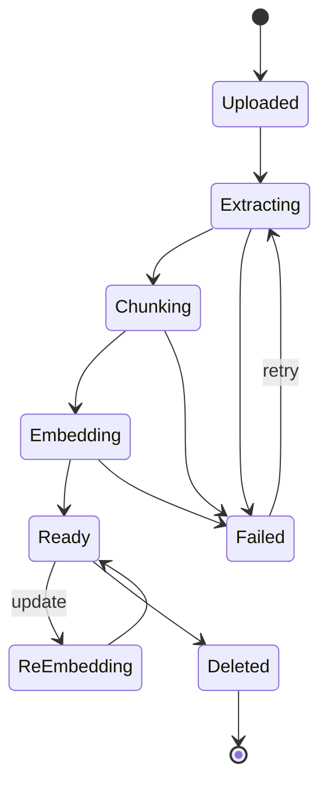
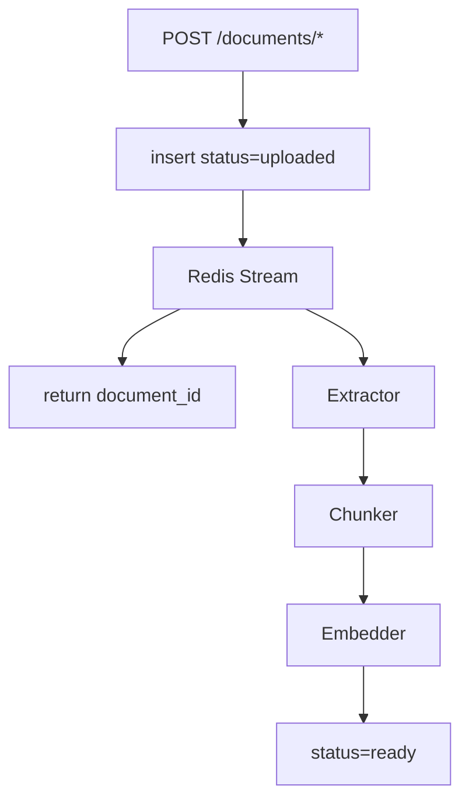

# Chapter 7 — Knowledge Ingestion Pipeline

> Customers asked "can our PDFs be questioned?" Then said "we also have Notion, our website, ERP, and monthly Excels." This chapter handles all six.

## 7.1 Document State Machine



*Fig 7-1: Document lifecycle*

```sql
CREATE TABLE documents (
    id UUID PRIMARY KEY, tenant_id UUID NOT NULL, kb_id UUID NOT NULL,
    title TEXT, doc_type TEXT,  -- text|url|file|scraped|auto_push|api
    source_uri TEXT, file_name TEXT, file_size BIGINT,
    char_count INT, chunk_count INT,
    status TEXT DEFAULT 'uploaded', error TEXT,
    ingested_at TIMESTAMPTZ, ready_at TIMESTAMPTZ, deleted_at TIMESTAMPTZ,
    source_hash TEXT,
    created_at TIMESTAMPTZ DEFAULT now()
);
```

## 7.2 Six Ingestion Sources

### 7.2.1 Paste Text

```http
POST /api/v1/documents/text
{"knowledge_base_id":"uuid","title":"Return Policy 2026","content":"..."}
```

### 7.2.2 File Upload

| Type | Extension | Extractor |
|------|-----------|-----------|
| PDF | .pdf | pdfjs + OCR fallback |
| Word | .doc/.docx | mammoth |
| PowerPoint | .ppt/.pptx | pptx-parser |
| Excel | .xls/.xlsx | xlsx (per sheet) |
| Text | .txt/.md | direct |
| HTML | .html | cheerio |

### 7.2.3 URL Import

Backend fetch → content-type branch: HTML → Puppeteer, PDF → file pipeline, others rejected.

### 7.2.4 Site Scrape

```mermaid
flowchart LR
    ROOT[root_url] --> Q[BFS Queue]
    Q --> FETCH
    FETCH --> ROBOTS{robots.txt}
    ROBOTS -->|disallow| SKIP
    ROBOTS -->|allow| PARSE
    PARSE --> EXTRACT[@mozilla/readability]
    EXTRACT --> LINKS --> Q
    EXTRACT --> DOC
```

Details: main content via Readability, dedupe by URL/content hash, 1 req/s per site.

### 7.2.5 Webhook Push

```http
POST /api/v1/documents/push
X-Webhook-Signature: <hmac-sha256>
```

HMAC verification:

```typescript
const expected = hmacSha256(rawBody, tenant.webhook_secret);
if (!timingSafeEqual(req.headers['x-webhook-signature'], expected)) {
  return res.status(401).send('invalid signature');
}
```

### 7.2.6 API Pull

Periodic sync for Notion / Confluence / Zendesk: compare `external_id + version`, upsert on change.

## 7.3 OCR Pipeline

Three PDF categories:

| Category | Extraction |
|----------|-----------|
| Text PDF | pdfjs-dist |
| Mixed | pdfjs + per-image OCR |
| Image-only (scan) | Google Vision OCR |

Detection heuristic: first 3 pages total <300 chars → image-only. Google Vision chosen over local Tesseract for 96% vs 82% CJK accuracy and layout preservation; $1.50/1,000 pages is acceptable for SaaS.

## 7.4 Background Workers



*Fig 7-3: Ingestion pipeline*

Independent horizontal scaling per worker. Redis Streams (vs RabbitMQ) for reuse, consumer groups, XLEN visibility.

## 7.5 Incremental Update & Dedup

- **Source hash**: `sha256(raw)` skips duplicates
- **External ID + version**: webhook / API sync triggers soft-delete old chunks
- **Incremental embedding**: only new/changed chunks embed

## 7.6 Failure Handling

| Error | Cause | Strategy |
|-------|-------|----------|
| OCR fail | File corrupt / Vision rate limit | Retry 3×, exponential backoff |
| Embedding fail | OpenAI rate limit | Worker pause 60s, requeue |
| Parse fail | Unsupported format | Immediate fail, notify user |
| Wiki compile fail | LLM error | Revert previous Wiki, `lint_status = failed` |

Dead Letter Queue: >3 retries → daily report for human review.

---

## Key Takeaways

- State machine: Uploaded → Extracting → Chunking → Embedding → Ready
- Six sources: text / file / URL / scraped / webhook push / API pull
- PDF type detection by first-pages char count; image-only → Google Vision
- Three-stage workers (Extractor / Chunker / Embedder) scale independently
- Source hash + external_id + version for multi-layer dedup
- DLQ + exponential backoff ensures system stability

## References

- [pdfjs-dist][pdfjs] · [Readability][read] · [Google Vision OCR][vision] · [Redis Streams][rstream]

[pdfjs]: https://github.com/mozilla/pdf.js
[read]: https://github.com/mozilla/readability
[vision]: https://cloud.google.com/vision/docs/ocr
[rstream]: https://redis.io/docs/latest/develop/data-types/streams/

---

**Navigation**: [← Ch 6](./ch06-tenant-isolation.md) · [📖 Contents](./README.md) · [Ch 8 →](./ch08-stream-handoff.md)
