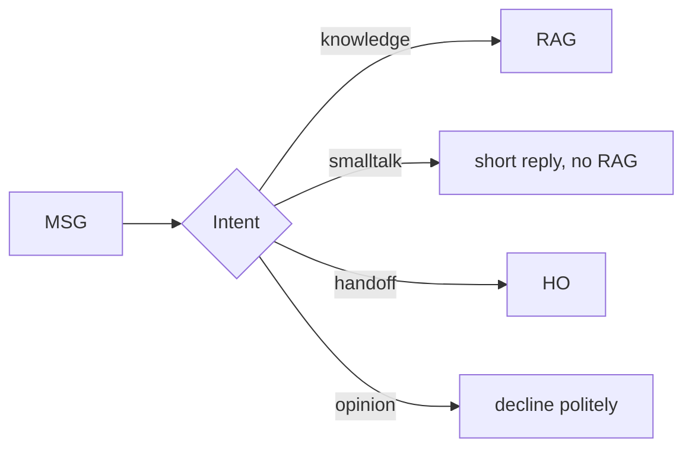
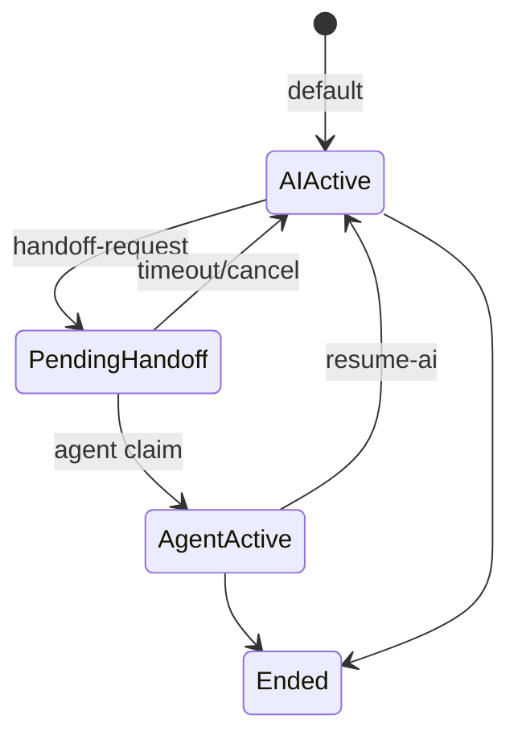
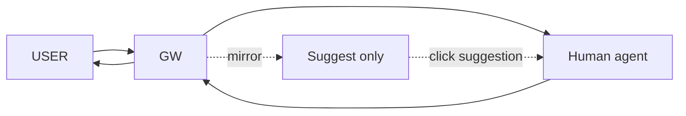

# Chapter 8 — Streaming Answers & Handoff Loop

> Slow AI loses customers. Wrong AI angers them. This chapter fixes both.

## 8.1 Why Streaming Matters

| Experience | Non-streaming | Streaming |
|-----------|--------------|-----------|
| First token | 3–5 s | 0.3–0.8 s |
| Felt wait | Anxious | "It's happening" |
| Cancel rate | 12% | 3% |

LLM APIs support `stream:true`. Engineering cost is in the gateway SSE handling, early-start events from retrieval, and L1 bypass on hit.

## 8.2 SSE Event Protocol

```text
event: start
data: {"conversation_id":"uuid","reply_message_id":"uuid","intent":"knowledge"}

event: delta
data: {"content":"Our return"}

event: delta
data: {"content":" policy is..."}

event: ping
data: {}

event: done
data: {"message_id":"uuid","answer":"...","sources":[...]}
```

### 8.2.1 nginx

```nginx
location /api/v1/ask {
    proxy_pass http://rag_backend;
    proxy_buffering off;
    proxy_cache off;
    proxy_set_header X-Accel-Buffering no;
    proxy_http_version 1.1;
    chunked_transfer_encoding off;
}
```

`X-Accel-Buffering: no` is essential — without it, the client never sees delta events.

### 8.2.2 Reconnect

Native SSE `Last-Event-ID`. For RAG, a half-finished answer usually means we re-answer. Client policy: retry once after 2s, then show "connection lost, retry" button.

## 8.3 Conversation Memory

Redis LIST stores last N rounds (default 6):

```typescript
const key = `conv:${conversationId}`;
const history = await redis.lrange(key, 0, 11);
const prompt = history.map(m => `${m.role === 'user' ? 'User' : 'AI'}: ${m.content}`).join('\n');
const augmentedQ = `[Context]\n${prompt}\n\n[Current]\n${question}`;
```

- N configurable (default 6, long-convo tenants 10–20)
- Token cap at 3,000; drop oldest
- 24h TTL for privacy

### 8.3.1 Intent Routing



Small-model classification (~$0.0001/call) filters 15–20% of unnecessary RAG lookups.

## 8.4 Handoff State Machine



*Fig 8-2: Five states*

Trigger conditions: user asks explicitly, intent classifier detects, AI confidence <0.3 × 3, legal/compliance keyword auto-escalates.

## 8.5 Mirror Mode



*Fig 8-3: Mirror mode*

AI suggestions don't auto-send; human clicks to use. Default `mirror_human_reply=true`, disable per tenant (e.g., legal consultation).

## 8.6 Handoff Summary

When an agent claims a conversation, they need context immediately. AI generates a summary JSON:

```text
[PROMPT]
Produce a handoff summary JSON for the human agent.
Fields: customer_name, main_question, context_facts[], pending_facts[],
        suggested_actions[] (≤3), sentiment (neutral|frustrated|urgent)
Transcript:
{transcript}
```

Shown in Agent Console left panel.

### 8.6.1 Resume-AI

After the human resolves the critical part:

```http
POST /api/v1/sessions/{conv_id}/resume-ai
{"agent_email":"alice@acme.example"}
```

- State: agent_active → ai_active
- AI sees full history including human turns
- Next user message handled by AI

---

## Key Takeaways

- SSE streaming cuts cancel rate ~75%, but nginx needs `X-Accel-Buffering: no`
- Conversation memory via Redis, N configurable, 24h TTL
- Intent classifier filters 15–20% unnecessary RAG calls at near-zero cost
- Handoff 5 states: ai_active / pending / agent_active / ended
- Mirror mode helps human agents with AI suggestions that don't auto-send
- Handoff summary gives agents instant context

## References

- [SSE spec][sse] · [nginx SSE][nginx-sse] · [Redis Lists][redis-list]

[sse]: https://html.spec.whatwg.org/multipage/server-sent-events.html
[nginx-sse]: https://nginx.org/en/docs/http/ngx_http_proxy_module.html
[redis-list]: https://redis.io/docs/latest/develop/data-types/lists/

---

**Navigation**: [← Ch 7](./ch07-ingestion.md) · [📖 Contents](./README.md) · [Ch 9 →](./ch09-geo-integration.md)
