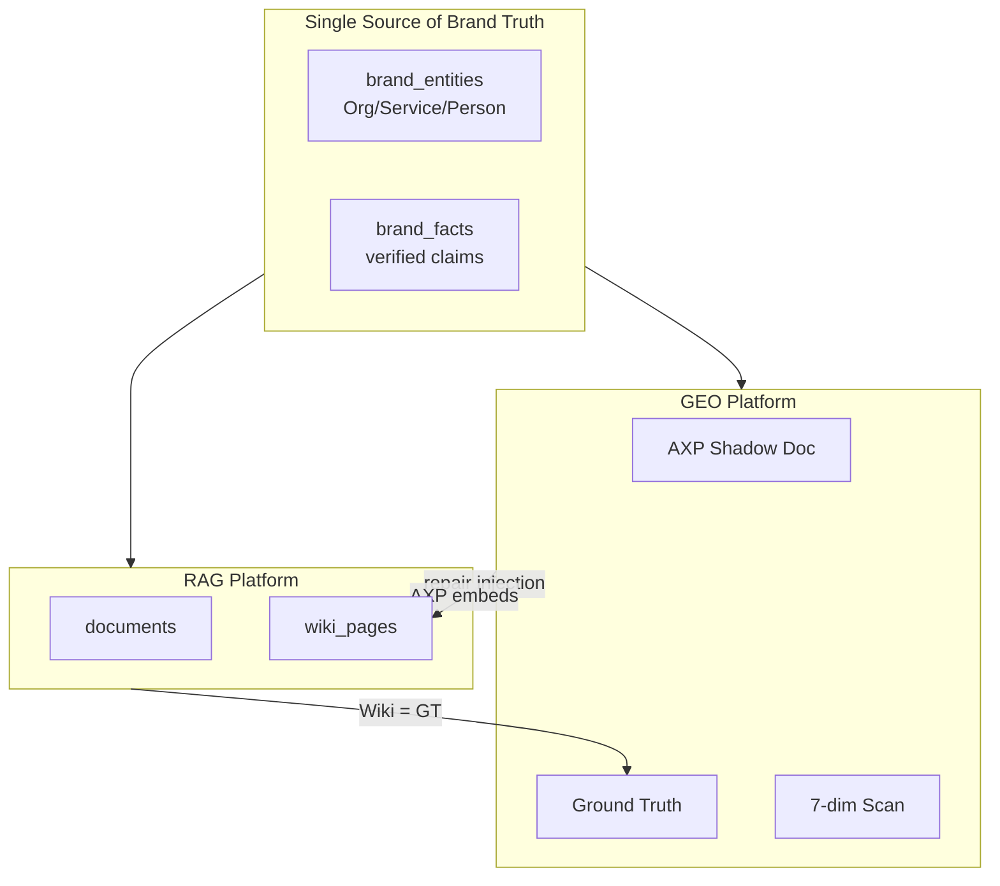
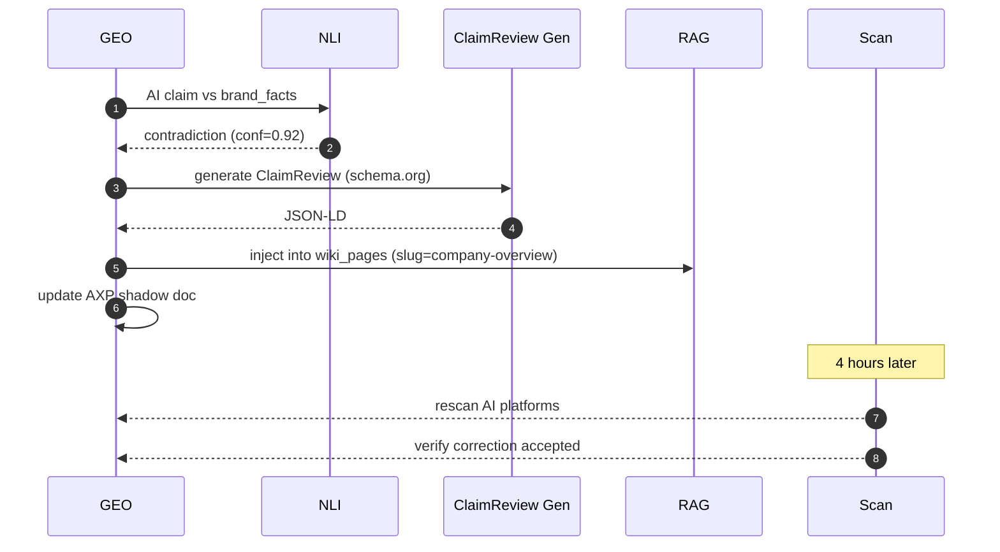

# Chapter 9 — Integration with Baiyuan GEO

> GEO makes brands appear in AI answers. RAG ensures the AI sees the right facts. They are two sides of one coin.

## 9.1 Why Deep Integration

GEO Platform (see sister whitepaper at <https://github.com/baiyuan-tech/geo-whitepaper>) handles seven-dimension AI citation scoring, AXP shadow docs, hallucination remediation loop. RAG handles L1 Wiki + L2 retrieval, multi-tenant knowledge. They share **brand facts**.



*Fig 9-1: Shared model + bidirectional flow*

Three data flows:

1. `brand_entities` → both systems (brand bio written once)
2. RAG Wiki → GEO Ground Truth (Wiki pages are structured facts)
3. GEO hallucination detection → RAG injection (correct facts flow back)

## 9.2 Shared Brand Entity Model

```sql
CREATE TABLE brand_entities (
    id UUID PRIMARY KEY, tenant_id UUID NOT NULL,
    entity_type TEXT,  -- Organization / Service / Person / LocalBusiness
    schema_id TEXT,    -- "https://acme.example/#org"
    name TEXT, description TEXT, properties JSONB,
    sameAs TEXT[],     -- Wikipedia, Wikidata, LinkedIn
    created_at TIMESTAMPTZ, updated_at TIMESTAMPTZ
);

CREATE TABLE brand_facts (
    id UUID PRIMARY KEY, tenant_id UUID, entity_id UUID,
    claim TEXT, evidence TEXT, evidence_url TEXT,
    verified_by TEXT,  -- human / llm_nli / auto_scraped
    verified_at TIMESTAMPTZ, confidence REAL
);
```

`brand_facts` is the authoritative source. RAG Wiki and GEO GT both reference it.

## 9.3 Ground Truth Closed Loop



*Fig 9-2: Repair loop*

Key points: NLI three-way decides only `contradiction` triggers repair; ClaimReview is schema.org-native; RAG is the injection point so the brand's own CS chat also sees corrected fact.

## 9.4 Schema.org @id Three-Layer Interlink

```json
{
  "@graph": [
    {"@type": "Organization", "@id": "https://acme.example/#org",
     "hasOfferCatalog": {"@id": "https://acme.example/#catalog"},
     "employee": [{"@id": "https://acme.example/team/alice#person"}]},
    {"@type": "Service", "@id": "https://acme.example/#service-consulting",
     "provider": {"@id": "https://acme.example/#org"}},
    {"@type": "Person", "@id": "https://acme.example/team/alice#person",
     "worksFor": {"@id": "https://acme.example/#org"}}
  ]
}
```

AXP shadow doc injects this JSON-LD into HTML `<head>`. RAG Wiki body cites the same `@id`s. AI crawlers (GPTBot, ClaudeBot, PerplexityBot) treat three-layer interlink as a strong knowledge-graph signal.

## 9.5 Hallucination Detection → RAG Auto-Repair

Scenario:

1. Customer asks "Who is your CEO?" on chat.baiyuan.io widget
2. RAG Wiki `company-overview` lacks CEO info
3. L1 miss → L2 chunks also missing → LLM hallucinates "Bob Smith"
4. Meanwhile GEO scans ChatGPT → also says "Bob Smith"
5. But `brand_facts` says "Alice Wang"
6. GEO triggers repair: patches RAG `company-overview` with `CEO: Alice Wang`
7. Next customer question → Wiki hit → "Alice Wang" ✓

```typescript
await rag.api.post('/api/v1/wiki/patch', {
  tenant_id, kb_id,
  slug: 'company-overview',
  patch: {section: 'leadership', content: 'CEO: Alice Wang (since 2020)',
          source_claim_id: claim.id, confidence: 0.98},
});
```

RAG side: merge patch into `wiki_pages.body`, re-lint, if pass → live; folded into next compile.

This feature launches **2026 Q2**.

## 9.6 Shared Dashboard Metrics

| Metric | Source | Meaning |
|--------|--------|---------|
| AI Citation Rate (GEO) | 7-dim scan | % AI platforms mentioning brand |
| Fact Accuracy (GEO) | NLI verify | % mentions that are correct |
| Wiki Coverage (RAG) | RAG compile stats | % brand_facts covered by Wiki |
| CS Hit Rate (RAG) | RAG query log | % CS questions answerable |
| Repair Latency | inject → next-scan verify | Days until AI changes answer |

Five axes quantifying "brand AI health."

---

## Key Takeaways

- GEO and RAG share `brand_entities` / `brand_facts` as single source of truth
- RAG's L1 Wiki doubles as GEO's Ground Truth
- Schema.org `@id` three-layer interlink across AXP + Wiki
- GEO detects hallucination → auto-patches RAG Wiki (2026 Q2 launch)
- Five-axis Dashboard quantifies brand AI health

## References

- [GEO whitepaper][geo] · [Schema.org ClaimReview][cr] · [NLI models][nli]

[geo]: https://github.com/baiyuan-tech/geo-whitepaper
[cr]: https://schema.org/ClaimReview
[nli]: https://huggingface.co/tasks/natural-language-inference

---

**Navigation**: [← Ch 8](./ch08-stream-handoff.md) · [📖 Contents](./README.md) · [Ch 10 →](./ch10-pif-integration.md)
