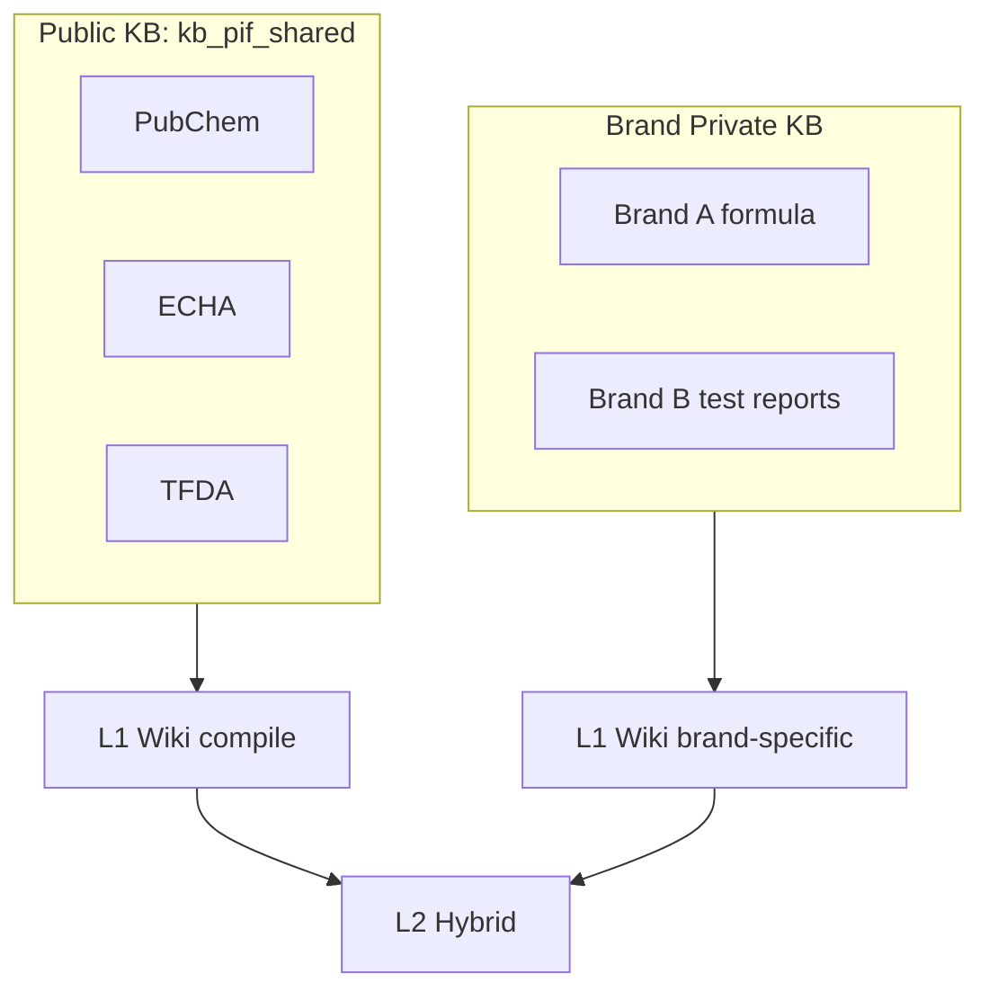
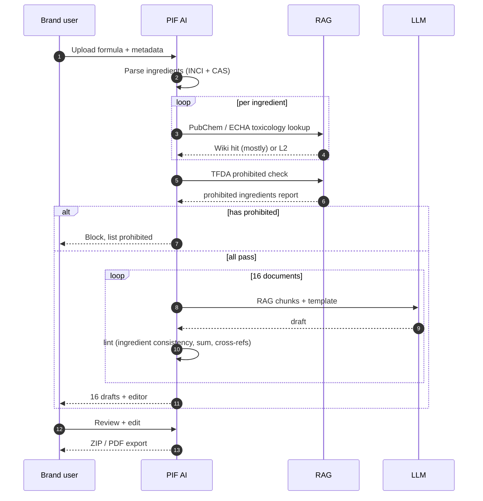

# Chapter 10 — Integration with Baiyuan PIF AI

> Taiwan's cosmetics industry must file Product Information Files by July 2026. Traditional consultants take 4–8 weeks. PIF AI does it in 3–5 days using RAG. Here's why.

## 10.1 Regulatory Context

Taiwan's TFDA (per *Cosmetics Hygiene and Safety Management Act*) requires a **Product Information File** (PIF) of **16 documents** per product:

| # | Document |
|---|----------|
| 1 | Product summary |
| 2 | INCI ingredient list + CAS |
| 3 | Physicochemical properties |
| 4 | Microbial quality test |
| 5 | Packaging material spec |
| 6 | Batch stability |
| 7 | Toxicology safety assessment |
| 8 | Adverse reaction history |
| 9 | GMP certification |
| 10 | Label/appearance review |
| 11 | Usage method |
| 12 | R&D and batch info |
| 13 | Risk assessment (sensitizers) |
| 14 | Preservative efficacy (challenge test) |
| 15 | Heavy metals / prohibited substance check |
| 16 | Non-animal-testing statement |

**Deadline**: July 1, 2026. >5,000 brands affected; most SMBs can't afford 4–8 week, USD 3,000+ consultant engagements.

PIF AI (<https://pif.baiyuan.io>) is Baiyuan's SaaS answer: 3–5 days, <20% of consultant cost.

## 10.2 Why RAG Is the Keystone

| Dimension | Generic CS RAG | Regulatory RAG |
|-----------|---------------|----------------|
| Hallucination tolerance | Medium (post-fix) | Zero (legal risk) |
| Answer length | 100–500 chars | 1,000–5,000 |
| Citation rigor | General | Paragraph-level + law citation |
| Refresh frequency | Monthly | Weekly |
| Audit needs | Optional | Mandatory for TFDA |

Baiyuan RAG is **auditable, traceable, versionable** by design — natural fit.

## 10.3 Three External Knowledge Sources

### 10.3.1 PubChem (US NIH)

- 150M+ compounds with physicochemical and toxicity data
- Ingestion: PubChem REST API + crawler fallback
- Frequency: monthly full sync, daily incremental
- Chunking: one chunk per compound + property-level sub-chunks

### 10.3.2 ECHA (EU Chemicals Agency)

REACH registrations, CLP classifications, SVHC list. Weekly XML dump sync.

### 10.3.3 TFDA Announcements

Prohibited/restricted ingredients for cosmetics, adverse reactions, regulation updates. Site crawl + human review for new notices.

~2M chunks total. Shared KB `kb_pif_shared` for all PIF AI tenants. Each brand also has private KB (formulas, test reports). Three-layer tenant isolation still applies.



*Fig 10-1: Public + private dual-KB*

## 10.4 16-Document Generation Pipeline



*Fig 10-2: 16-document generation*

Key insight: **most content doesn't need LLM generation, just RAG retrieval + reformat**. Per-document RAG dependency:

| Document | Main source | Customer provides | RAG % |
|----------|-------------|------------------|-------|
| Ingredient list (#2) | Formula sheet | Everything | 0% |
| Toxicology (#7) | PubChem + ECHA | Formula | 80% |
| Prohibited check (#15) | TFDA | Formula | 90% |
| Microbial quality (#4) | Lab report | Everything | 0% |
| Preservative test (#14) | Literature + formula | Results | 60% |

Average: **50% of PIF content comes from RAG**. This is why 4 weeks → 3 days.

## 10.5 Traceable Citations

TFDA inspectors demand source proof. RAG answers carry **paragraph-level citations**:

```json
{
  "answer": "Benzyl alcohol shows no skin irritation at pH 5.5.",
  "citations": [
    {
      "source": "pubchem:8773",
      "chunk_id": "c_abc123",
      "paragraph_hash": "sha256:...",
      "quote": "Benzyl alcohol shows no skin irritation at pH < 6.5...",
      "url": "https://pubchem.ncbi.nlm.nih.gov/compound/8773#section=...",
      "accessed_at": "2026-04-18T03:22:11Z"
    }
  ]
}
```

`paragraph_hash` is critical: even if upstream text changes, we can prove what we cited.

### 10.5.1 Strict Citation Prompt

```text
[PROMPT — PIF Strict]
You are authoring cosmetics PIF regulatory docs.

Rules:
1. Every factual claim must carry [cite:chunk_id]
2. No output without a source
3. If multiple chunks support, cite all
4. Inferences beyond chunks must say "cannot confirm from available data"
5. Conservative wording: "studies indicate" / "per ECHA classification" not "certainly"
```

## 10.6 Version Lock & Audit

PIF answers expire when regulations change. Baiyuan RAG offers **locked answers**:

```sql
CREATE TABLE locked_answers (
    id UUID PRIMARY KEY, tenant_id UUID,
    question TEXT, answer TEXT,
    cited_chunks UUID[], cited_snapshot JSONB,
    locked_at TIMESTAMPTZ, locked_by TEXT,
    expiry_check_at TIMESTAMPTZ
);
```

Monthly cron: compare current chunk hash with locked snapshot. If diverged, flag for review.

### 10.6.1 Audit Trail

Every PIF document segment logs:

- User
- Formula input
- RAG-retrieved chunks
- LLM prompt + model + temperature
- Final output

On TFDA audit, we can reproduce the generation. This is **auditable RAG** — unachievable for non-regulated products.

---

## Key Takeaways

- PIF AI target: Taiwan cosmetics industry before July 2026 deadline, 3–5 day filing
- Three public sources (PubChem / ECHA / TFDA) + private per-brand KB
- Average 50% of PIF content comes straight from RAG
- Paragraph-level citations with `paragraph_hash` enable TFDA audit
- Version-locked answers with monthly drift check
- Full audit trail reproduces every generation

## References

- [TFDA law][tfda] · [PubChem API][pubchem] · [ECHA][echa] · [PIF AI][pif]

[tfda]: https://law.moj.gov.tw/LawClass/LawAll.aspx?pcode=L0030013
[pubchem]: https://pubchem.ncbi.nlm.nih.gov/docs/pug-rest
[echa]: https://echa.europa.eu/information-on-chemicals
[pif]: https://pif.baiyuan.io

---

**Navigation**: [← Ch 9](./ch09-geo-integration.md) · [📖 Contents](./README.md) · [Ch 11 →](./ch11-case-studies.md)
