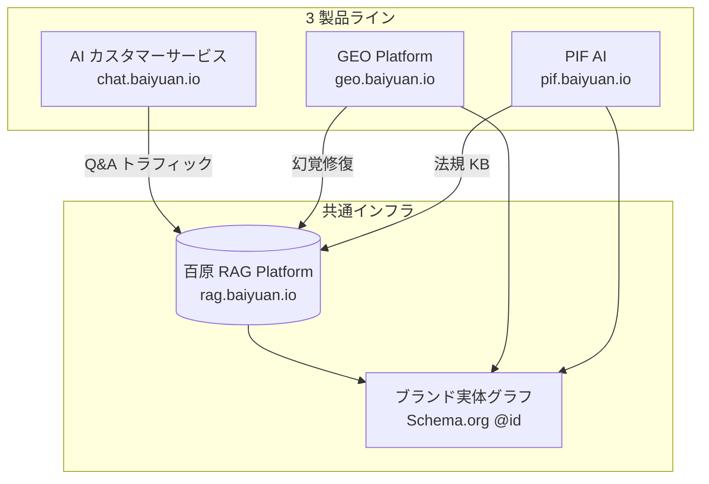

# 百原 RAG ナレッジプラットフォーム — 技術ホワイトペーパー

> マルチテナント AI SaaS のための L1 Wiki + L2 RAG 混合検索に関するホワイトペーパー
>
> [中文版](../zh-TW/) · [English version](../en/)

## エグゼクティブサマリー

本書は百原科技（Baiyuan Technology）が 2024–2026 年に開発した**百原 RAG ナレッジプラットフォーム**のエンジニアリング実践を記録する。本プラットフォームはマルチテナント知識検索インフラとして、以下 3 製品を共通で支える：

1. **百原 AI カスタマーサービス SaaS**（chat.baiyuan.io）
2. **百原 GEO Platform**（geo.baiyuan.io） — 姉妹ホワイトペーパー：<https://github.com/baiyuan-tech/geo-whitepaper>
3. **百原 PIF AI**（pif.baiyuan.io） — 台湾 TFDA 化粧品法規対応の Product Information File 自動化

コアアーキテクチャの貢献は**二層検索システム**：

- **L1 Wiki** — DB キャッシュ済み、LLM コンパイル済み、slug キーの構造化サマリー。約 40% の一般的な問い合わせを 500 ms 未満、ゼロ LLM コストで回答
- **L2 RAG** — pgvector コサイン検索 + PostgreSQL `tsvector` BM25 を Reciprocal Rank Fusion（k=60）で融合

Pilot テナントで従来型単層 RAG に対し、月額 LLM トークンコスト −40〜68%、幻覚率 −57%、P95 レイテンシ −51%（2026 Q1 計測）。

## 目次

### Part I — 問題とアーキテクチャ

- [第 1 章 — ナレッジベースの暗黒森林](ch01-dark-forest.md)
- [第 2 章 — 百原 RAG システム全景](ch02-system-overview.md)

### Part II — コアアルゴリズム

- [第 3 章 — L1 Wiki: DB キャッシュ型知識コンパイラ](ch03-l1-wiki.md)
- [第 4 章 — L2 RAG: pgvector + BM25 + RRF](ch04-l2-rag.md)
- [第 5 章 — L1→L2 フォールバックとトークン経済学](ch05-fallback-economics.md)

### Part III — エンジニアリング基盤

- [第 6 章 — 三層テナント分離](ch06-tenant-isolation.md)
- [第 7 章 — ナレッジ取り込みパイプライン](ch07-ingestion.md)
- [第 8 章 — ストリーミング応答と Handoff 閉ループ](ch08-stream-handoff.md)

### Part IV — エコシステム統合

- [第 9 章 — 百原 GEO との統合](ch09-geo-integration.md)
- [第 10 章 — 百原 PIF AI との統合](ch10-pif-integration.md)

### Part V — 現実の検証

- [第 11 章 — 匿名化テナント観察](ch11-case-studies.md)
- [第 12 章 — 限界・未解問題・今後の課題](ch12-limitations.md)

### 付録

- [A. 用語集](appendix-a-glossary.md)
- [B. 公開 API 規格](appendix-b-api.md)
- [C. 参考文献](appendix-c-references.md)
- [D. 図表索引](appendix-d-figures.md)

## 問題定義

企業が生成 AI を顧客サービス、知識検索、法規合規に導入すると、5 つのエンジニアリング課題に直面する：

1. **幻覚と事実不正確** — 規制業界（法務、医療、金融）では許容不可
2. **トークンコスト爆発** — 高 QPS で LLM API 料金が制御不能に
3. **マルチテナント分離** — A 社の知識が B 社の検索に絶対漏れてはならない
4. **異質な知識源** — PDF、Web、DB、API、Excel 全部を取り込む必要
5. **製品ラインごとの重複投資** — 3 製品それぞれに RAG = 3 倍のコスト

百原 RAG ナレッジプラットフォームはこれら 5 つへの統合的な工学的回答。

## 三つの柱

*Fig 0: RAG 基盤を共有する 3 製品の構成*

## 主要用語

| 用語 | 定義 |
|------|------|
| **L1 Wiki** | PostgreSQL 内の LLM コンパイル済み構造化サマリー。slug キー、~50 ms で応答 |
| **L2 RAG** | pgvector コサイン + BM25 tsvector + RRF 融合 |
| **RRF** | Reciprocal Rank Fusion: `score(d) = Σ 1/(k + rank_i(d))`, k=60 |
| **Wiki Compile** | chunks から wiki_pages を生成するオフラインバッチ |
| **Wiki Lint** | 事実矛盾、引用漏れを毎日 cron でチェック |
| **三層分離** | App ヘッダー + PostgreSQL RLS + SQL WHERE の多層防御 |
| **Handoff** | AI→人間の引き継ぎ五状態マシン（ai_active / pending / agent_active / ended） |
| **NLI** | 三値分類（entailment / contradiction / neutral）による幻覚検知 |
| **GEO** | Generative Engine Optimization（姉妹製品） |
| **PIF** | Product Information File（化粧品法規対応、姉妹製品） |

## 誰が読むべきか

| 読者 | 推奨ルート |
|------|----------|
| B2B 意思決定者（CIO/CTO） | 第 1, 2, 9, 10, 11 章 |
| エンジニアリングリード / アーキテクト | 第 2, 5, 6, 9, 10 章 |
| バックエンドエンジニア | 第 3, 4, 5, 7, 8 章 |
| AI / 学術研究者 | 第 3, 4, 12 章 |
| カスタマーサポート運用導入者 | 第 2, 8, 11 章 |

## 引用方法

**APA 7**

> Lin, V. (2026). *Baiyuan RAG Knowledge Platform: A whitepaper on L1 Wiki + L2 RAG hybrid retrieval for multi-tenant AI SaaS*. Baiyuan Technology. <https://github.com/baiyuan-tech/rag-whitepaper>

## ライセンス

**CC BY-NC 4.0**。商用利用は <services@baiyuan.io> まで。

---

*Baiyuan Technology Co., Ltd. · <https://baiyuan.io> · <services@baiyuan.io>*
