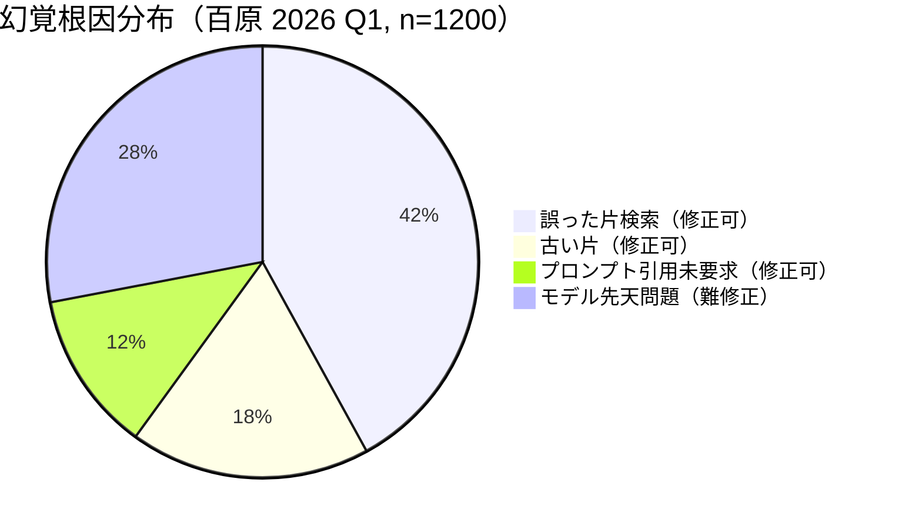
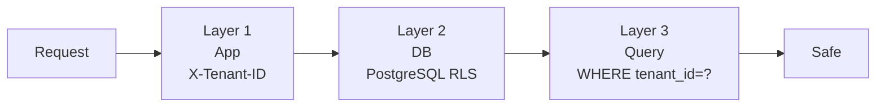

# 第 1 章 — ナレッジベースの暗黒森林

> 企業が PDF を ChatGPT に投げる。翌日、顧客が AI の価格間違い、返品ポリシーの説明逆転、A 社の機密を B 社に漏らしたことを発見する。これがナレッジベースの暗黒森林だ。

## 1.1 「PDF を ChatGPT に投げる」式 RAG の 5 つの死角

2024 年半ば以降、ほぼすべての企業 CTO が同じ要請を受けた：「当社の製品マニュアルを質問できる AI にしてください」。第一版実装はこんな感じ：

```python
documents = load_pdfs("docs/")
chunks = split_into_chunks(documents, size=500)
vectors = openai.embed(chunks)
qdrant.upsert(vectors)

def ask(question):
    q_vec = openai.embed(question)
    top_k = qdrant.search(q_vec, k=5)
    context = "\n".join(top_k)
    return openai.chat([
        {"role": "system", "content": "以下に基づいて回答"},
        {"role": "user", "content": f"{context}\n\n質問: {question}"}
    ])
```

第一週は魔法に見える。第一ヶ月には 5 つの死角が現れる：

1. **幻覚が残る**：Top-K が無関係な片を引くと、LLM が「流暢さのため」捏造で埋める
2. **トークンコスト爆発**：3,000 token × 1 万クエリ/日 × GPT-4o = 月 USD 18,000
3. **テナント横断汚染**：A と B の embedding が同じインデックスにあると漏洩発生
4. **PDF 以外の源が入らない**：Notion、Confluence、Excel、DB に新規パイプライン必要
5. **監査不能**：顧客が「AI が間違ってた」と言っても、工学側は当時取り込まれた片を見られない

個々は解けるが、全 5 つを SaaS マルチテナントで同時解決するのは **基盤**問題、プロンプト調整ではない。

## 1.2 幻覚の大半は基盤問題

エンジニアは「GPT-4o が嘘を作る」と言いがちだが、幻覚には 4 源：

| 源 | 責任 | 修正層 |
|----|------|-------|
| **モデル限界** | モデル | モデル切替 |
| **誤った片を検索** | 基盤 | 再現率向上、混合検索、Rerank |
| **古い片を検索** | 基盤 | バージョン、鮮度タグ |
| **LLM が片を超えて補完** | プロンプト工学 | 厳密引用、NLI 検証 |

**60% 超の幻覚は基盤で修正可能**（百原内部 2026 Q1）：



*Fig 1-1: 幻覚根因内訳*

本書の中核論点：42% + 18% を基盤問題として扱い、残 28% を NLI + ChainPoll（第 12 章）で処理する。

## 1.3 真のトークン料金

多くの RAG デモは「1 クエリ 3,000 token」で計算するが、企業規模の実際のコストカーブ：

| 規模 | クエリ/日 | 月 Token | GPT-4o 月費 |
|------|---------|---------|-----------|
| Pilot | 500 | 5M | ~USD 150 |
| 中小企業 | 5,000 | 50M | ~USD 1,500 |
| 中堅 SaaS | 50,000 | 500M | ~USD 15,000 |
| 大規模 CC | 500,000 | 5B | ~USD 150,000 |

だが大半は省ける：

1. **同一問いを異なるユーザが 1,000 回** → Redis answer cache（−50%+）
2. **言い換え問い** → Semantic Cache（−10〜20%）
3. **高頻度 80% 問いは固定答え** → **L1 Wiki 事前コンパイル**（−30〜50%）
4. **Wiki 命中なら LLM ゼロ**（−100%）

百原計測：**L1 命中率 35〜60% で月トークン費用は元の 20〜40% まで低下**。

## 1.4 マルチテナント分離：セキュリティは機能より重要

SaaS RAG は自社用 RAG と決定的に違う：**分離はオプション機能ではない**。4 つの実事件（匿名化、2024–2025）：

1. A 社従業員ハンドブックを B 社カスタマーボットが引用 → embedding index にコレクション分離なし
2. 企業横断機密漏洩 → SQLi で `WHERE tenant_id = ?` を回避
3. テナント削除後も旧 embedding 返却 → soft delete + vacuum 未実施
4. 管理コンソールが他テナントを誤検索 → app を superuser で接続

三層分離（第 6 章）に対応：



*Fig 1-2: 三層防御*

欠ければ穴が増える。

## 1.5 異質な知識源の工学代償

業務側で「ナレッジベース」は単純な言葉だが、工学側ではお化け屋敷。サポート源（第 7 章）：

| 源 | 例 | 難点 |
|----|----|------|
| テキスト貼付 | 従業員入力 FAQ | 形式混乱 |
| ファイル | PDF、Word、PPT、TXT | OCR、表、改行 |
| URL | マーケページ、Notion | JS、ログイン壁 |
| サイト巡回 | 定期全量クロール | robots、rate limit、重複 |
| Webhook | ERP/CRM 通知 | 増分、重複、バージョン |
| API | 内部マイクロサービス | 権限、schema drift |

これは RAG 製品ではなく **ナレッジ ETL プラットフォーム**。第 7 章で各パイプライン詳述。

## 1.6 なぜ製品ラインごとに RAG を作らないか

反直感的な工学判断。百原は 3 製品ライン：

- AI カスタマーサービス SaaS
- GEO Platform
- PIF AI

自然なアプローチは製品ごとに RAG を 1 つずつ。我々は**共通 RAG 基盤**を選択：

1. **知識は本質的に共通** — GEO の Ground Truth、CS の FAQ、PIF の成分毒理は同じブランドの事実
2. **Schema.org `@id`** が 3 層を横串で接続（Organization → Service → Person）
3. **バージョン管理統一** — ブランド紹介を 1 回更新すれば 3 製品同期
4. **工学投資が重複しない** — Wiki コンパイラ、混合検索、NLI 検証はコスト高い

代償：マルチテナント × マルチ製品の複雑度。第 9、10 章で統合パターンを分解。

## 1.7 本書のエンジニアリング命題

> **単一のマルチテナント RAG 基盤で、カスタマー Q&A、GEO 幻覚修復、PIF 法規建文書の 3 種異なる AI 応用を同時にサポートし、コスト、幻覚率、データ分離の 3 軸で本番級を達成するには？**

この命題が 12 章を貫く。

---

## 本章のポイント

- 「PDF 投入型」RAG には 5 つの死角
- 幻覚の約 60% は基盤で修正可能
- L1 Wiki 事前コンパイルで月トークン費用を 20〜40% まで圧縮
- マルチテナント分離は三層防御、どれを欠いても穴が増える
- 共通 RAG 基盤が 3 製品ラインを支える意図的アーキテクチャ

## 参考資料

- [pgvector][pgv] · [Stanford HELM][helm]

[pgv]: https://github.com/pgvector/pgvector
[helm]: https://crfm.stanford.edu/helm/

---

**ナビゲーション**：[📖 目次](./README.md) · [第 2 章 →](./ch02-system-overview.md)
