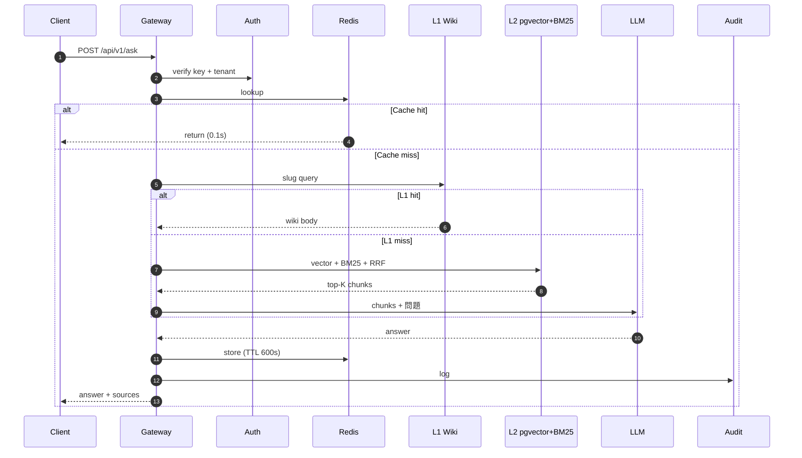
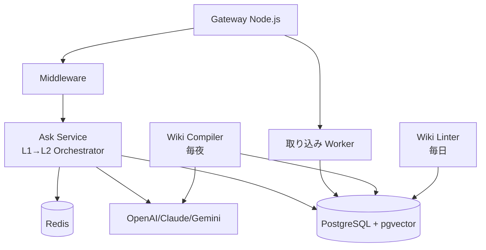
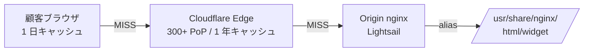

# 第 2 章 — 百原 RAG システム全景

> まず全体地図、次に部品。本章は後続 11 章の骨格。

## 2.1 一文でシステムを表現

百原 RAG ナレッジプラットフォームは、PostgreSQL + pgvector を中核、Redis をキャッシュ、Node.js を API、マルチテナント分離をセキュリティ底線、L1 Wiki + L2 RAG を検索主軸とする**共用 AI 知識基盤**。3 製品ラインは `X-RAG-API-Key` + `X-Tenant-ID` で同一能力にアクセス。

## 2.2 リクエストから応答までの経路



*Fig 2-1: `/api/v1/ask` シーケンス*

約 2/3 のクエリが LLM 生成に到達する前に終了する — これがトークン経済学の中核。

## 2.3 データベーススキーマ全景

| テーブル | 用途 | 主キー |
|---------|------|-------|
| `tenants` | テナント本体 | `id`, `api_key` |
| `knowledge_bases` | KB（テナント下） | `id`, `tenant_id`, `is_default` |
| `documents` | 原文書 | `id`, `kb_id`, `doc_type`, `status` |
| `chunks` | 切片 | `id`, `document_id`, `content`, `fts` |
| `embeddings` | ベクトル | `chunk_id`, `embedding vector(1536)` |
| `wiki_pages` | L1 ページ | `id`, `kb_id`, `slug`, `body` |
| `queries` | 監査ログ | `id`, `tenant_id`, `question`, `from_wiki` |

すべてのテナント関連テーブルで **PostgreSQL Row-Level Security** 有効（第 6 章）。

## 2.4 コンポーネント配置



*Fig 2-2: コンポーネント配置*

- Gateway: HTTP/SSE のみ、ビジネスロジック無
- Ask Service: L1→L2 オーケストレータ
- Ingestion Worker: バックグラウンドで PDF/URL/ファイル処理
- Wiki Compiler: オフラインバッチ、通常毎夜
- Wiki Linter: 毎日一貫性チェック

## 2.5 3 製品ラインの共通点

| 製品 | 用途 | 投入データ | 特殊要件 |
|------|------|----------|---------|
| AI CS | Q&A、Handoff サマリー | FAQ、製品マニュアル | SSE、<3s |
| GEO | 幻覚修復 GT | ブランド紹介、チーム、サービス | NLI、厳密引用 |
| PIF AI | 成分 / 毒理検索 | PubChem / ECHA / TFDA | 追跡可能引用、バージョンロック |

共通点：同一 `tenant_id` = 同一ブランド、Schema.org `@id` 相互参照、Wiki コンパイラ共用、API エンドポイント単一。

## 2.6 技術選定

| 決定 | 選択 | 代替 | 理由 |
|------|------|------|------|
| ベクトルストア | pgvector | Pinecone / Qdrant / Milvus | 同一 Postgres、txn、ops シンプル |
| メイン DB | PostgreSQL 16 | MySQL、CockroachDB | 成熟 pgvector、RLS、JSONB |
| 全文検索 | PG tsvector | Elasticsearch | サービス 1 つ削減 |
| 融合 | RRF (k=60) | 加重平均、ColBERT | ロバスト、調整不要 |
| キャッシュ | Redis 7 | Memcached | 共有、正確な TTL |
| 言語 | Node.js (TS) | Python、Go | chat-gateway と同一スタック |
| Wiki LLM | Claude Sonnet 4.6 | 小モデル | オフライン、品質重視 |
| 応答 LLM | ルーター（複数） | 単一ベンダー | コスト / 可用性分散 |
| デプロイ | Docker Compose / Lightsail | K8s | テナント規模、オーバーヘッド低 |
| 認証 | ヘッダベース API key | OAuth | 製品間呼び出し |

毎決定がトレードオフ。第 12 章でどれを見直すか議論。

---

## 2.7 Widget エッジ配信とキャッシュ戦略

AI カスタマーサポート製品ラインの Chat Widget は、**顧客**サイトの全ページに埋め込まれる約 35KB の JavaScript ファイルです。100 テナント × 各テナントサイト 10,000 PV/日 のスケールでは、**1 日約 100 万回**の widget 読み込みが発生します。これをすべて Lightsail 上の origin nginx が捌くと、プラットフォームの最初の流量ボトルネックとなります。

本プラットフォームは「**origin + CDN edge**」の 2 層キャッシュ構成を採用し、エンドユーザーのリクエストがほぼ origin に到達しない設計です。

### 2.7.1 ファイル配信経路



最善：ブラウザキャッシュで即時応答（< 10ms）。コールドスタート：CF 台北 PoP からの TTFB < 60ms。最悪：当該地域 PoP の初回 MISS でのみ origin を叩き、以降は PoP HIT。

### 2.7.2 キャッシュヘッダー設計

Origin nginx は `/widget/*` に対して以下を返します：

```http
Cache-Control: public, max-age=86400, s-maxage=31536000, immutable
Access-Control-Allow-Origin: *
```

| ディレクティブ | 対象 | 意味 | 設計理由 |
|----------|------|------|---------|
| `max-age=86400` | ブラウザ | 1 日後に再検証 | バグ修正の迅速展開をサポート |
| `s-maxage=31536000` | 共有 CDN | 1 年 | edge HIT 率 → 100%、origin 再要求ほぼゼロ |
| `immutable` | ブラウザ | TTL 内の再検証なし | 条件付き GET を省略、RTT 削減 |

Cloudflare Cache Rule で edge TTL を `Override origin → 1 year` に強制。Free plan でも edge が確実に 1 年保持されます。

### 2.7.3 CORS とバージョン戦略

Widget はクロスオリジンで読み込まれるため `Access-Control-Allow-Origin: *` が必須。これは**公開リソース**で秘密情報を含まず、テナント識別は実行時に `window.BAIYUAN_WIDGET.tenantKey` で渡します。

現在の戦略：**バージョンなし URL + 短いブラウザ TTL**。

- ✅ 長所：URL は恒久、顧客の埋め込みコード変更不要
- ❌ 短所：バグ修正後、顧客は 1 日のブラウザ TTL 経過後に新版を取得
- 🔄 アップグレード：`chat-widget.v{SEMVER}.js` へ切替後、ブラウザ TTL を 1 年に延長可能

### 2.7.4 無効化と Purge

- **ブラウザ**：URL 変更（バージョン付与）→ 再取得；または `max-age` 経過を待つ
- **CF edge**：Dashboard → Caching → Purge Everything / Custom Purge（URL 単位）；または CF API で自動化
- **Origin**：ファイルは `/home/ubuntu/cs-widget/dist/` に配置、nginx に `:ro` マウント、`docker compose up -d --no-deps nginx` でホットリロード

### 2.7.5 実測性能

| 指標 | 数値（台北 PoP、CF HIT） |
|------|-------|
| TTFB | < 60ms |
| Total | < 70ms |
| Origin 再要求率 | < 0.1% |
| Edge HIT 率 | > 99.9% |

---

## 本章のポイント

- システム = PG + pgvector + Redis + Node.js + L1/L2 Hybrid
- リクエスト速度はキャッシュ → L1 → L2 の段階で決まる
- すべてのテナントテーブルは RLS、マルチテナント安全の第一防線
- 3 製品ラインが基盤を共有するのは意図的判断
- 主要な選定はすべてトレードオフ
- Chat Widget は origin nginx + Cloudflare edge の 2 層キャッシュで配信、TTFB < 60ms、origin 再要求率 < 0.1%

## 参考資料

- [pgvector][pgv] · [RRF 論文][rrf] · [PostgreSQL RLS][rls]

[pgv]: https://github.com/pgvector/pgvector
[rrf]: https://plg.uwaterloo.ca/~gvcormac/cormacksigir09-rrf.pdf
[rls]: https://www.postgresql.org/docs/current/ddl-rowsecurity.html

---

**ナビゲーション**：[← 第 1 章](./ch01-dark-forest.md) · [📖 目次](./README.md) · [第 3 章 →](./ch03-l1-wiki.md)
