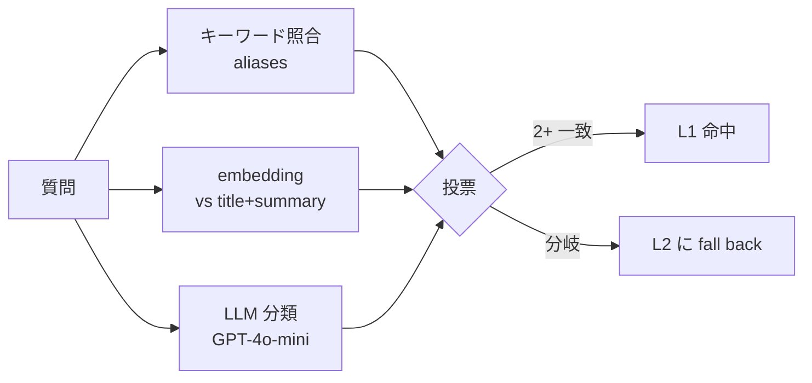
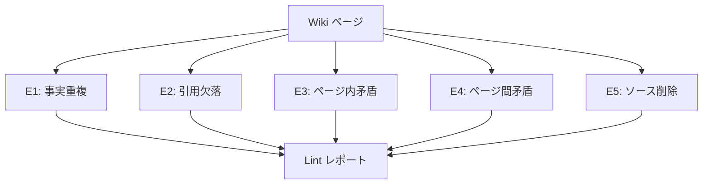

# 第 3 章 — L1 Wiki: DB キャッシュ型知識コンパイラ

> 80% の問いに固定答えがあるなら、なぜ毎回 embedding 検索して 5 片を LLM に送るのか。L1 Wiki は逆発想：事前に答えを組み立て、クエリ時はそのまま返す。

## 3.1 MediaWiki からのヒント

Wikipedia には見過ごされがちな洞察がある：**人間の知識の 80% は固定構造を持つ**。「Apple 社」には必ず設立年、本社、CEO、主力製品がある。従来 RAG はこれを 500 token 片に分解し、クエリごとにパズルを組み直す — 同一パズルを 1,000 回解くのは無駄。

L1 Wiki の逆転：**オフラインでパズルを組み立て、クエリ時にそのまま返す**。夜間バッチが：

1. KB の全 `documents` をスキャン
2. 事前定義の slug 一覧（手動または LLM 生成）に対し
3. 関連 chunks を LLM に送り、構造化サマリー生成
4. `(kb_id, slug)` をキーに `wiki_pages` へ保存

クエリ時、問いが slug にマップできれば **wiki body を直接返す** — L2 不使用。

## 3.2 Wiki データモデル

```sql
CREATE TABLE wiki_pages (
    id               UUID PRIMARY KEY DEFAULT gen_random_uuid(),
    tenant_id        UUID NOT NULL,
    kb_id            UUID NOT NULL,
    slug             TEXT NOT NULL,
    title            TEXT NOT NULL,
    aliases          TEXT[] NOT NULL DEFAULT '{}',
    body             TEXT NOT NULL,
    summary          TEXT NOT NULL,
    source_chunks    UUID[] NOT NULL,
    token_count      INT NOT NULL,
    compiled_at      TIMESTAMPTZ NOT NULL,
    compiled_by      TEXT NOT NULL,
    compiled_prompt  TEXT NOT NULL,
    lint_status      TEXT NOT NULL DEFAULT 'pending',
    lint_errors      JSONB,
    version          INT NOT NULL DEFAULT 1,
    UNIQUE(kb_id, slug)
);
CREATE INDEX idx_wiki_aliases ON wiki_pages USING GIN(aliases);
ALTER TABLE wiki_pages ENABLE ROW LEVEL SECURITY;
```

3 つの設計：`aliases` を GIN インデックス付き配列、`source_chunks` で追跡、`compiled_prompt` でバージョン A/B。

## 3.3 コンパイラ

```typescript
async function compileWiki(kb) {
  const slugs = await planSlugs(kb);
  for (const slug of slugs) {
    const existing = await findPage(kb.id, slug);
    const chunks = await findRelevantChunks(kb, slug);
    const fp = hashChunks(chunks);
    if (existing?.fingerprint === fp) continue;  // 変更なしスキップ
    const page = await llmCompile({
      model: 'claude-sonnet-4-6',
      prompt: COMPILE_PROMPT_V2,
      slug, chunks,
      existingBody: existing?.body,
    });
    await upsertPage(kb.id, slug, page, fp);
    await enqueueLint(page.id);
  }
}
```

Fingerprint スキップでコスト制御、既存 body 提供で差分更新、Lint 非同期で worker 解放。

### 3.3.1 コンパイルプロンプト

```text
[SYSTEM]
あなたは知識コンパイラ。複数 chunks を構造化 Wiki ページに統合する。

規則：
1. Markdown 出力
2. 最初の文は 80 字以内のサマリー
3. 見出し、リスト、表で本体構成
4. 事実主張末尾に [chunk_id] 付記
5. chunks 間矛盾は「注意事項」に明記
6. chunks 外の情報を作らない
```

## 3.4 Slug と意図の整合

### 3.4.1 手動 slug 一覧

```yaml
slugs:
  - slug: return-policy
    title: "返品ポリシー"
    aliases: ["返金フロー", "返品方法", "返品期間"]
    category: policy
```

### 3.4.2 LLM 自動生成

「このナレッジベースで最も問われそうなトピック 30–50 個を JSON で出力せよ」。

### 3.4.3 クエリ時の 3 路投票



*Fig 3-1: 3 路投票*

## 3.5 Wiki Lint



*Fig 3-2: 5 種チェック*

| エラー | 検出 | 対応 |
|-------|------|------|
| E1 重複 | LLM セクション比較 | 警告のみ |
| E2 引用欠落 | Regex カバレッジ | ブロック + 再コンパイル |
| E3 内部矛盾 | NLI 三値分類 | ブロック + 人手審査 |
| E4 ページ間矛盾 | ページ間 NLI | 警告 + レビュー |
| E5 ソース失効 | JOIN soft-delete | ブロック + 再予定 |

## 3.6 命中判定

L1 命中 3 条件：slug 投票、`lint_status=passed` かつ `compiled_at >= chunks.updated_at`、テナント / KB 一致。

命中応答：

```json
{"from_wiki": true, "answer": "...", "tokens": {"prompt": 0, "completion": 0}}
```

**純 L1 命中で LLM 呼び出しゼロ**。

### 3.6.1 L1 + サマリー

Wiki body 長（>500 token）時は LLM に要約依頼。L2 より 80% トークン節約。

## 3.7 投資回収

| 指標 | 単層 L2 | L1 + L2 | 差 |
|------|--------|---------|---|
| 平均レイテンシ | 2.8 s | 1.2 s | −57% |
| P95 レイテンシ | 6.5 s | 3.2 s | −51% |
| 月 Token 費 | USD 15,000 | USD 4,800 | −68% |
| L1 命中率 | N/A | 38–52% | — |
| 幻覚率 | 4.2% | 1.8% | −57% |

Wiki ページは lint 検証済みのため、幻覚率も下がる。

---

## 本章のポイント

- L1 Wiki は逆発想：構造化答えを事前生成
- `(kb_id, slug)` キー、aliases GIN インデックス
- Fingerprint スキップでコスト制御、差分コンパイル対応
- 3 路投票で命中判定
- Lint 5 種で品質ガード
- 実測：レイテンシ −57%、コスト −68%、幻覚 −57%

---

**ナビゲーション**：[← 第 2 章](./ch02-system-overview.md) · [📖 目次](./README.md) · [第 4 章 →](./ch04-l2-rag.md)
