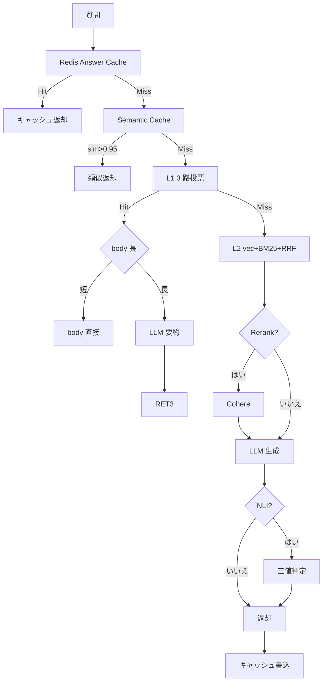
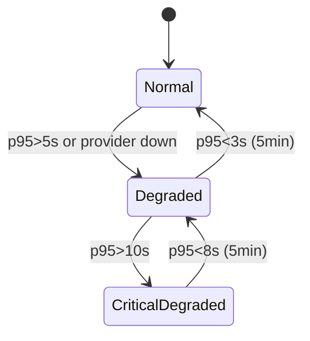

# 第 5 章 — L1→L2 フォールバックとトークン経済学

> 二層検索は独立 2 システムではなく、動的コスト／精度トレードマシン。請求書を見せる。

## 5.1 完全なフォールバックツリー



*Fig 5-1: 7 層フォールバックツリー*

各ノードの命中率と遅延（百原 Pilot、2026 Q1、50 万クエリ）：

| ノード | 次段遷移率 | 平均遅延 | コスト |
|-------|----------|---------|-------|
| Answer Cache | 28% | 45 ms | ほぼ 0 |
| Semantic Cache | 8% | 120 ms | embedding |
| L1 Wiki | 35% | 320 ms | 小モデル分類 |
| L2 検索 | 100% | 680 ms | pg 検索 |
| Rerank | 100% | +250 ms | Cohere API |
| LLM 生成 | 100% | 1,800 ms | **主コスト** |
| NLI 検証 | 100% | +180 ms | NLI モデル |

**約 2/3 のクエリが LLM 生成到達前に終了**。

## 5.2 コスト／遅延モデル

月 30 万クエリで：

```text
キャッシュ 28%: $0.84
Semantic 6%: $0.90
L1 24%: $14.40
L2 42%: $1,008
合計 ≈ $1,024
```

L1 なしだと $1,729。**節約 40.7%** — SaaS 粗利で 60% → 75%+ の差。

## 5.3 3 層キャッシュ

### 5.3.1 Answer Cache（Redis）

```typescript
const key = `ans:${sha256(`${tenant}:${kb}:${normalize(q)}`)}`;
const cached = await redis.get(key);
if (cached) return JSON.parse(cached);
// ...
await redis.setex(key, 600, JSON.stringify(answer));
```

### 5.3.2 Semantic Cache（pgvector）

言い換え問いをカバー。`sim > 0.95` で命中。

### 5.3.3 Wiki Cache

構造化、ガバナンス付きキャッシュ。Answer Cache との差：粒度（単一クエリ vs トピック）、命中条件（字面 vs 意味）、更新（受動 vs 能動）、監査可能性。

## 5.4 マルチプロバイダ LLM ルーター

```yaml
llm_routing:
  default: claude-sonnet-4-6
  fallback: [gpt-4o, gemini-2.0-flash]
  rules:
    - if: question.lang == "ja"
      use: gpt-4o
    - if: question.category == "legal"
      use: claude-opus-4-7
```

```typescript
async function routeLLM(req) {
  for (const p of providers) {
    try { return await p.complete(req); }
    catch (err) { if (isRetryable(err)) continue; throw err; }
  }
}
```

リトライ判定、サーキットブレーカー（3 連続失敗で 5 分停止）、リクエスト形状統一。

## 5.5 降格モード



*Fig 5-2: 3 段階降格*

- **Normal**：全パイプライン
- **Degraded**：Rerank 停止、中階モデル
- **CriticalDegraded**：L1 のみ、miss で canned message

## 5.6 実月請求

3 Pilot テナント、3 ヶ月：

| テナント | タイプ | クエリ/月 | L1 | キャッシュ | USD/月 | L1 なし推定 |
|---------|--------|---------|----|----------|-------|-----------|
| A | 電商 CS | 380,000 | 52% | 31% | 680 | 1,820 |
| B | 技術ドキュ | 120,000 | 38% | 22% | 450 | 920 |
| C | 医療（NLI on） | 55,000 | 41% | 18% | 320 | 710 |

観察：L1 命中率は知識構造化度と相関、キャッシュ命中率は業界反復率と相関、NLI 追加で 18% 増で幻覚 0.4% まで低下。

---

## 本章のポイント

- フォールバックは 7 層：Cache → Semantic → L1 → L2 → Rerank → LLM → NLI
- 2/3 クエリが LLM 生成到達前に終了
- キャッシュ 3 層：answer / semantic / Wiki
- ルーターでマルチプロバイダ切替
- 3 段階降格モードで高負荷対応
- L1 + キャッシュで月費用 −40〜60%

---

**ナビゲーション**：[← 第 4 章](./ch04-l2-rag.md) · [📖 目次](./README.md) · [第 6 章 →](./ch06-tenant-isolation.md)
