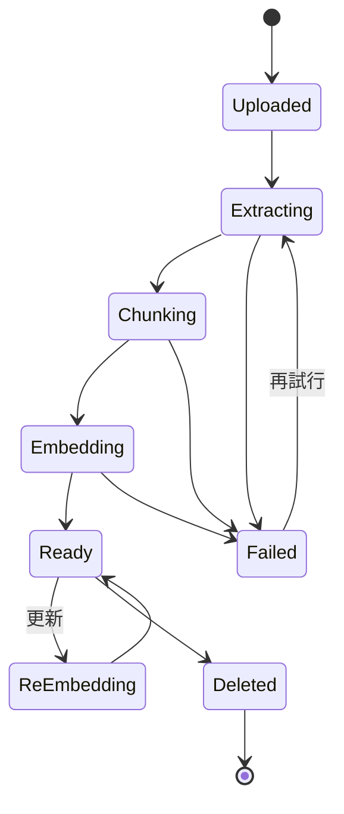
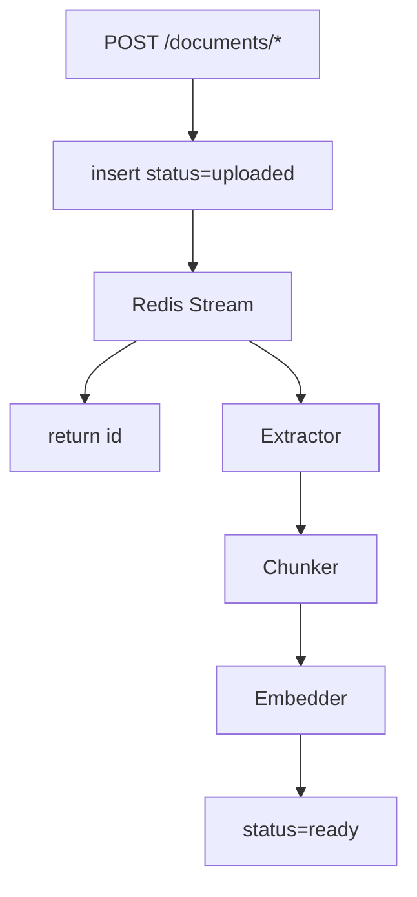

# 第 7 章 — ナレッジ取り込みパイプライン

> 「PDF を質問可能に」は顧客が言う。「Notion、公式サイト、ERP、毎月 Excel」は後から言われる。6 種異質源を処理する。

## 7.1 Document 状態機械



*Fig 7-1: Document ライフサイクル*

```sql
CREATE TABLE documents (
    id UUID PRIMARY KEY, tenant_id UUID, kb_id UUID,
    title TEXT, doc_type TEXT,  -- text|url|file|scraped|auto_push|api
    source_uri TEXT, file_name TEXT, file_size BIGINT,
    char_count INT, chunk_count INT,
    status TEXT DEFAULT 'uploaded', error TEXT,
    source_hash TEXT,
    ingested_at TIMESTAMPTZ, ready_at TIMESTAMPTZ, deleted_at TIMESTAMPTZ,
    created_at TIMESTAMPTZ DEFAULT now()
);
```

## 7.2 6 種の取り込み源

### 7.2.1 テキスト貼付

```http
POST /api/v1/documents/text
{"knowledge_base_id":"uuid","title":"返品 2026 版","content":"..."}
```

### 7.2.2 ファイルアップロード

| 種類 | 拡張子 | 抽出器 |
|------|-------|-------|
| PDF | .pdf | pdfjs + OCR |
| Word | .doc/.docx | mammoth |
| PowerPoint | .ppt/.pptx | pptx-parser |
| Excel | .xls/.xlsx | xlsx |
| テキスト | .txt/.md | 直接 |
| HTML | .html | cheerio |

### 7.2.3 URL インポート

Puppeteer で JS レンダー、PDF はファイルパイプへ、その他 reject。

### 7.2.4 サイトクロール

```mermaid
flowchart LR
    ROOT --> Q[BFS Queue]
    Q --> FETCH --> ROBOTS{robots.txt}
    ROBOTS -->|allow| PARSE --> EXTRACT[@mozilla/readability]
    EXTRACT --> LINKS --> Q
    EXTRACT --> DOC
```

Readability でメイン抽出、URL / content hash で重複削除、1 req/s/site。

### 7.2.5 Webhook Push

HMAC-SHA256 署名検証：

```typescript
const expected = hmacSha256(rawBody, tenant.webhook_secret);
if (!timingSafeEqual(req.headers['x-webhook-signature'], expected)) {
  return res.status(401).send('invalid signature');
}
```

### 7.2.6 API Pull

Notion / Confluence / Zendesk：`external_id + version` で変更検出。

## 7.3 OCR パイプライン

PDF 3 分類：

| 分類 | 抽出 |
|------|------|
| テキスト PDF | pdfjs |
| 混在 | pdfjs + 画像 OCR |
| 画像のみ | Google Vision OCR |

検出：先頭 3 頁 < 300 文字 = 画像のみ。Google Vision を選択（中文 96% vs Tesseract 82%、段落構造保持、$1.50/1000 頁）。

## 7.4 バックグラウンド Worker



*Fig 7-3: 取り込みパイプライン*

3 ステージ Worker が独立水平スケール。Redis Streams 選択理由：既存、Consumer group、XLEN 可視化。

## 7.5 増分更新と重複削除

- **Source hash**：`sha256(raw)` で重複スキップ
- **external_id + version**：webhook / API sync で旧 chunks を soft-delete
- **増分 embedding**：新規／変更 chunks のみ API 呼び出し

## 7.6 失敗処理と再試行

| エラー | 原因 | 戦略 |
|-------|------|-----|
| OCR 失敗 | 破損、Vision rate limit | 3 回、指数退避 |
| Embedding 失敗 | OpenAI rate limit | Worker 60s 停止、再キュー |
| Parse 失敗 | 対応外形式 | 即 fail、ユーザ通知 |
| Wiki compile 失敗 | LLM エラー | 前版ロールバック、`lint_status=failed` |

Dead Letter Queue：3 回超失敗 → 日次レポート人手審査。

---

## 本章のポイント

- 状態機械：Uploaded → Extracting → Chunking → Embedding → Ready
- 6 種源：text / file / url / scraped / webhook / api
- PDF タイプは先頭頁文字数で判定、画像のみは Google Vision OCR
- 3 ステージ worker 独立水平スケール
- source_hash + external_id + version で多層重複削除
- DLQ + 指数退避で安定性確保

---

**ナビゲーション**：[← 第 6 章](./ch06-tenant-isolation.md) · [📖 目次](./README.md) · [第 8 章 →](./ch08-stream-handoff.md)
