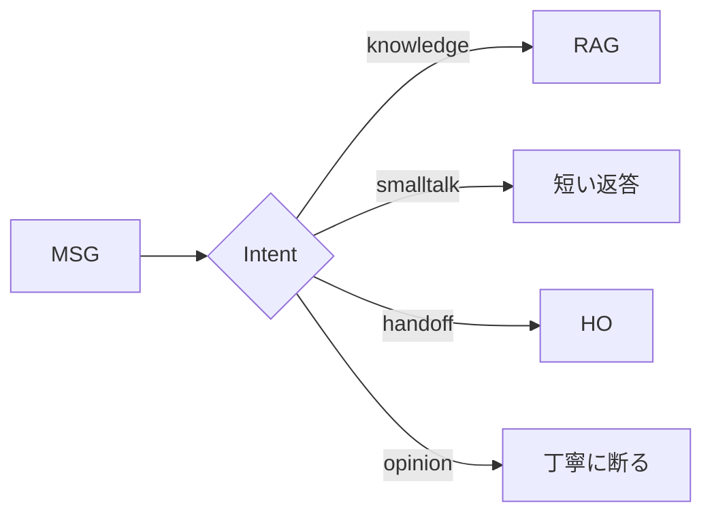
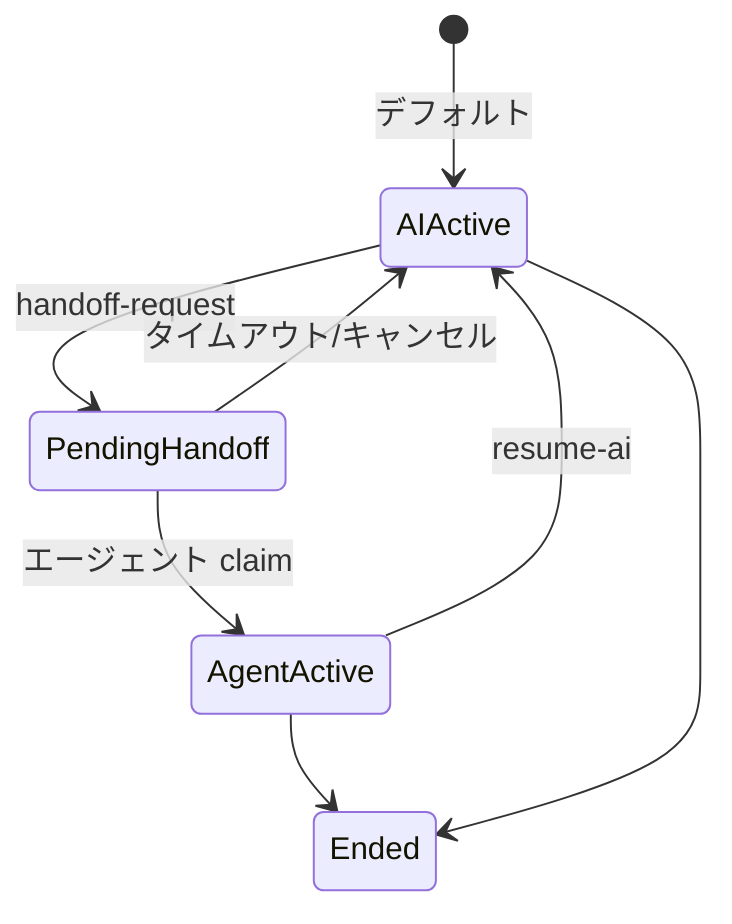
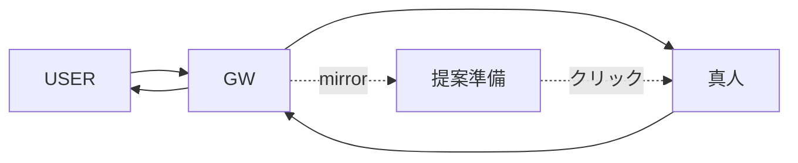

# 第 8 章 — ストリーミング応答と Handoff 閉ループ

> 遅い AI は顧客を失う。答えない AI は怒らせる。両方を解く。

## 8.1 ストリーミングの重要性

| 体感 | 非ストリーム | ストリーム |
|------|-----------|----------|
| 最初の token | 3–5 s | 0.3–0.8 s |
| 主観的待機感 | 不安 | 進行中 |
| キャンセル率 | 12% | 3% |

実装コストは低い（LLM API が `stream:true` サポート）。工学コストは Gateway SSE 処理、検索段階での早期 start イベント、Wiki L1 ヒット時の即返却。

## 8.2 SSE イベント

```text
event: start
data: {"conversation_id":"uuid","intent":"knowledge"}

event: delta
data: {"content":"当社の"}

event: delta
data: {"content":"返品ポリシーは"}

event: ping
data: {}

event: done
data: {"message_id":"uuid","answer":"...","sources":[...]}
```

### 8.2.1 nginx 設定

```nginx
location /api/v1/ask {
    proxy_pass http://rag_backend;
    proxy_buffering off;
    proxy_cache off;
    proxy_set_header X-Accel-Buffering no;
    proxy_http_version 1.1;
    chunked_transfer_encoding off;
}
```

`X-Accel-Buffering: no` が命脈。

### 8.2.2 再接続

ネイティブ SSE は `Last-Event-ID`。RAG では半途断線で再答え直すため、クライアントは 2s 後に 1 回再試行、失敗なら「再接続」ボタン。

## 8.3 会話メモリ

Redis LIST に最近 N 回（デフォルト 6）：

```typescript
const key = `conv:${conversationId}`;
const history = await redis.lrange(key, 0, 11);
const prompt = history.map(m => `${m.role === 'user' ? 'ユーザ' : 'AI'}: ${m.content}`).join('\n');
const augmentedQ = `[文脈]\n${prompt}\n\n[現在]\n${question}`;
```

3 つの詳細：N 可設定、Token 上限 3,000、24h TTL。

### 8.3.1 Intent Routing



小モデル分類（~$0.0001/回）で 15–20% の不要 RAG 呼び出しを削減。

## 8.4 Handoff 五状態



*Fig 8-2: 五状態*

トリガー：ユーザ明示要求、intent 判定、AI confidence < 0.3 × 3、legal / compliance キーワード自動エスカレート。

## 8.5 Mirror モード



*Fig 8-3: Mirror モード*

AI 提案は自動送信せず、真人がクリックして使用。`mirror_human_reply` デフォルト true。

## 8.6 Handoff Summary

エージェントが対話を claim した時、AI が自動サマリー：

```text
[PROMPT]
真人エージェント向けサマリー JSON を生成。
フィールド: customer_name, main_question, context_facts[],
          pending_facts[], suggested_actions[] (≤3),
          sentiment (neutral|frustrated|urgent)
対話:
{transcript}
```

Agent Console 左パネルに表示。

### 8.6.1 Resume-AI

```http
POST /api/v1/sessions/{conv_id}/resume-ai
{"agent_email":"alice@acme.example"}
```

状態：agent_active → ai_active、AI は人間返答を含む全履歴を見る。

---

## 本章のポイント

- SSE ストリーミングでキャンセル率 75% 減、nginx `X-Accel-Buffering: no` 必須
- 会話メモリは Redis、N 可設定、24h TTL
- Intent classifier が 15–20% 不要 RAG を除外
- Handoff 五状態：ai_active / pending / agent_active / ended
- Mirror モードで AI が真人を補助
- Handoff Summary で真人が即座に文脈理解

---

**ナビゲーション**：[← 第 7 章](./ch07-ingestion.md) · [📖 目次](./README.md) · [第 9 章 →](./ch09-geo-integration.md)
