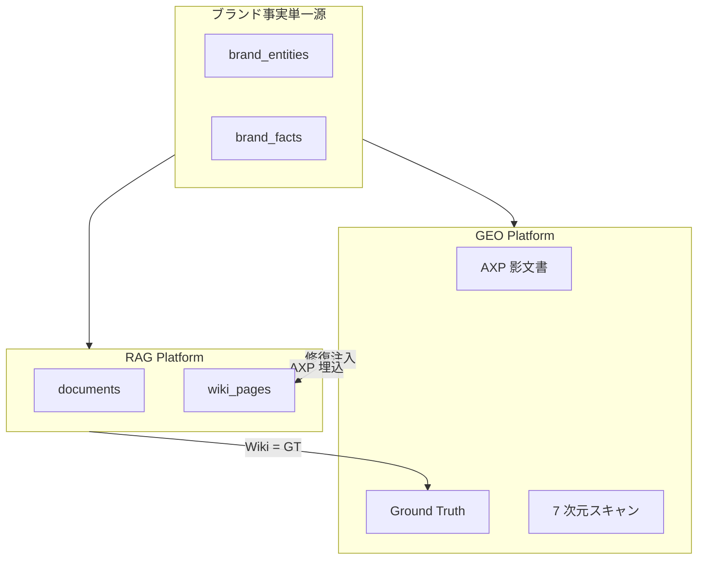
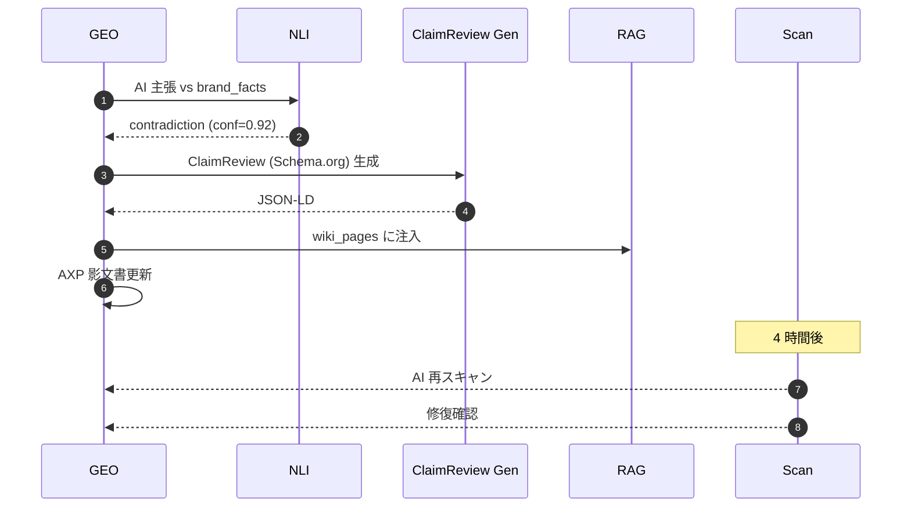

# 第 9 章 — 百原 GEO との統合

> GEO は AI 回答中のブランド言及を実現する。RAG は AI が正しい事実を見ることを保証する。一体両面。

## 9.1 深い統合の理由

GEO Platform（姉妹ホワイトペーパー：<https://github.com/baiyuan-tech/geo-whitepaper>）は 7 次元 AI 引用率採点、AXP 影文書、閉ループ幻覚修復を担当。RAG は L1 Wiki + L2 検索、マルチテナントを担当。**ブランド事実を共有する**。



*Fig 9-1: 共有 + 双方向フロー*

## 9.2 共有ブランド実体モデル

```sql
CREATE TABLE brand_entities (
    id UUID PRIMARY KEY, tenant_id UUID NOT NULL,
    entity_type TEXT,  -- Organization / Service / Person / LocalBusiness
    schema_id TEXT, name TEXT, description TEXT,
    properties JSONB, sameAs TEXT[],
    created_at TIMESTAMPTZ, updated_at TIMESTAMPTZ
);

CREATE TABLE brand_facts (
    id UUID PRIMARY KEY, tenant_id UUID, entity_id UUID,
    claim TEXT, evidence TEXT, evidence_url TEXT,
    verified_by TEXT, verified_at TIMESTAMPTZ, confidence REAL
);
```

`brand_facts` が権威源、RAG Wiki と GEO GT の両方が参照。

## 9.3 Ground Truth 閉ループ



*Fig 9-2: 閉ループ修復*

ポイント：NLI 三値（contradiction のみ修復トリガー）、ClaimReview は schema.org 型、RAG が注入点で自社 CS も一貫事実参照。

## 9.4 Schema.org @id 三層相互リンク

```json
{
  "@graph": [
    {"@type": "Organization", "@id": "https://acme.example/#org",
     "hasOfferCatalog": {"@id": "https://acme.example/#catalog"},
     "employee": [{"@id": "https://acme.example/team/alice#person"}]},
    {"@type": "Service", "@id": "https://acme.example/#service-consulting",
     "provider": {"@id": "https://acme.example/#org"}},
    {"@type": "Person", "@id": "https://acme.example/team/alice#person",
     "worksFor": {"@id": "https://acme.example/#org"}}
  ]
}
```

AXP 影文書が HTML `<head>` に注入、RAG Wiki body が同じ `@id` を引用。AI クローラはこれを強い知識グラフ信号と認識。

## 9.5 幻覚検知 → RAG 自動修復

シナリオ：

1. 顧客が chat.baiyuan.io で「CEO は？」
2. RAG Wiki `company-overview` に CEO 情報なし
3. L1 miss → L2 chunks にも情報なし → LLM 「Bob Smith」捏造
4. 別路：GEO が ChatGPT スキャンでも「Bob Smith」検出
5. brand_facts は「Alice Wang」
6. GEO トリガー修復：`CEO: Alice Wang` を RAG の `company-overview` に追加
7. 次の顧客問いは Wiki hit で「Alice Wang」✓

```typescript
await rag.api.post('/api/v1/wiki/patch', {
  tenant_id, kb_id,
  slug: 'company-overview',
  patch: {section: 'leadership', content: 'CEO: Alice Wang（2020 年〜）',
          source_claim_id: claim.id, confidence: 0.98},
});
```

**2026 Q2 本番投入**。

## 9.6 共有メトリクス

| 指標 | ソース | 意味 |
|-----|-------|------|
| AI 引用率 (GEO) | 7 次元スキャン | AI プラットフォームでの言及率 |
| 事実正確率 (GEO) | NLI 検証 | 言及時の正しさ |
| Wiki カバー率 (RAG) | RAG コンパイル統計 | brand_facts を Wiki 化した比率 |
| CS 命中率 (RAG) | クエリログ | CS 問いに回答できた率 |
| 修復レイテンシ | 注入→次スキャン検証 | AI が言い直すまでの日数 |

5 軸で「ブランド AI 健康度」を定量化。

---

## 本章のポイント

- GEO と RAG は `brand_entities` / `brand_facts` を単一権威源として共有
- RAG L1 Wiki が GEO の Ground Truth を兼ねる
- Schema.org `@id` 三層相互リンクが AXP + Wiki 共通のブランド知識グラフ信号
- GEO が幻覚検知後に RAG Wiki を自動 patch（2026 Q2 投入）
- 5 軸ダッシュボードで「ブランド AI 健康度」を定量化

---

**ナビゲーション**：[← 第 8 章](./ch08-stream-handoff.md) · [📖 目次](./README.md) · [第 10 章 →](./ch10-pif-integration.md)
