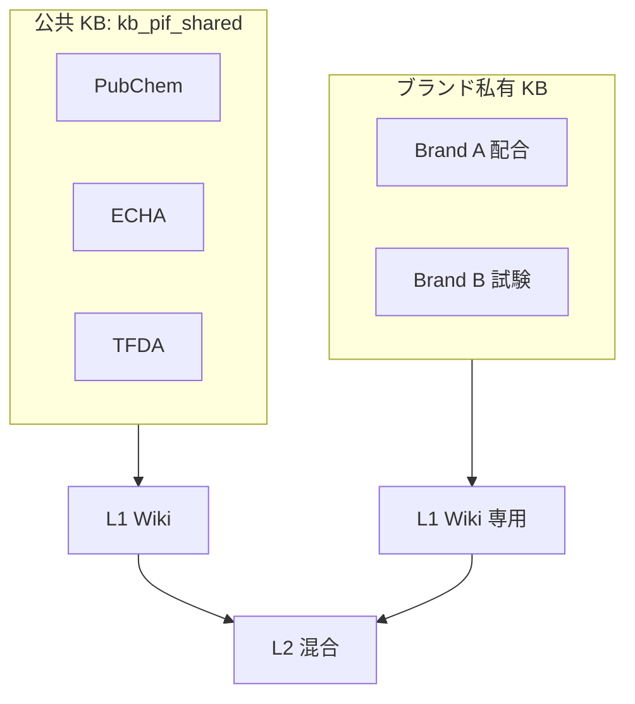
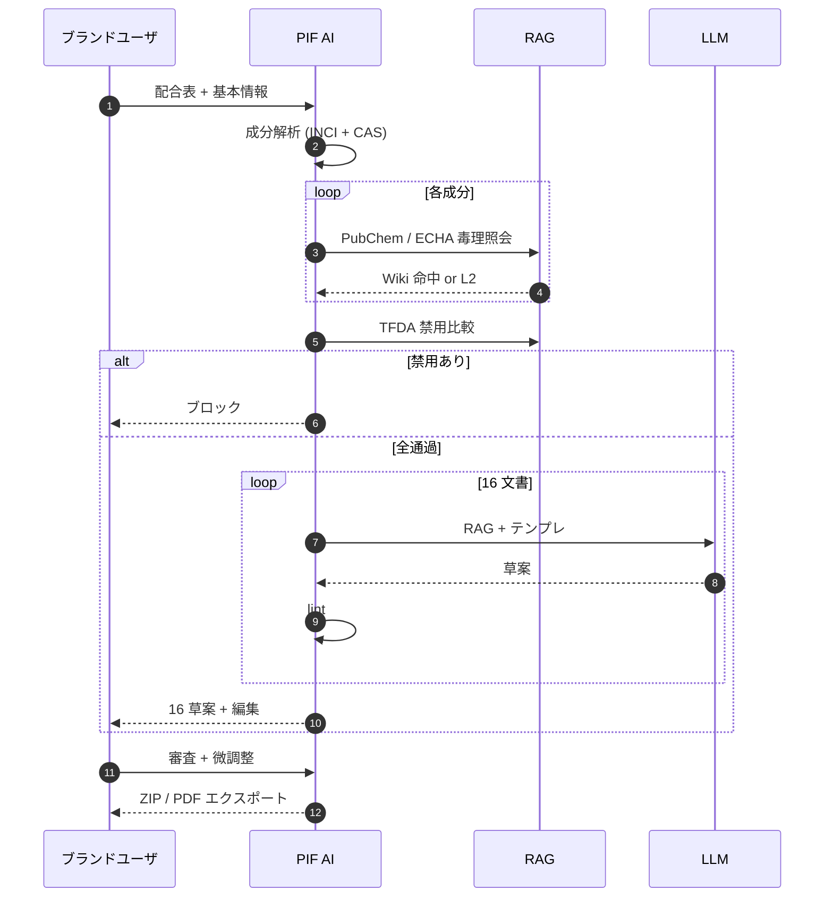

# 第 10 章 — 百原 PIF AI との統合

> 台湾化粧品業者は 2026 年 7 月までに Product Information File を備える必要がある。従来の人手は 4–8 週、PIF AI は RAG で 3–5 日。理由を述べる。

## 10.1 化粧品 PIF 法規背景

台湾 TFDA（化粧品衛生安全管理法）は上市前に **Product Information File（PIF、製品情報ファイル）** の 16 項目文書整備を要求：

| # | 文書 |
|---|------|
| 1 | 製品情報サマリー |
| 2 | INCI 成分リスト + CAS 番号 |
| 3 | 物理化学特性 |
| 4 | 微生物品質試験 |
| 5 | 包装材料仕様 |
| 6 | バッチ安定性 |
| 7 | 安全性評価（毒理学） |
| 8 | 有害反応履歴 |
| 9 | GMP 証明 |
| 10 | ラベル審査 |
| 11 | 使用方法 |
| 12 | R&D とバッチ情報 |
| 13 | リスク評価 |
| 14 | 防腐効能試験 |
| 15 | 重金属 / 禁用物質検査 |
| 16 | 動物試験代替声明 |

**期限**：2026 年 7 月 1 日。PIF 無しは販売禁止。影響ブランド 5,000+。多数の中小企業は USD 3,000+、4–8 週のコンサル費用を負担できない。

PIF AI（<https://pif.baiyuan.io>）は百原の SaaS 回答：3–5 日、コンサル費の 20% 未満。

## 10.2 なぜ RAG が要

| 次元 | 一般 CS RAG | 法規 RAG |
|-----|-----------|---------|
| 幻覚許容 | 中（事後修正） | ゼロ（法的リスク） |
| 回答長 | 100–500 字 | 1,000–5,000 字 |
| 引用厳密度 | 一般 | 段落 / 法令番号レベル |
| 更新頻度 | 月 | 週 |
| 監査 | 任意 | TFDA 必須 |

百原 RAG は**監査可能・追跡可能・バージョン可能**設計、法規自然親和。

## 10.3 3 つの外部知識源

### 10.3.1 PubChem

- 1.5 億化合物の物性、毒理、安全性
- PubChem API（REST）+ クローラフォールバック
- 月次全量、日次増分
- 化合物ごとに chunk + プロパティレベル子 chunks

### 10.3.2 ECHA

REACH 登録、CLP 分類、SVHC 高懸念物質リスト。週次 XML dump sync。

### 10.3.3 TFDA

化粧品禁用 / 制限成分、有害反応通知、法規変動。サイトクロール + 新公告の人手確認。

合計 200 万 chunks 規模。`kb_pif_shared` として全 PIF AI テナント共用。各ブランドは私有 KB（配合、試験報告）も持ち、三層テナント分離適用。



*Fig 10-1: 公 + 私の二重 KB*

## 10.4 16 文書生成パイプライン



*Fig 10-2: 16 文書生成*

核心洞察：**ほとんどのコンテンツは LLM 生成不要、RAG 検索で再整形**。

| 文書 | 主ソース | 顧客提供 | RAG 比率 |
|------|---------|---------|---------|
| 成分表 (#2) | 配合 | 全部 | 0% |
| 毒理 (#7) | PubChem + ECHA | 配合 | 80% |
| 禁用比較 (#15) | TFDA | 配合 | 90% |
| 微生物品質 (#4) | 試験 | 全部 | 0% |
| 防腐 (#14) | 文献 + 配合 | 結果 | 60% |

平均 **50% の PIF 内容を RAG が直接生成**。これが 4 週→3 日の核心。

## 10.5 追跡可能引用

TFDA 検査時にソース要求。RAG は**段落レベル引用**：

```json
{
  "answer": "ベンジルアルコールは pH 5.5 で皮膚刺激なし。",
  "citations": [{
    "source": "pubchem:8773",
    "chunk_id": "c_abc123",
    "paragraph_hash": "sha256:...",
    "quote": "Benzyl alcohol shows no skin irritation at pH < 6.5...",
    "url": "https://pubchem.ncbi.nlm.nih.gov/compound/8773",
    "accessed_at": "2026-04-18T03:22:11Z"
  }]
}
```

`paragraph_hash` が鍵 — 上流変動後も「引用時点の内容」を証明可能。

### 10.5.1 厳密引用プロンプト

```text
[PROMPT — PIF 厳密]
化粧品 PIF 法規文書を作成中。

規則：
1. 事実主張すべてに [cite:chunk_id] 付記
2. ソース無し主張は出力不可
3. 複数 chunk 支持なら全て引用
4. chunks 外の推論は「現有データで確認不可」と明示
5. 保守的表現：「研究では」「ECHA 分類によれば」を使用
```

## 10.6 バージョンロックと監査

```sql
CREATE TABLE locked_answers (
    id UUID PRIMARY KEY, tenant_id UUID,
    question TEXT, answer TEXT,
    cited_chunks UUID[], cited_snapshot JSONB,
    locked_at TIMESTAMPTZ, locked_by TEXT,
    expiry_check_at TIMESTAMPTZ
);
```

月次 cron：snapshot と現行 chunk hash 比較、乖離時レビュー登録。

### 10.6.1 監査証跡

各 PIF セグメント出力に記録：ユーザ、配合、RAG 検索 chunks、LLM prompt + model + temperature、最終出力。TFDA 監査時に再現可能。**監査可能 RAG** の実例、非規制製品では実現不可。

---

## 本章のポイント

- PIF AI 目標：台湾化粧品 2026/7 期限前、RAG 支援で 3–5 日
- 3 公共源（PubChem / ECHA / TFDA）+ ブランド私有 KB
- 16 文書平均 50% が RAG 直接生成
- 段落レベル引用 + `paragraph_hash` で TFDA 監査対応
- 回答バージョンロック + ソース変動アラート
- 監査証跡で各生成を再現可能

---

**ナビゲーション**：[← 第 9 章](./ch09-geo-integration.md) · [📖 目次](./README.md) · [第 11 章 →](./ch11-case-studies.md)
