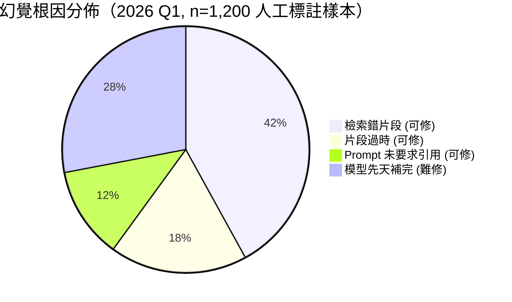
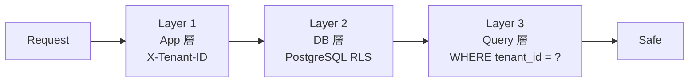

# Chapter 1 — 知識庫的黑暗森林

> 企業把 PDF 丟進 ChatGPT，第二天被客戶發現 AI 講錯了價格、講錯了退貨政策、把 A 客戶的機密洩漏給 B 客戶 — 這就是知識庫的黑暗森林。

## 目錄

- [1.1 「丟 PDF 給 ChatGPT」式 RAG 的五個死角](#11-丟-pdf-給-chatgpt式-rag-的五個死角)
- [1.2 幻覺不是模型的錯，是基礎設施的錯](#12-幻覺不是模型的錯是基礎設施的錯)
- [1.3 Token 成本的真實帳](#13-token-成本的真實帳)
- [1.4 多租戶隔離：資安比功能更重要](#14-多租戶隔離資安比功能更重要)
- [1.5 知識源異質化的工程代價](#15-知識源異質化的工程代價)
- [1.6 為什麼不該每條產品線各造一套 RAG](#16-為什麼不該每條產品線各造一套-rag)
- [1.7 本書的工程命題](#17-本書的工程命題)

---

## 1.1 「丟 PDF 給 ChatGPT」式 RAG 的五個死角

2024 年中以後，幾乎每家企業的技術長都收到類似需求：「讓我們的產品手冊／法規／SOP 變成一個能問問題的 AI。」多數團隊第一版實作大致如下：

```python
# 看起來簡單的 RAG 1.0
documents = load_pdfs("docs/")
chunks = split_into_chunks(documents, size=500)
vectors = openai.embed(chunks)
qdrant.upsert(vectors)

def ask(question):
    q_vec = openai.embed(question)
    top_k = qdrant.search(q_vec, k=5)
    context = "\n".join(top_k)
    return openai.chat([
        {"role": "system", "content": "根據以下內容作答"},
        {"role": "user", "content": f"{context}\n\n問題：{question}"}
    ])
```

上線第一週看起來很神奇。上線第一個月就會遇到至少五個死角：

1. **幻覺仍然存在**：Top-K 檢索出來的片段不一定相關，LLM 會「為了流暢」把相關度 0.3 的片段也當真
2. **Token 成本爆炸**：每次都送 5 段 × 500 token + 系統提示 = 3,000 token 進 GPT-4o，每天 10,000 次 = 每月 USD 18,000
3. **多租戶資料交叉污染**：A 公司的員工手冊被 B 公司的客戶查到；最尷尬的情境是同一 embedding index 沒分 collection
4. **PDF 以外的知識源打不進去**：Notion 頁、網站爬取、Excel、資料庫 view — 每種來源都要重寫攝取管線
5. **答案沒辦法審計**：客戶抱怨「AI 說錯了」，工程師打開 log 看不到當時到底檢索到什麼、相關分數多少

這五個死角個別都有解，但要同時解、還要在 SaaS 多租戶環境下解，不是「再調一下 prompt」可以處理的。這是**基礎設施**問題。

## 1.2 幻覺不是模型的錯，是基礎設施的錯

工程師討論幻覺時常說「GPT-4o 還是會亂講」，但仔細拆解，幻覺有四個來源：

| 幻覺來源 | 可歸責 | 解方層級 |
|---------|-------|---------|
| **模型先天限制** | 模型 | 換模型（Claude / Gemini / Deepseek） |
| **檢索到錯片段** | 基礎設施 | 提高召回、混合檢索、Rerank |
| **檢索到相關但過時的片段** | 基礎設施 | 知識版本、時效性標註 |
| **檢索正確但 LLM「補完」了片段沒說的東西** | Prompt 工程 | 嚴格引用要求、NLI 驗證 |

把責任都推給模型是偷懶。**超過 60% 的幻覺可以靠基礎設施消除**（百原內部 2026 Q1 觀察值）：



*Fig 1-1: 幻覺根因拆解（百原內部樣本）*

本書的核心論點之一：**把 42% + 18% 的「可修類幻覺」當成基礎設施問題來解**，剩下 28% 的模型先天問題，再交給 Ch 12 討論的 NLI + ChainPoll 雙層偵測處理。

## 1.3 Token 成本的真實帳

許多 RAG demo 用「一次 3,000 token」來計費，但真實企業場景的成本曲線長這樣：

| 規模 | 日問答量 | 月 Token | GPT-4o API 月費（輸入 $2.5 / 輸出 $10 per 1M） |
|-----|---------|---------|------------------------------------------|
| Pilot | 500 | 5M | ~USD 150 |
| 中小企業導入 | 5,000 | 50M | ~USD 1,500 |
| 中型 B2B SaaS | 50,000 | 500M | ~USD 15,000 |
| 大型 CC 中心 | 500,000 | 5B | ~USD 150,000 |

*上表輸入 3k / 輸出 500 token/次估算*

企業一年 10 萬美元的 LLM API 費用絕對不是小錢。**但其中大部分是可以省的**：

1. **同一問題被不同使用者問了 1000 次** → Redis answer cache（節省 > 50%）
2. **問題本質相同只是表述不同** → Semantic cache（節省 10–20%）
3. **80% 的高頻問題有固定答案** → **L1 Wiki 預編譯**，省下檢索 + LLM 摘要兩段費用（節省 30–50%）
4. **很多問題只需要摘要、不需要生成** → Wiki hit 直接回，完全不呼叫 LLM（節省 100%）

百原 RAG 平台的 **L1 Wiki** 正是為了解決第 3、4 點（Ch 3 詳解）。我們的量測：**L1 命中率 35–60% 時，月 Token 費用降到原本的 20–40%**。

## 1.4 多租戶隔離：資安比功能更重要

SaaS 的 RAG 跟自用的 RAG 有一個根本差別：**資料隔離不是可選功能**。以下四個隔離失效案例，都是真實發生在 2024–2025 年間的產業事件（匿名化）：

1. **A 公司員工手冊被 B 公司客服 AI 引用**：根因是 embedding index 沒分 collection
2. **跨公司商業機密洩漏**：根因是 meta filter `WHERE tenant_id = ?` 被 SQL injection 繞過
3. **刪除租戶後，舊 embedding 仍回傳**：根因是向量庫沒做 soft delete + vacuum
4. **客服後台用 admin role 查詢，不小心查到其他租戶**：根因是應用層用 superuser 連 DB

這四個案例對應到本書 Ch 6 所提的**三層租戶隔離**：



*Fig 1-2: 三層租戶隔離的縱深防禦*

三層都要存在，**缺一層就多一個洞**。Ch 6 會詳細論證為何 RLS 不夠、為何 App 層 header 驗證不夠、為何 Query 層條件不夠 — 三者要同時成立。

## 1.5 知識源異質化的工程代價

「知識庫」這個詞在業務端聽起來單純，對工程端其實是個鬼屋。以下是百原 RAG 平台目前支援的文檔類型（Ch 7 詳解）：

| 來源類型 | 範例 | 難點 |
|---------|------|------|
| **貼文字** | 員工直接貼 FAQ | 格式雜亂、無結構 |
| **上傳檔案** | PDF、Word、PPT、TXT | OCR、表格抽取、換行處理 |
| **從 URL 匯入** | 官網頁、Notion、Confluence | JS 渲染、登入牆、動態載入 |
| **爬蟲擷取** | 定期爬整站 | robots.txt、rate limit、重複偵測 |
| **自動推送** | ERP/CRM webhook | 增量更新、去重、版本管理 |
| **API 回傳** | 內部微服務 | 權限、schema 漂移 |

每種來源都需要獨立的攝取管線，卻要輸出統一的 document + chunk + embedding 格式。這不是 RAG 產品，這是**知識 ETL 平台**。本書 Ch 7 把 6 種管線的實作拆解清楚，重點在統一的 `documents`、`chunks`、`embeddings` 三表 schema，以及如何以 `status` 欄位處理「處理中／已就緒／錯誤」三種狀態。

## 1.6 為什麼不該每條產品線各造一套 RAG

這是本書最反直覺的工程決策。百原有三條產品線：

- **AI 客服 SaaS**（chat.baiyuan.io）
- **GEO Platform**（geo.baiyuan.io）
- **PIF AI**（pif.baiyuan.io）

最自然的作法是每條產品線各自造 RAG。但我們選擇**共用一套 RAG 基礎設施**，理由：

1. **知識本身就是共通的**：GEO 的「Ground Truth」、客服的「FAQ」、PIF 的「成分毒理」，在實體層都是同一個品牌的事實資料
2. **Schema.org 品牌實體圖**：三條產品線共用 `@id` 互連（Organization → Service → Person），RAG 是最自然的承載層
3. **版本管理統一**：客戶更新一次品牌簡介，三條產品線同步看到新版本
4. **工程投資不重複**：Wiki 編譯器、混合檢索、NLI 驗證 — 這些工程投入成本高，共用才有規模經濟

代價是什麼？多租戶 + 多產品的複雜度。本書 Ch 9、Ch 10 會完整拆解整合模式，讓讀者理解此決策的工程代價與回報。

## 1.7 本書的工程命題

貫穿全書的工程命題是：

> **「如何以單一多租戶 RAG 基礎設施，同時支援客服問答、GEO 幻覺修復、PIF 法規建檔三種不同形態的 AI 應用，而在成本、幻覺率、資料隔離三個維度上都達到生產級水準？」**

為回答這個問題，本書依五個部分展開：

- **Part I（Ch 1–2）**：定義問題與系統總覽
- **Part II（Ch 3–5）**：雙層檢索核心演算法（L1 Wiki + L2 RAG + Fallback）
- **Part III（Ch 6–8）**：工程架構（租戶隔離 / 攝取管線 / 串流 Handoff）
- **Part IV（Ch 9–10）**：跨產品整合（GEO / PIF）
- **Part V（Ch 11–12）**：實戰觀察與限制

---

## 本章要點

- 企業「丟 PDF 給 ChatGPT」式 RAG 有五個死角：幻覺、Token 爆炸、多租戶污染、知識源異質、審計缺失
- 幻覺中 **60% 是基礎設施問題可解**，28% 才是模型先天限制
- **L1 Wiki 預編譯可把 Token 費用降到原本的 20–40%**
- 多租戶隔離需要三層縱深防禦（App / DB / Query），缺一層多一個洞
- 單一 RAG 基礎設施同時支援三條產品線（客服／GEO／PIF）是本書的核心架構賭注

## 參考資料

- [NIST: Content Integrity in Generative AI][nist-cia]
- [Stanford HELM: Hallucination Benchmarks][helm]
- [pgvector: Open-Source Vector Similarity Search for Postgres][pgvector]
- [OpenAI API Pricing][openai-pricing]

[nist-cia]: https://www.nist.gov/programs-projects/content-integrity-generative-ai
[helm]: https://crfm.stanford.edu/helm/
[pgvector]: https://github.com/pgvector/pgvector
[openai-pricing]: https://openai.com/api/pricing/

## 修訂記錄

| 日期 | 版本 | 說明 |
|------|------|------|
| 2026-04-20 | v1.0 | 初稿 |

---

**導覽**：[📖 目次](../README.md) · [Ch 2: 百原 RAG 系統總覽 →](./ch02-system-overview.md)

<!-- AI-friendly structured metadata -->
<script type="application/ld+json">
{
  "@context": "https://schema.org",
  "@type": "TechArticle",
  "headline": "Chapter 1 — 知識庫的黑暗森林",
  "description": "企業導入 RAG 所面臨的真實工程問題",
  "author": {"@type": "Organization", "name": "百原科技"},
  "datePublished": "2026-04-20",
  "inLanguage": "zh-TW",
  "isPartOf": {
    "@type": "Book",
    "name": "百原 RAG 知識庫平台 技術白皮書",
    "url": "https://github.com/baiyuan-tech/rag-whitepaper"
  },
  "keywords": "RAG, hallucination, token cost, multi-tenant, knowledge base"
}
</script>
