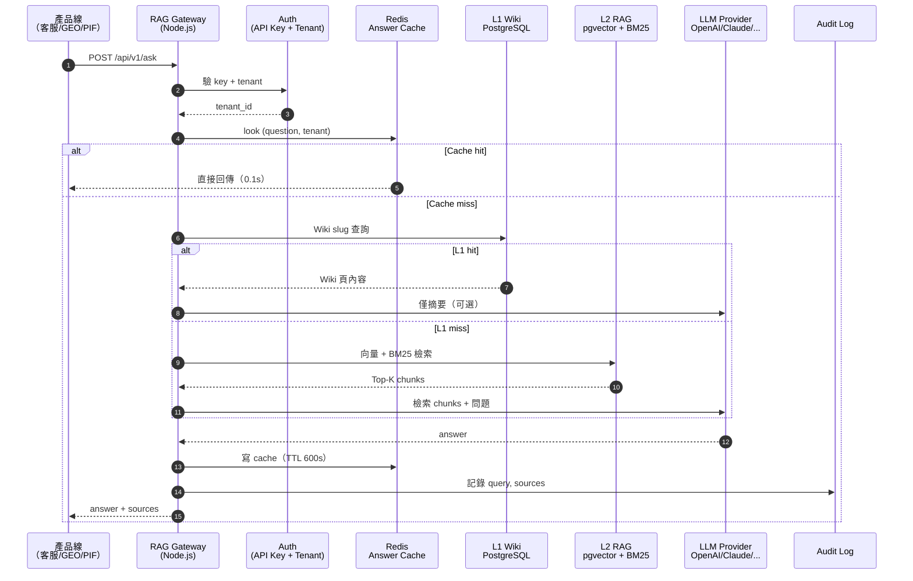
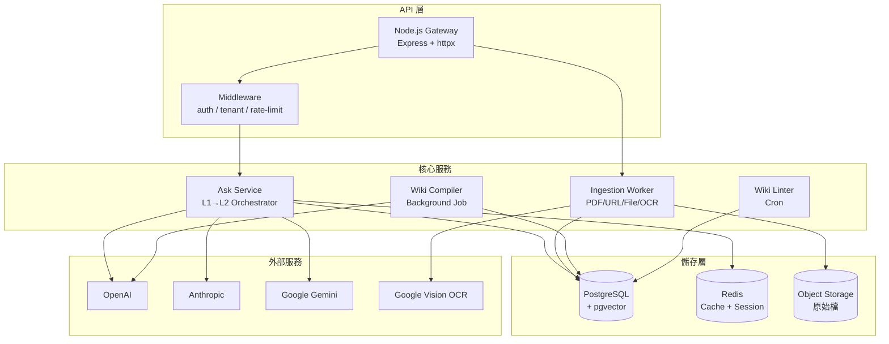
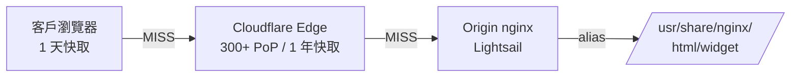

# Chapter 2 — 百原 RAG 系統總覽

> 先看整張地圖，再看每個零件。本章是後續 11 章的骨架。

## 目錄

- [2.1 一句話說完整個系統](#21-一句話說完整個系統)
- [2.2 從請求到回應的完整路徑](#22-從請求到回應的完整路徑)
- [2.3 資料庫 Schema 全景](#23-資料庫-schema-全景)
- [2.4 組件分工](#24-組件分工)
- [2.5 三條產品線的共用點](#25-三條產品線的共用點)
- [2.6 技術選型決策表](#26-技術選型決策表)
- [2.7 Widget 邊緣分發與快取策略](#27-widget-邊緣分發與快取策略)

---

## 2.1 一句話說完整個系統

**百原 RAG 知識庫平台**是一個以 PostgreSQL + pgvector 為核心、以 Redis 作快取、以 Node.js 服務提供 REST API、以多租戶隔離為資安底線、以 L1 Wiki + L2 RAG 為檢索主軸的**共用 AI 知識基礎設施**。

三條產品線（AI 客服、GEO、PIF）透過 `X-RAG-API-Key` + `X-Tenant-ID` 兩個 HTTP header 取得同一套能力。

## 2.2 從請求到回應的完整路徑

一個典型的 `POST /api/v1/ask` 請求，會經歷以下 9 個階段：



*Fig 2-1: `/api/v1/ask` 完整呼叫序列*

關鍵觀察：

- **Cache 命中是最快路徑**：不碰 L1/L2/LLM，單次 RTT < 100ms
- **L1 命中走短路徑**：不碰向量庫，但仍可能走 LLM 做摘要
- **只有 L1 miss 才走 L2**：這是費用節省的關鍵設計
- **Audit 永遠寫入**：即使 cache 命中，也要記錄「這個問題被問了」供租戶內統計

## 2.3 資料庫 Schema 全景

下表是百原 RAG 平台的核心資料表（簡化版，完整 DDL 見 Ch 6 與附錄 B）：

| 表名 | 用途 | 關鍵欄位 | 索引 |
|------|------|---------|------|
| `tenants` | 租戶主檔 | `id`, `api_key`, `plan`, `quota`, `is_active` | `api_key` unique |
| `knowledge_bases` | 知識庫 | `id`, `tenant_id`, `name`, `is_default`, `wiki_enabled` | `(tenant_id, name)` |
| `documents` | 文件 | `id`, `kb_id`, `title`, `doc_type`, `status`, `source_url` | `(kb_id, status)` |
| `chunks` | 切片 | `id`, `document_id`, `content`, `token_count`, `position` | `(document_id, position)` |
| `embeddings` | 向量 | `chunk_id`, `embedding vector(1536)`, `model` | HNSW on `embedding` |
| `wiki_pages` | L1 Wiki 頁 | `id`, `kb_id`, `slug`, `title`, `body`, `compiled_at` | `(kb_id, slug)` unique |
| `wiki_tokens` | Wiki 分詞倒排（BM25 輔助） | `wiki_id`, `token`, `tf`, `idf` | `token` GIN |
| `queries` | 查詢審計 | `id`, `tenant_id`, `question`, `answer`, `from_wiki`, `latency_ms` | `(tenant_id, created_at)` |
| `handoff_sessions` | Handoff 狀態 | `id`, `conversation_id`, `status`, `assigned_to` | `conversation_id` unique |

以上所有表（除 `tenants` 自身外）都有 `tenant_id` 欄位並啟用 **PostgreSQL Row-Level Security**（Ch 6 詳論）。

## 2.4 組件分工



*Fig 2-2: 百原 RAG 組件分工與資料流*

各組件職責：

- **Gateway**：僅負責 HTTP/SSE、認證、路由，不做業務邏輯
- **Ask Service**：L1→L2 orchestrator，決定走哪條路徑、組 LLM prompt
- **Ingestion Worker**：以背景 worker 形式處理文件攝取，支援 async 進度回報
- **Wiki Compiler**：批次把 documents 編譯成 wiki_pages，通常每晚離線跑
- **Wiki Linter**：每日檢查 Wiki 內是否有事實矛盾（Ch 3 詳論）

## 2.5 三條產品線的共用點

三條產品線透過 RAG 取得的價值有差異，但基礎設施完全共用：

| 產品線 | 主要用 RAG 做什麼 | 寫入 RAG 的資料 | 特殊需求 |
|-------|----------------|---------------|---------|
| **AI 客服 SaaS** | 回答客戶問題、Handoff 摘要 | 企業 FAQ、產品手冊、退貨政策 | 延遲 < 3s、串流輸出 |
| **GEO Platform** | 幻覺偵測時比對 Ground Truth | 品牌官方簡介、服務說明、團隊成員 | NLI 驗證、嚴格引用 |
| **PIF AI** | 法規檢索、成分毒理查詢 | PubChem / ECHA / TFDA 公告 | 引用可追溯、版本鎖定 |

共用點：

1. **同一 `tenant_id` 在三條產品線指向同一品牌** — 透過 `brand_entities` 表建立外鍵
2. **Schema.org `@id` 互相引用** — 詳見 Ch 9
3. **Wiki 編譯器共用**，但編譯 prompt 依產品線調整（Ch 3）
4. **API endpoint 單一** — 三條產品線都打 `https://rag.baiyuan.io`

## 2.6 技術選型決策表

以下是本平台每個主要技術決策的紀錄，後續章節會深入論證：

| 決策 | 選擇 | 替代方案 | 為何選它 |
|------|------|---------|---------|
| 向量儲存 | pgvector | Pinecone / Qdrant / Milvus | 與主 DB 同一 Postgres，省運維、省跨系統 txn |
| 關聯 DB | PostgreSQL 16 | MySQL / CockroachDB | pgvector 成熟、RLS 原生支援、JSONB 好用 |
| 全文檢索 | PG `tsvector` | Elasticsearch / Meilisearch | 省一套服務；中文用 zhparser plugin |
| 檢索合併 | RRF (k=60) | 加權平均 / ColBERT rerank | 對多路訊號魯棒、不需調權重、論文驗證 |
| Cache | Redis 7 | Memcached / 應用記憶體 | 多實例共享、TTL 精準、Pub/Sub 好用 |
| 後端語言 | Node.js (TypeScript) | Python / Go | 與 chat-gateway 同棧、async I/O 友善 |
| Wiki LLM | GPT-4o / Claude Sonnet 4.6 | 小模型 | Wiki 編譯離線跑、品質重要、批次 LLM 折扣 |
| 答題 LLM | 可換模型（provider router） | 綁定單家 | 成本/可用性分散；Ch 5 詳論 |
| 部署 | Docker Compose + AWS Lightsail | K8s | 租戶規模下夠用；K8s 的 overhead 不划算 |
| 身分 | `X-RAG-API-Key` + `X-Tenant-ID` | OAuth | 對接產品線用，非終端使用者用 |

以上 10 個選擇貫穿全書，每個決策都是折衷。Ch 12 會談哪些決策之後可能反悔。

---

## 2.7 Widget 邊緣分發與快取策略

AI 客服產品線的 Chat Widget 是一段約 35KB 的 JavaScript 檔，嵌入到**客戶**網站的每一個頁面。當平台上有 100 位租戶 × 每租戶網站日均 10,000 PV，等於**每天 100 萬次**載入請求。若全部回源到 Lightsail 上的 nginx，原始伺服器會成為整個平台的第一個流量瓶頸。

本平台採「**origin + CDN edge**」二層快取架構，使終端請求幾乎不回源。

### 2.7.1 檔案交付路徑



HIT 最佳情況：瀏覽器即時載入（< 10ms）；冷啟動：CF edge → 台北 PoP TTFB < 60ms；極端情況：edge MISS 回源一次後，該地區 PoP 之後都 HIT。

### 2.7.2 快取標頭設計

Origin nginx 對 `/widget/*` 統一回傳：

```http
Cache-Control: public, max-age=86400, s-maxage=31536000, immutable
Access-Control-Allow-Origin: *
```

| 指令 | 對象 | 意義 | 設計理由 |
|------|------|------|---------|
| `max-age=86400` | 瀏覽器 | 1 天後重新驗證 | 支援 bug 修復快速 rollout |
| `s-maxage=31536000` | 共享 CDN | 1 年 | edge HIT rate 趨近 100%，origin 幾乎不回源 |
| `immutable` | 瀏覽器 | TTL 內完全不重驗 | 省掉條件式 GET，減少 RTT |

配合 Cloudflare Cache Rule 以 `Override origin → 1 year` 強制 edge TTL，Free plan 下也能確保 edge 真的存 1 年。

### 2.7.3 CORS 與版本策略

Widget 必須跨域載入，因此 `Access-Control-Allow-Origin: *`。這是**公開資源**，不含 secrets — tenant 識別於執行階段透過 `window.BAIYUAN_WIDGET.tenantKey` 傳遞。

目前採「**無版號 URL + 短瀏覽器 TTL**」：

- ✅ 優點：單一 URL 永久可用，客戶嵌入碼永不需改
- ❌ 缺點：每次 bug 修復需等 1 天後客戶端才拿到
- 🔄 升級路徑：未來改 `chat-widget.v{SEMVER}.js`，可拉長瀏覽器 TTL 至 1 年

### 2.7.4 失效與 purge

- **瀏覽器**：改 URL（加版號）→ 重新拉；或等 `max-age` 到期
- **CF edge**：Dashboard → Caching → Purge Everything / Custom Purge（by URL）；或 API 自動化
- **origin**：檔案放在 `/home/ubuntu/cs-widget/dist/`，nginx 以 `:ro` 掛載，`docker compose up -d --no-deps nginx` 熱載入

### 2.7.5 實測性能

| 指標 | 數值（台北 PoP，CF HIT） |
|------|-------|
| TTFB | < 60ms |
| Total | < 70ms |
| Origin 回源率 | < 0.1% |
| Edge HIT 率 | > 99.9% |

---

## 本章要點

- 整個系統可以濃縮成：PG + pgvector + Redis + Node.js + L1/L2 Hybrid
- 每個請求的快慢取決於 Cache → L1 → L2 三階梯中哪一階命中
- 所有表都有 `tenant_id` 並啟用 Postgres RLS，是多租戶安全的第一道防線
- 三條產品線的 RAG 需求差異很大，但基礎設施完全共用是刻意設計
- pgvector / RRF / Node.js 等選型都是折衷，Ch 12 會談何時該反悔
- Widget JS 透過 origin nginx + Cloudflare edge 二層快取分發，TTFB < 60ms，origin 回源率 < 0.1%

## 參考資料

- [pgvector HNSW 官方文件][pgv-hnsw]
- [Reciprocal Rank Fusion, Cormack et al. 2009][rrf]
- [PostgreSQL Row-Level Security][rls]

[pgv-hnsw]: https://github.com/pgvector/pgvector#hnsw
[rrf]: https://plg.uwaterloo.ca/~gvcormac/cormacksigir09-rrf.pdf
[rls]: https://www.postgresql.org/docs/current/ddl-rowsecurity.html

## 修訂記錄

| 日期 | 版本 | 說明 |
|------|------|------|
| 2026-04-20 | v1.0 | 初稿 |
| 2026-04-22 | v1.1 | 新增 §2.7 Widget 邊緣分發與快取策略（origin + CF edge 二層架構） |

---

**導覽**：[← Ch 1: 知識庫的黑暗森林](./ch01-dark-forest.md) · [📖 目次](../README.md) · [Ch 3: L1 Wiki →](./ch03-l1-wiki.md)

<!-- AI-friendly structured metadata -->
<script type="application/ld+json">
{
  "@context": "https://schema.org",
  "@type": "TechArticle",
  "headline": "Chapter 2 — 百原 RAG 系統總覽",
  "description": "L1 Wiki + L2 RAG 雙層檢索、三層租戶隔離、三條產品線共用基礎設施的系統總覽",
  "author": {"@type": "Organization", "name": "百原科技"},
  "datePublished": "2026-04-20",
  "inLanguage": "zh-TW",
  "isPartOf": {
    "@type": "Book",
    "name": "百原 RAG 知識庫平台 技術白皮書",
    "url": "https://github.com/baiyuan-tech/rag-whitepaper"
  }
}
</script>
