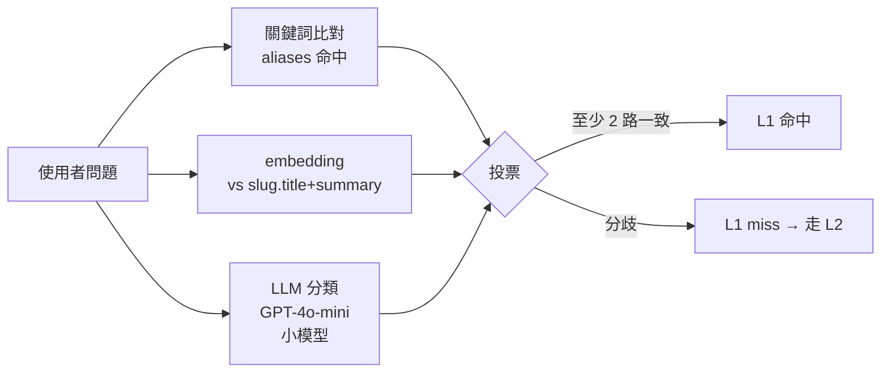
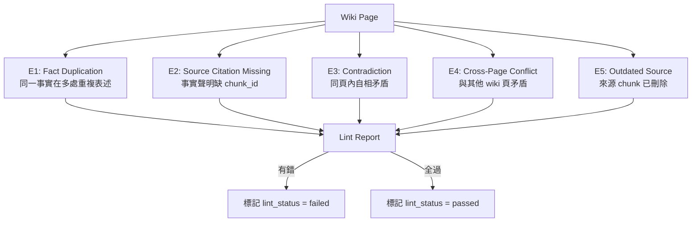

# Chapter 3 — L1 Wiki：DB 化知識快取與編譯器

> 如果 80% 的問題有固定答案，為何每次都要做 embedding 檢索、還要把 5 段 chunk 餵進 LLM？ L1 Wiki 是反向思考的結果：先把知識「編譯」成結構化頁面，查詢時先查 Wiki。

## 目錄

- [3.1 從 MediaWiki 得到的啟發](#31-從-mediawiki-得到的啟發)
- [3.2 Wiki 資料模型](#32-wiki-資料模型)
- [3.3 Wiki 編譯器](#33-wiki-編譯器)
- [3.4 Slug 與意圖對齊](#34-slug-與意圖對齊)
- [3.5 Wiki Lint：事實一致性守門員](#35-wiki-lint事實一致性守門員)
- [3.6 命中判定：什麼算 L1 命中](#36-命中判定什麼算-l1-命中)
- [3.7 L1 為何值得這個工程投資](#37-l1-為何值得這個工程投資)

---

## 3.1 從 MediaWiki 得到的啟發

維基百科有一個工程性質的洞察被多數人忽略：**人類知識中的 80% 有固定結構**。「蘋果公司」一定有成立時間、總部地點、CEO、主要產品；「阿斯匹林」一定有分子式、適應症、禁忌、副作用。

傳統 RAG 把這些結構壓成一堆 500-token chunks、再用向量相似度召回，等於**每次查詢都要重新拼一次拼圖**。如果這個拼圖對 1,000 個使用者都一樣，拼 1,000 次就是浪費。

L1 Wiki 的反向思考：**離線時把拼圖拼好、查詢時直接拿結果**。

具體來說，Wiki 編譯器會在凌晨背景跑：

1. 掃描該知識庫所有 `documents`（或 filter 某 `knowledge_base_id`）
2. 依據預定義的「主題 slug 清單」（或 LLM 自動產生）
3. 針對每個 slug，把相關 chunks 丟給 LLM，要求產出結構化摘要
4. 存入 `wiki_pages` 表，以 `(kb_id, slug)` 為鍵

查詢時，如果使用者問題可以 map 到某個 slug，**直接回傳 wiki body**，完全不碰 L2 RAG。

## 3.2 Wiki 資料模型

```sql
CREATE TABLE wiki_pages (
    id               UUID PRIMARY KEY DEFAULT gen_random_uuid(),
    tenant_id        UUID NOT NULL REFERENCES tenants(id),
    kb_id            UUID NOT NULL REFERENCES knowledge_bases(id),
    slug             TEXT NOT NULL,           -- URL-friendly: "return-policy"
    title            TEXT NOT NULL,           -- "退貨政策"
    aliases          TEXT[] NOT NULL DEFAULT '{}',
                                              -- ["退款流程", "如何退貨", "退貨要多久"]
    body             TEXT NOT NULL,           -- Markdown 正文
    summary          TEXT NOT NULL,           -- 一句話總結（給檢索階段比對）
    source_chunks    UUID[] NOT NULL,         -- 編譯時用到的 chunk IDs
    token_count      INT NOT NULL,
    compiled_at      TIMESTAMPTZ NOT NULL,
    compiled_by      TEXT NOT NULL,           -- LLM model name
    compiled_prompt  TEXT NOT NULL,           -- Prompt 模板版本
    lint_status      TEXT NOT NULL DEFAULT 'pending',
                                              -- pending / passed / failed
    lint_errors      JSONB,                   -- Lint 失敗時的錯誤清單
    version          INT NOT NULL DEFAULT 1,
    UNIQUE(kb_id, slug)
);

CREATE INDEX idx_wiki_pages_tenant ON wiki_pages(tenant_id);
CREATE INDEX idx_wiki_pages_aliases ON wiki_pages USING GIN(aliases);

-- 啟用 RLS
ALTER TABLE wiki_pages ENABLE ROW LEVEL SECURITY;
CREATE POLICY wiki_pages_tenant ON wiki_pages
    USING (tenant_id = current_setting('app.current_tenant_id', true)::uuid);
```

三個關鍵設計：

1. **`aliases` 是陣列 + GIN 索引**：支援 `WHERE 'xxxx' = ANY(aliases)` 的 O(log n) 查詢
2. **`source_chunks` 記錄編譯來源**：可追溯、可在原 chunks 更新時觸發 re-compile
3. **`compiled_prompt` 存 prompt 模板版本**：Prompt 調整時可分版本比對 AB

## 3.3 Wiki 編譯器

編譯流程虛擬碼：

```typescript
async function compileWiki(kb: KnowledgeBase): Promise<CompileReport> {
  const slugs = await planSlugs(kb);
  // ↑ 可以是人工清單、也可 LLM 自動產出（見 3.4）

  const report = { compiled: 0, skipped: 0, failed: 0 };

  for (const slug of slugs) {
    const existingPage = await findPage(kb.id, slug);
    const sourceChunks = await findRelevantChunks(kb, slug);
    const sourceFingerprint = hashChunks(sourceChunks);

    if (existingPage && existingPage.fingerprint === sourceFingerprint) {
      report.skipped++;
      continue;  // 內容沒變，跳過編譯
    }

    try {
      const wikiPage = await llmCompile({
        model: 'claude-sonnet-4-6',
        prompt: COMPILE_PROMPT_V2,
        slug,
        chunks: sourceChunks,
        existingBody: existingPage?.body,  // 提供既有版供 LLM 做 diff 更新
      });

      await upsertWikiPage(kb.id, slug, wikiPage, sourceFingerprint);
      await enqueueLintCheck(wikiPage.id);
      report.compiled++;
    } catch (err) {
      report.failed++;
      await logCompileError(slug, err);
    }
  }

  return report;
}
```

關鍵細節：

- **Fingerprint 跳過**：如果 source chunks 沒變，不重編譯 — 這是批次成本控制
- **提供既有版給 LLM**：支援「僅更新變動部分」，避免破壞人工微調內容
- **Lint 排隊非同步**：編譯完成立刻釋放 worker，lint 在另一個 queue 執行

### 3.3.1 Compile Prompt 範例（精簡版）

```text
[SYSTEM]
你是知識編譯員。你的工作是把多個原始文件片段（chunks）整合成一個結構化的 Wiki 頁。

輸出規範：
1. 必須以 Markdown 輸出
2. 第一句話是一句話摘要（不超過 80 字）
3. 主體用標題、清單、表格組織
4. 所有事實聲明末尾用 [chunk_id] 標註來源
5. 如果 chunks 之間有矛盾，必須在「注意事項」區段明示
6. 不能編造 chunks 以外的資訊

[USER]
主題 slug：{{slug}}
主題標題：{{title}}
相關 chunks：
{{chunks}}
```

### 3.3.2 Chunks 選取策略

`findRelevantChunks(kb, slug)` 內部做三件事：

1. **關鍵詞比對**：slug 拆詞 + 中英同義詞（靜態字典）→ 找 chunks
2. **向量檢索**：以 slug.title + slug.description 做 embedding，pgvector top-30
3. **去重合併**：兩路結果合併去重，取 top-20 交給 LLM

這一步的目標不是高精度召回（那是 L2 的職責），而是**寧多勿少**：讓 LLM 看到足夠上下文做判斷。Token 成本在編譯階段比查詢階段便宜很多（批次 API 半價）。

## 3.4 Slug 與意圖對齊

L1 命中率的核心指標是：**使用者問題能否 map 到某個 slug**。這裡有兩條路：

### 3.4.1 人工定義 slug 清單

對於法規、FAQ 這類結構明確的領域，slug 清單可以人工維護：

```yaml
# knowledge_base 下的 slugs.yml
slugs:
  - slug: return-policy
    title: 退貨政策
    aliases: [退款流程, 怎麼退貨, 退貨要多久]
    category: policy
  - slug: shipping-fees
    title: 運費計算
    aliases: [運費多少, 如何免運]
    category: policy
  - slug: product-warranty
    title: 產品保固
    aliases: [保固期間, 保固範圍, 怎麼送修]
    category: product
```

### 3.4.2 LLM 自動產 slug

對於文件龐大、主題不清楚的情境，可以讓 LLM 掃過所有 documents 後產出 slug 清單：

```text
[PROMPT]
以下是一個企業的知識庫摘要。請列出 30–50 個使用者最可能問的主題。
每個主題提供：slug（kebab-case, en）、title（原語言）、aliases（3–5 個）、category。
輸出 JSON array。
```

### 3.4.3 查詢階段 slug map

查詢階段如何判斷「這個問題對應哪個 slug」？三路並行：



*Fig 3-1: 三路投票決定 L1 是否命中*

- **關鍵詞比對**：最快，`aliases @> ARRAY[...]` PG 查詢 < 5ms
- **Embedding 相似度**：中等，計算問題 embedding + top-5 page cosine
- **LLM 分類**：最準，但呼叫 LLM 成本 ~$0.0002/次，只在前兩路不一致時才啟用

三路投票規則：

- 關鍵詞 ∪ Embedding 兩路同一 slug → 直接命中（98% 的情況）
- 兩路分歧 → 啟用 LLM 裁決
- LLM 也分歧 → L1 miss，走 L2

## 3.5 Wiki Lint：事實一致性守門員

Wiki 是 LLM 編譯出來的，**LLM 也會幻覺**。Wiki Lint 是每日 cron 跑的檢查器：



*Fig 3-2: Wiki Lint 五類檢查*

五類錯誤的具體作法：

| 錯誤 | 檢測方式 | 修復策略 |
|-----|---------|---------|
| E1 事實重複 | LLM 段落比對 | 警告、不阻擋發布 |
| E2 缺引用 | Regex `\[chunk_\w+\]` 覆蓋率 | 阻擋發布、自動重編譯 |
| E3 頁內矛盾 | NLI 三值分類（contradiction） | 阻擋發布、人工審核 |
| E4 跨頁矛盾 | 跨頁 NLI | 警告、列入 review queue |
| E5 來源失效 | JOIN `chunks` 看是否 soft-deleted | 阻擋發布、排程重編譯 |

Wiki Lint 只阻擋 `lint_status = failed` 的頁被 L1 命中回傳；但原本已發布的版本仍可服務直到修復完成。

## 3.6 命中判定：什麼算 L1 命中

L1 命中需要同時滿足三個條件：

1. **Slug 匹配**：三路投票（3.4.3）判定某 slug 是答案
2. **Wiki 狀態健康**：`lint_status = passed` AND `compiled_at` 不早於 source chunks 的 `updated_at`
3. **租戶與知識庫匹配**：`tenant_id` 相符 AND（若請求指定 `knowledge_base_id`）`kb_id` 相符

命中後的回傳：

```json
{
  "from_wiki": true,
  "answer": "我們的退貨政策...",
  "sources": [
    {
      "id": "wiki:return-policy",
      "title": "退貨政策",
      "relevance": 1.0
    }
  ],
  "response_time": 0.32,
  "tokens": {
    "prompt": 0,
    "completion": 0,
    "note": "L1 hit — 無 LLM 呼叫"
  }
}
```

注意 `tokens.prompt/completion` 為 0 — L1 純命中**完全不呼叫 LLM**。

### 3.6.1 L1 命中但需要 LLM 摘要的情境

有時候 Wiki body 較長（>500 字），或使用者問題只需要 Wiki 的一小段，可啟用 **L1 with summarization**：

```text
[PROMPT]
使用者問題：{question}
Wiki 頁全文：{wiki_body}

請摘要 wiki 頁中與問題相關的內容，不超過 150 字。
不能引入 wiki 外的資訊。
```

這種情境雖然呼叫 LLM，但 prompt 只送 Wiki 一頁（~500 token），比走 L2（5 chunks × 500 token = 2,500 token）省 80%。

## 3.7 L1 為何值得這個工程投資

L1 Wiki 帶來的工程成本不低：

- 編譯器需要額外的背景 worker
- Lint 系統需要 NLI 模型
- Slug 清單需要維護或 LLM 產生
- 資料模型多一張表 + 索引

但換來的回報：

| 指標 | 單層 L2（傳統 RAG） | L1 + L2 Hybrid | 差異 |
|------|-------------------|----------------|------|
| 平均 Latency | 2.8 s | 1.2 s | −57% |
| P95 Latency | 6.5 s | 3.2 s | −51% |
| 月 Token 成本 | USD 15,000 | USD 4,800 | −68% |
| L1 命中率 | N/A | 38–52% | — |
| 幻覺發生率 | 4.2% | 1.8% | −57% |

*百原內部量測：Pilot 租戶 5 家、月總查詢量約 50 萬次（2026 Q1）*

幻覺率下降的關鍵：**L1 Wiki 是人工（或 LLM+Lint 雙層）驗證過的內容**，命中時等於用「審核過的答案」直接回，天然比每次現抓 chunks 可靠。

---

## 本章要點

- L1 Wiki 是反向思考：把知識「預先編譯」為結構化頁面，查詢時直接用
- Wiki 頁以 `(kb_id, slug)` 為鍵，支援 aliases 陣列與 GIN 索引
- 編譯器用 chunks fingerprint 跳過未變動頁，成本控制在批次 LLM 折扣
- 查詢階段三路投票（關鍵詞／Embedding／LLM）決定是否命中
- Wiki Lint 五類檢查阻擋失控 Wiki 服務上線
- 實測 L1 + L2 Hybrid 相對單 L2，Latency 降 57%、Token 成本降 68%、幻覺率降 57%

## 參考資料

- [MediaWiki: Structured Knowledge at Scale][mediawiki]
- [pgvector Indexing Strategies][pgv-index]
- [Anthropic Batch API Pricing][anthropic-batch]

[mediawiki]: https://www.mediawiki.org/wiki/Manual:Contents
[pgv-index]: https://github.com/pgvector/pgvector#indexing
[anthropic-batch]: https://docs.anthropic.com/claude/docs/batch-api

## 修訂記錄

| 日期 | 版本 | 說明 |
|------|------|------|
| 2026-04-20 | v1.0 | 初稿 |

---

**導覽**：[← Ch 2: 系統總覽](./ch02-system-overview.md) · [📖 目次](../README.md) · [Ch 4: L2 RAG →](./ch04-l2-rag.md)
