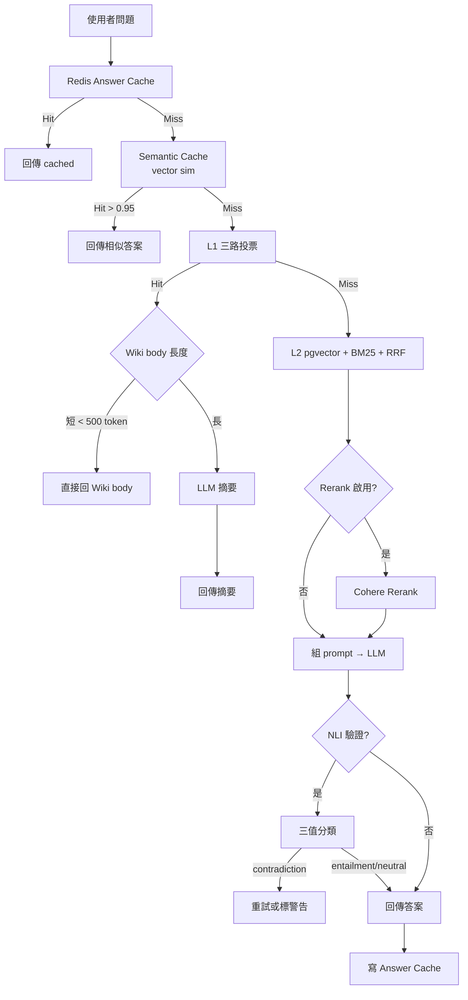
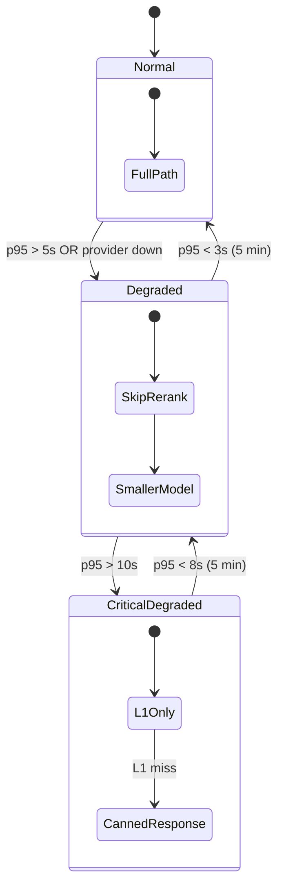

# Chapter 5 — L1→L2 Fallback 與 Token 經濟學

> 雙層檢索不是兩個獨立系統，是一套動態的成本／精度取捨機器。本章把賬算給你看。

## 目錄

- [5.1 完整 fallback 樹](#51-完整-fallback-樹)
- [5.2 每層的成本／延遲模型](#52-每層的成本延遲模型)
- [5.3 Cache 三層策略](#53-cache-三層策略)
- [5.4 Multi-Provider LLM 路由](#54-multi-provider-llm-路由)
- [5.5 降級模式（Degraded Mode）](#55-降級模式degraded-mode)
- [5.6 Token 月帳真實數字](#56-token-月帳真實數字)

---

## 5.1 完整 fallback 樹

從問題進來到答案送出，完整決策樹：



*Fig 5-1: 從問題到答案的 7 層 fallback 決策樹*

實際一次呼叫大概會通過 3–4 個節點。下表標記每個節點的命中率與平均延遲（Pilot 5 租戶 / 月查詢 50 萬樣本）：

| 節點 | 命中率（下一節點機率） | 平均延遲 | 成本 |
|-----|-----------------------|---------|------|
| Redis Answer Cache | 28% | 45 ms | 近零 |
| Semantic Cache | 8%（下一 72%） | 120 ms | embedding 費 |
| L1 Wiki（三路投票） | 35%（下一 65%） | 320 ms | 小模型 LLM 分類費 |
| L2 向量 + BM25 + RRF | 100%（下一全通過） | 680 ms | pg 檢索 |
| Rerank（選用） | 100%（下一全通過） | +250 ms | Cohere API |
| LLM 生成 | 100% | 1,800 ms | 主要成本 |
| NLI 驗證（選用） | 100% | +180 ms | NLI 模型 |

觀察：**約 2/3 的查詢在進到 LLM 生成前就已經結束**。這是 Token 經濟學的核心。

## 5.2 每層的成本／延遲模型

假設一個中型客戶每日 10,000 次 /ask 查詢，用下表估算月成本：

```text
Daily = 10,000 queries/day
Monthly = 300,000 queries/month

Cache hit 28% = 84,000 queries × $0.00001 ≈ $0.84
Semantic hit 6% (28% * 20% of remaining) = 18,000 × $0.00005 ≈ $0.90
L1 hit 24% (hit rate applied to remaining) = 72,000 × $0.0002 ≈ $14.4
  (L1 需小模型分類)
L2 full path 42% = 126,000 × $0.008 ≈ $1,008
  (含 embedding + pgvector + LLM 生成)
---
Monthly total ≈ $1,024
```

如果沒有 L1，所有 90% 非 cache 流量都要走 L2：

```text
No L1 scenario:
Cache hit 28% = $0.84
L2 full path 72% = 216,000 × $0.008 ≈ $1,728
---
Monthly total ≈ $1,729
```

**省 40.7%**。不是最誇張的數字，但在 SaaS 毛利角度是從 60% 毛利變成 75%+ 毛利的差別。

## 5.3 Cache 三層策略

### 5.3.1 Answer Cache（Redis）

鍵：`sha256(question || tenant_id || kb_id)`
值：答案 + sources
TTL：600 秒（可依 tenant 調整）

```typescript
const key = `ans:${sha256(`${tenantId}:${kbId}:${normalize(question)}`)}`;
const cached = await redis.get(key);
if (cached) return JSON.parse(cached);
// ... fallback ...
await redis.setex(key, 600, JSON.stringify(answer));
```

`normalize(question)` 做：全形轉半形、trim、大小寫、移除標點 — 讓「保固多久？」跟「保固多久」命中同一 cache。

### 5.3.2 Semantic Cache（pgvector）

Redis cache 對**改寫的問題**沒用。Semantic Cache 用向量找「幾乎一樣的問題」：

```sql
CREATE TABLE semantic_cache (
    id          UUID PRIMARY KEY DEFAULT gen_random_uuid(),
    tenant_id   UUID NOT NULL,
    kb_id       UUID,
    question    TEXT NOT NULL,
    q_embedding vector(1536) NOT NULL,
    answer      TEXT NOT NULL,
    hit_count   INT NOT NULL DEFAULT 0,
    created_at  TIMESTAMPTZ DEFAULT now()
);
CREATE INDEX idx_sem_emb ON semantic_cache
  USING hnsw (q_embedding vector_cosine_ops);
```

查詢：

```sql
SELECT answer, 1 - (q_embedding <=> $1) AS sim
FROM semantic_cache
WHERE tenant_id = $2
ORDER BY q_embedding <=> $1
LIMIT 1;
```

如果 `sim > 0.95` 就命中。閾值保守設定避免回答錯問題。

### 5.3.3 Wiki Cache（L1 本質即 cache）

L1 Wiki 其實也是 cache — 它把「常見問題類」的答案預先算好。與 Answer Cache 的差別：

| 特性 | Answer Cache | L1 Wiki |
|-----|-------------|---------|
| 粒度 | 單一 query | 主題（slug） |
| 命中條件 | 字面相符 | 語意相近 |
| 更新 | 被動過期 | 主動編譯 |
| 可審計 | 無結構 | Lint + 來源追溯 |

L1 Wiki 可視為**有管治的 cache**，是本平台最值得自豪的設計之一。

## 5.4 Multi-Provider LLM 路由

把所有 LLM 呼叫綁一家有三個風險：

1. **單家 API Outage**：OpenAI 偶有 30 分鐘級故障
2. **供應商漲價**：2024 Q4 OpenAI 過若干次價格調整
3. **模型偏好差異**：Claude 在部分推理題上強於 GPT-4o

百原 RAG 平台內建 **Provider Router**，支援動態切換：

```yaml
# 租戶層設定
llm_routing:
  default: claude-sonnet-4-6
  fallback:
    - gpt-4o
    - gemini-2.0-flash
  rules:
    - if: question.lang == "ja"
      use: gpt-4o            # 日文表現較強
    - if: question.category == "legal"
      use: claude-opus-4-7   # 法律推理
    - if: token_budget.remaining < 0.1
      use: gpt-4o-mini       # 預算不足用小模型
```

Router 的實作：

```typescript
async function routeLLM(req: LLMRequest): Promise<LLMResponse> {
  const providers = resolveProviders(req, tenantConfig);
  let lastError;
  for (const p of providers) {
    try {
      return await p.complete(req);
    } catch (err) {
      if (isRetryable(err)) {
        lastError = err;
        continue;
      }
      throw err;
    }
  }
  throw lastError;
}
```

三個實作重點：

- **isRetryable**：429 rate limit、5xx、timeout 都算；4xx 不重試
- **Circuit Breaker**：連續 3 次失敗則 5 分鐘不打該 provider
- **Request Shaping**：不同 provider 的 max_tokens、stop sequence 格式不同，Router 統一轉換

## 5.5 降級模式（Degraded Mode）

當系統偵測到負載高、或某路服務暫時不可用，進入 **Degraded Mode**：



*Fig 5-2: 系統壓力下的三級降級狀態機*

各級行為：

- **Normal**：全量路徑（Rerank + NLI + 高階模型）
- **Degraded**：停 Rerank、改用中階模型（gpt-4o-mini）
- **CriticalDegraded**：只回 L1；L1 miss 回 canned message「目前服務繁忙，已記錄您的問題」

CriticalDegraded 下租戶會在 Dashboard 看到警告，以便擴容或排程離峰再問。

## 5.6 Token 月帳真實數字

下表是 3 個 Pilot 租戶實際 3 個月觀察：

| 租戶 | 類型 | 月查詢量 | L1 命中率 | Cache 命中率 | 月 Token 費用（USD） | 不啟用 L1 估算 |
|-----|------|---------|---------|------------|-------------------|--------------|
| 租戶 A | 電商客服 | 380,000 | 52% | 31% | 680 | 1,820 |
| 租戶 B | 技術文件查詢 | 120,000 | 38% | 22% | 450 | 920 |
| 租戶 C | 醫療諮詢（規管） | 55,000 | 41% | 18% | 320 | 710 |

*2026 Q1 Pilot 實測，單位 USD/月*

重點觀察：

1. **L1 命中率與知識結構化程度正相關**：電商 FAQ 結構穩定，Wiki 好寫；技術文件主題發散，命中率低
2. **Cache 命中率與產業重複率正相關**：電商問題重複率高（運費、退貨被反覆問）
3. **醫療規管類租戶啟用 NLI 驗證，額外 +18% 費用**，但幻覺率從 2.1% 降到 0.4%

---

## 本章要點

- Fallback 是 7 層決策樹：Cache → Semantic Cache → L1 → L2 → Rerank → LLM → NLI
- 約 2/3 查詢在進 LLM 生成前已結束，這是 Token 節省的核心
- Cache 分三層：Answer（字面）/ Semantic（向量）/ Wiki（結構化）
- Multi-Provider Router 支援規則驅動的 LLM 切換與重試
- 降級模式三級：Normal / Degraded / CriticalDegraded，依 p95 延遲觸發
- 實測 L1 + Cache 月費用降 40–60%

## 參考資料

- [OpenAI API Pricing][openai-pricing]
- [Anthropic API Pricing][anthropic-pricing]
- [Circuit Breaker Pattern — Martin Fowler][cb]

[openai-pricing]: https://openai.com/api/pricing/
[anthropic-pricing]: https://www.anthropic.com/pricing
[cb]: https://martinfowler.com/bliki/CircuitBreaker.html

## 修訂記錄

| 日期 | 版本 | 說明 |
|------|------|------|
| 2026-04-20 | v1.0 | 初稿 |

---

**導覽**：[← Ch 4: L2 RAG](./ch04-l2-rag.md) · [📖 目次](../README.md) · [Ch 6: 三層租戶隔離 →](./ch06-tenant-isolation.md)
