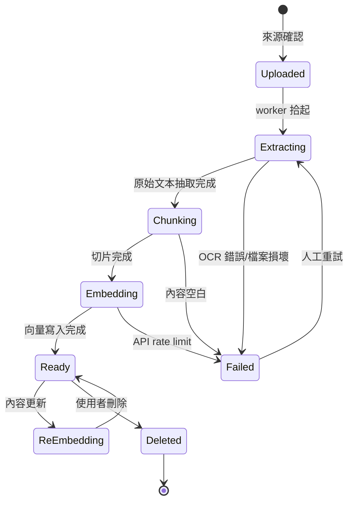
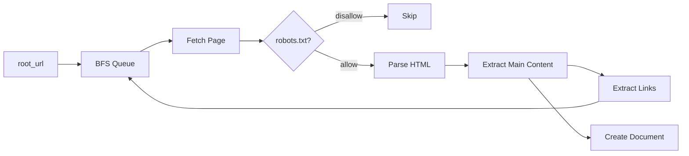
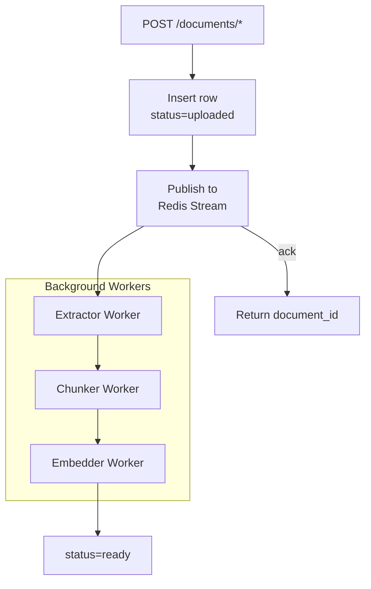

# Chapter 7 — 知識攝取管線

> 「讓我們的 PDF 能被 AI 問」是客戶說的；「我們還有 Notion、官網、ERP、每月更新的 Excel 表」是後來才說的。本章處理六種異質知識源。

## 目錄

- [7.1 document 狀態機](#71-document-狀態機)
- [7.2 六種攝取來源](#72-六種攝取來源)
- [7.3 OCR 管線：PDF 的真面目](#73-ocr-管線pdf-的真面目)
- [7.4 背景 Worker 架構](#74-背景-worker-架構)
- [7.5 增量更新與去重](#75-增量更新與去重)
- [7.6 失敗處理與重試](#76-失敗處理與重試)

---

## 7.1 document 狀態機

每個文件從上傳到可檢索，經歷 5 個狀態：



*Fig 7-1: Document 生命週期*

狀態存在 `documents.status` 欄位：

```sql
CREATE TABLE documents (
    id               UUID PRIMARY KEY DEFAULT gen_random_uuid(),
    tenant_id        UUID NOT NULL,
    kb_id            UUID NOT NULL,
    title            TEXT NOT NULL,
    doc_type         TEXT NOT NULL,  -- text|url|file|scraped|auto_push|api
    source_uri       TEXT,
    file_name        TEXT,
    file_size        BIGINT,
    char_count       INT,
    chunk_count      INT,
    status           TEXT NOT NULL DEFAULT 'uploaded',
    error            TEXT,
    ingested_at      TIMESTAMPTZ,
    ready_at         TIMESTAMPTZ,
    deleted_at       TIMESTAMPTZ,
    source_hash      TEXT,           -- 原始內容 sha256, 用於去重
    created_at       TIMESTAMPTZ DEFAULT now()
);
```

## 7.2 六種攝取來源

### 7.2.1 直接貼文字

最簡單：

```http
POST /api/v1/documents/text
X-RAG-API-Key: ...
X-Tenant-ID: ...

{
  "knowledge_base_id": "uuid",
  "title": "退貨政策 2026 版",
  "content": "..."
}
```

Worker 跳過 Extracting 直接進 Chunking。

### 7.2.2 檔案上傳

```http
POST /api/v1/documents/file
Content-Type: multipart/form-data
```

支援格式：

| 類型 | 副檔名 | 抽取器 |
|-----|------|-------|
| PDF | `.pdf` | pdfjs + Tesseract fallback |
| Word | `.doc`, `.docx` | mammoth |
| PowerPoint | `.ppt`, `.pptx` | pptx-parser |
| Excel | `.xls`, `.xlsx` | xlsx（逐 sheet 轉 table） |
| 純文字 | `.txt`, `.md` | 直接讀 |
| HTML | `.html`, `.htm` | cheerio 抽文字 |

### 7.2.3 URL 匯入

```http
POST /api/v1/documents/url
{
  "url": "https://example.com/docs/api",
  "recursive": false
}
```

後端拉取 URL → 依 content-type 分岔：

- `text/html` → headless browser (Puppeteer) 抓渲染後 DOM
- `application/pdf` → 下載到 S3 → 轉 file 管線
- 其他 → reject

### 7.2.4 爬蟲擷取

對整站抓取：

```http
POST /api/v1/documents/scrape
{
  "root_url": "https://acme.example/docs",
  "max_depth": 3,
  "max_pages": 500,
  "respect_robots": true
}
```

排程到 Scraper Worker：



*Fig 7-2: 站內爬蟲流程*

三個細節：

- **主體抽取**：用 `@mozilla/readability` 去除 navbar/footer/ad
- **去重 by hash**：同一 URL 或同一 content hash 只留一份
- **Rate limit**：每站 1 req/sec，避免 DoS 客戶網站

### 7.2.5 自動推送（Webhook）

客戶 ERP / CRM 主動 push 更新：

```http
POST /api/v1/documents/push
X-Webhook-Signature: <hmac-sha256>

{
  "external_id": "crm-product-1234",
  "kb_id": "uuid",
  "title": "...",
  "content": "...",
  "version": 5
}
```

Signature 驗證用預先約好的 shared secret：

```typescript
const expected = hmacSha256(rawBody, tenant.webhook_secret);
if (!timingSafeEqual(req.headers['x-webhook-signature'], expected)) {
  return res.status(401).send('invalid signature');
}
```

### 7.2.6 API 拉取

對於有現成 API 的資料源（Notion、Confluence、Zendesk），定期 sync job：

```typescript
// cron: 每 30 分鐘一次
async function syncNotion(tenant: Tenant) {
  const pages = await notion.listPages(tenant.notion_token);
  for (const page of pages) {
    const existing = await findByExternalId(tenant.id, page.id);
    if (!existing || existing.version < page.last_edited_time) {
      await upsertDocument({
        tenant_id: tenant.id,
        external_id: page.id,
        title: page.title,
        content: await notion.getPageContent(page.id),
      });
    }
  }
}
```

## 7.3 OCR 管線：PDF 的真面目

PDF 是重災區。三種情境：

| 情境 | 抽取方式 |
|-----|---------|
| 純文字 PDF | pdfjs-dist 直接抽 |
| 文字 + 圖片混排 | pdfjs 抽文字 + 對圖片 OCR |
| 純圖片 PDF（掃描件） | Google Vision OCR 全頁 |

偵測邏輯：

```typescript
async function detectPdfType(buffer: Buffer): Promise<PdfType> {
  const pdf = await pdfjs.getDocument(buffer).promise;
  let totalChars = 0;
  for (let i = 1; i <= Math.min(pdf.numPages, 3); i++) {
    const page = await pdf.getPage(i);
    const text = await page.getTextContent();
    totalChars += text.items.reduce((n, it) => n + it.str.length, 0);
  }
  if (totalChars < 100 * 3) return 'image-only';  // 3 頁 < 300 字 = 純圖
  if (totalChars < 1000 * 3) return 'mixed';
  return 'text';
}
```

OCR 選 Google Vision 而非本地 Tesseract：

- **精度**：Vision 中文辨識準確率 ~96%，Tesseract ~82%
- **版面**：Vision 保留段落、表格結構
- **成本**：$1.50 per 1,000 頁，對 SaaS 可接受

本地 Tesseract 當 fallback（Vision rate limit 時）。

## 7.4 背景 Worker 架構

Ingestion 不能在 API 請求時做，必須 async：



*Fig 7-3: Ingestion 流水線*

三個 worker 獨立水平擴展：

- **Extractor**：CPU 密集（PDF 解析）
- **Chunker**：輕量，通常單一實例
- **Embedder**：I/O 密集（OpenAI API），可多實例

Redis Streams 作 message broker，比起 RabbitMQ 三個優勢：

1. 已經有 Redis，不多加服務
2. Consumer group + acknowledgement 足夠
3. `XLEN` 可直接看 queue 深度

## 7.5 增量更新與去重

**Source Hash**：所有來源都計算 `sha256(raw_content)`。相同 hash 不重複攝取：

```typescript
const hash = sha256(raw);
const existing = await db.documents
  .where('tenant_id', '=', tenantId)
  .where('source_hash', '=', hash)
  .executeTakeFirst();
if (existing) return existing.id;
```

**版本化**：對 webhook / API sync 來源，`external_id + version` 識別變動：

```sql
-- 新版進來，舊 chunks/embeddings 軟刪，產生新版
INSERT INTO documents (tenant_id, external_id, version, ...) VALUES (...);
UPDATE documents SET deleted_at = now()
WHERE tenant_id = $1 AND external_id = $2 AND version < $3;
```

**增量向量化**：只對新增或變動的 chunks 送 embedding API，節省費用。

## 7.6 失敗處理與重試

Ingestion 失敗類型：

| 錯誤 | 原因 | 策略 |
|-----|-----|-----|
| OCR 失敗 | 檔案損壞、Vision rate limit | 自動重試 3 次，間隔指數退避 |
| Embedding 失敗 | OpenAI rate limit | Worker pause 60s、重排隊 |
| Parse 失敗 | 檔案格式不支援 | 立即 fail，通知使用者 |
| LLM Compile 失敗 | Wiki 編譯階段模型錯誤 | 回退到前一版 Wiki，lint = failed |

Dead Letter Queue：超過 3 次重試仍失敗的 job 進 DLQ，每日報表人工審核。

---

## 本章要點

- Document 狀態機：Uploaded → Extracting → Chunking → Embedding → Ready
- 六種攝取來源：text / file / url / scraped / webhook push / api pull
- PDF 三種類型靠首幾頁字數啟發式偵測，純圖 PDF 走 Google Vision OCR
- 三階段 worker（Extractor / Chunker / Embedder）獨立水平擴展
- Source hash + external_id + version 多層去重
- Dead Letter Queue + 指數退避，保證系統穩定

## 參考資料

- [pdfjs-dist][pdfjs]
- [@mozilla/readability][readability]
- [Google Cloud Vision OCR][vision]
- [Redis Streams][rstreams]

[pdfjs]: https://github.com/mozilla/pdf.js
[readability]: https://github.com/mozilla/readability
[vision]: https://cloud.google.com/vision/docs/ocr
[rstreams]: https://redis.io/docs/latest/develop/data-types/streams/

## 修訂記錄

| 日期 | 版本 | 說明 |
|------|------|------|
| 2026-04-20 | v1.0 | 初稿 |

---

**導覽**：[← Ch 6: 租戶隔離](./ch06-tenant-isolation.md) · [📖 目次](../README.md) · [Ch 8: 串流 + Handoff →](./ch08-stream-handoff.md)
