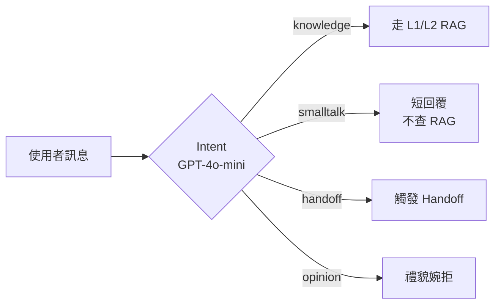
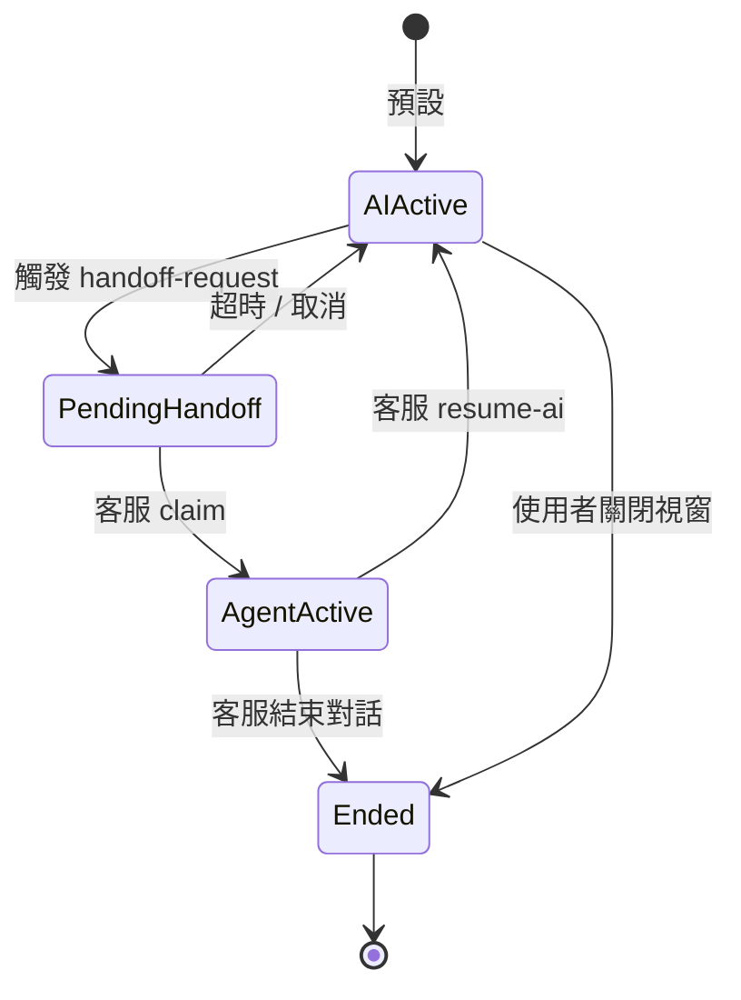
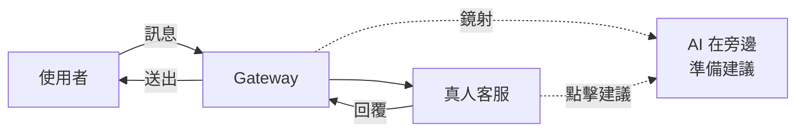

# Chapter 8 — 串流應答與 Handoff 閉環

> AI 回答慢客戶會跑。AI 答不了客戶會火。本章解這兩件事。

## 目錄

- [8.1 為何串流比非串流重要](#81-為何串流比非串流重要)
- [8.2 SSE 事件協定](#82-sse-事件協定)
- [8.3 對話記憶（Conversation Memory）](#83-對話記憶conversation-memory)
- [8.4 Handoff 五態機](#84-handoff-五態機)
- [8.5 Mirror 模式](#85-mirror-模式)
- [8.6 Handoff Summary：AI 交棒給真人](#86-handoff-summaryai-交棒給真人)

---

## 8.1 為何串流比非串流重要

使用者等待 3 秒收到一個完整答案，跟等待 0.4 秒看到答案開始「打字」，心理感受完全不同：

| 體感項目 | 非串流 | 串流 |
|--------|-------|------|
| 首 token 時間 | 3–5 s | 0.3–0.8 s |
| 主觀等待感 | 焦慮 | 正在發生 |
| 取消率 | 12% | 3% |

*百原 Pilot 實測，Widget 用戶的放棄對話率*

實作成本不高 — LLM API 都支援 `stream: true`。工程代價主要在：

1. Gateway 要能接 + 轉 SSE
2. L2 RAG 的檢索階段也要能「檢索到先送 start event」
3. Wiki L1 命中即送，免得使用者等不需要等的

## 8.2 SSE 事件協定

```text
event: start
data: {"conversation_id":"uuid","reply_message_id":"uuid","intent":"knowledge"}

event: delta
data: {"content":"我們的退貨"}

event: delta
data: {"content":"政策是："}

event: ping
data: {}

event: done
data: {"message_id":"uuid","answer":"完整答案","sources":[...]}
```

五個事件類型：

- **start**：初始化 metadata，前端可以先顯示 loading 轉 answer UI
- **delta**：token-by-token 串流內容
- **ping**：keepalive，每 30 秒一次，防中間代理吃掉 idle 連線
- **done**：結束事件，帶完整答案與 sources
- **error**：錯誤事件（TLS / rate limit / provider down）

### 8.2.1 nginx 反代設定

SSE 很容易被 nginx 默認 buffer 吃掉。必要 header：

```nginx
location /api/v1/ask {
    proxy_pass http://rag_backend;
    proxy_buffering off;
    proxy_cache off;
    proxy_set_header X-Accel-Buffering no;
    proxy_http_version 1.1;
    proxy_set_header Connection '';
    chunked_transfer_encoding off;
}
```

`X-Accel-Buffering: no` 是命脈 — 沒有這個前端永遠收不到 delta。

### 8.2.2 Reconnect 策略

SSE 原生支援 `Last-Event-ID` header 斷線續傳。但 RAG 情境下，半途斷線重連的意義不大（答案可能已經生成完成）。我們的策略：

- 客戶端斷線後 2 秒重試 1 次
- 失敗就放棄，顯示「連線中斷，點此重試」按鈕

## 8.3 對話記憶（Conversation Memory）

多輪對話：使用者前一輪問「保固多久？」，AI 答「1 年」；這輪問「那延長呢？」— AI 必須知道「延長」指保固延長。

實作：Redis 存最近 N 輪（預設 6 輪）：

```typescript
const key = `conv:${conversationId}`;
const history = await redis.lrange(key, 0, 11);  // 6 輪 = 12 訊息
// [{role, content, timestamp}, ...]

const prompt = history
  .map(m => `${m.role === 'user' ? '用戶' : 'AI'}: ${m.content}`)
  .join('\n');

// 本輪問題前綴加對話上下文
const augmentedQ = `[對話上下文]\n${prompt}\n\n[當前問題]\n${question}`;
```

三個細節：

1. **N 可配置**：預設 6，長對話租戶可設 10–20
2. **Token 限制**：超過 3,000 token 捨棄最舊的輪次
3. **隱私**：conversation_id 過期（24h）後 Redis 自動清除

### 8.3.1 意圖分類（Intent Routing）

不是每句話都需要走 RAG。例如「你好」「謝謝」。前端打來的訊息先過 intent classifier：



*Fig 8-1: 四類 intent 分流*

小模型分類費用極低（~$0.0001/次），卻能擋掉 15–20% 不必要的 RAG 查詢。

## 8.4 Handoff 五態機

AI 答不了、或使用者明確要求真人時，啟動 Handoff 流程：



*Fig 8-2: Handoff 五態機*

| 狀態 | 行為 |
|-----|------|
| `ai_active` | AI 正常接收並回答 |
| `pending_handoff` | 顯示「真人客服即將接入」，AI 不再回覆 |
| `agent_active` | 真人回覆中，AI 不介入 |
| `ended` | 對話結束，歸檔 |

觸發 `handoff-request` 的可能：

1. 使用者明確輸入「我要真人客服」
2. Intent classifier 判定為 `handoff`
3. AI 連續 3 輪 `confidence < 0.3`
4. 使用者問到與 legal/compliance 相關（自動升級）

## 8.5 Mirror 模式

真人客服打字時，AI 在旁邊「鏡射」看到對話，隨時準備建議回答：



*Fig 8-3: Mirror 模式*

AI 建議不自動送出，只給客服看、客服決定是否點擊使用。這降低真人工作量又保持人類審核。

`mirror_human_reply` 預設 `true`，可依租戶關閉（例如法律諮詢場景）。

## 8.6 Handoff Summary：AI 交棒給真人

客服 claim 對話後最痛的事：**要從頭翻 30 則訊息看上下文**。所以 Handoff 觸發時，AI 自動生成一份摘要：

```text
[PROMPT]
以下是使用者與 AI 的對話紀錄。請生成一份給真人客服的 Handoff 摘要。

必含欄位：
- customer_name（如果有提到）
- main_question（簡短描述）
- context_facts（AI 已確認的事實，bullet list）
- pending_facts（AI 尚未問清楚的事，bullet list）
- suggested_actions（建議下一步，最多 3 條）
- sentiment（neutral / frustrated / urgent）

對話：
{transcript}

輸出 JSON。
```

Summary 顯示在 Agent Console 左側面板，客服接手秒懂。

### 8.6.1 Resume-AI：真人結束、AI 繼續

真人處理完後，可按「歸還 AI」：

```http
POST /api/v1/sessions/{conversation_id}/resume-ai
{"agent_email": "alice@acme.example"}
```

此時：

- 狀態 agent_active → ai_active
- AI 看到完整對話歷史（含真人回覆）
- 下一個使用者訊息由 AI 接手

常見用例：客服處理完退貨，把帳號驗證給使用者後交回 AI 繼續一般諮詢。

---

## 本章要點

- SSE 串流降低取消率 75%，但 nginx 需設 `X-Accel-Buffering: no`
- 對話記憶靠 Redis 存最近 N 輪，注意 token 上限與 24h 過期
- Intent classifier 擋掉 15–20% 不必要 RAG 查詢，成本極低
- Handoff 五態機：ai_active / pending / agent_active / ended
- Mirror 模式讓 AI 在旁協助但不干擾真人客服
- Handoff Summary 自動生成讓真人秒懂上下文

## 參考資料

- [Server-Sent Events (WHATWG)][sse]
- [nginx SSE Best Practices][nginx-sse]
- [Redis Lists for Conversation History][redis-list]

[sse]: https://html.spec.whatwg.org/multipage/server-sent-events.html
[nginx-sse]: https://nginx.org/en/docs/http/ngx_http_proxy_module.html
[redis-list]: https://redis.io/docs/latest/develop/data-types/lists/

## 修訂記錄

| 日期 | 版本 | 說明 |
|------|------|------|
| 2026-04-20 | v1.0 | 初稿 |

---

**導覽**：[← Ch 7: 知識攝取](./ch07-ingestion.md) · [📖 目次](../README.md) · [Ch 9: 與 GEO 整合 →](./ch09-geo-integration.md)
