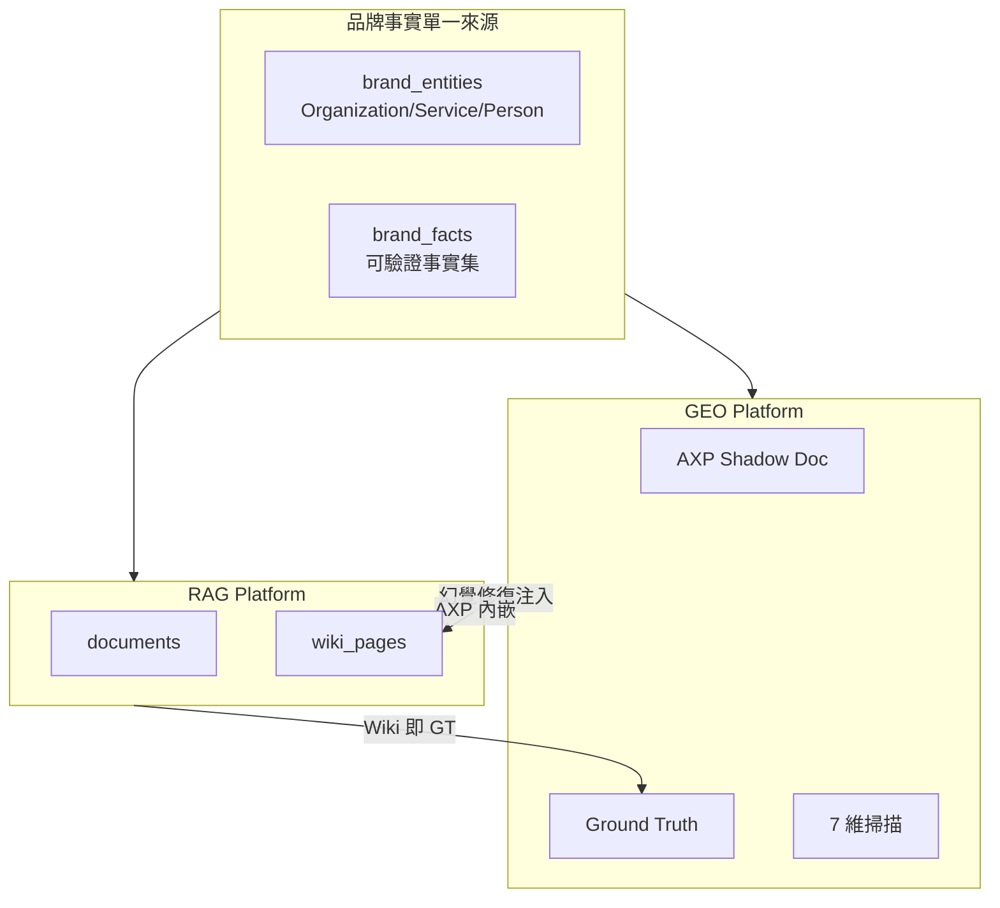
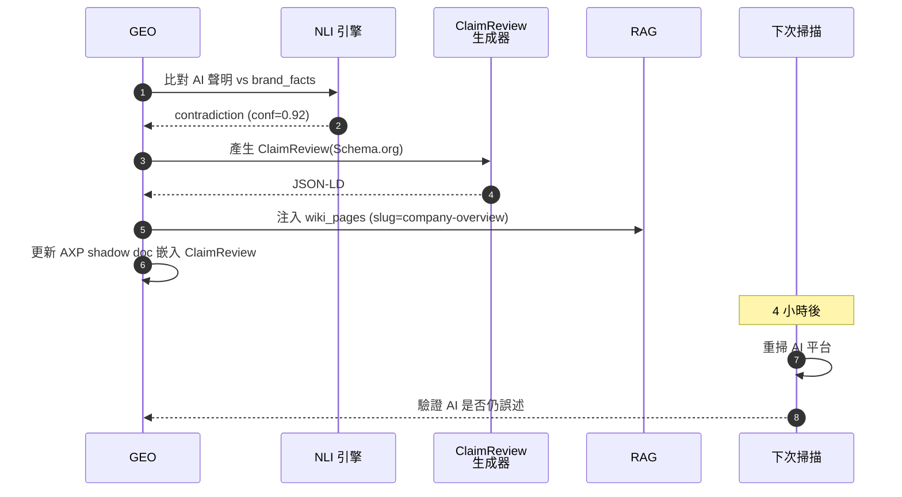

# Chapter 9 — 與 GEO Platform 的整合

> GEO 負責讓品牌在 AI 回答中被提及；RAG 負責確保 AI 看到正確的事實。兩者是一體兩面。

## 目錄

- [9.1 為何兩個產品要深度整合](#91-為何兩個產品要深度整合)
- [9.2 品牌實體共用資料模型](#92-品牌實體共用資料模型)
- [9.3 Ground Truth 閉環](#93-ground-truth-閉環)
- [9.4 Schema.org @id 三層互連](#94-schemaorg-id-三層互連)
- [9.5 幻覺偵測 → RAG 自動修復](#95-幻覺偵測--rag-自動修復)
- [9.6 共用指標與 Dashboard](#96-共用指標與-dashboard)

---

## 9.1 為何兩個產品要深度整合

百原 GEO Platform（見 [GEO 白皮書][geo-wp]）負責七維度 AI 引用率評分、AXP 影子文檔、閉環幻覺修復。RAG 負責 L1 Wiki + L2 混合檢索、多租戶知識庫。表面看是兩條產品線，但事實上**共用同一個「品牌事實」**。

具體共用的東西：



*Fig 9-1: RAG 與 GEO 的共用與雙向流*

三條重要的資料流：

1. **brand_entities → 兩系統**：品牌基本資料（成立年份、CEO、產品線）寫一次，GEO 和 RAG 各自讀
2. **RAG Wiki → GEO Ground Truth**：L1 Wiki 頁是結構化事實，直接作為 GEO 的 GT 比對源
3. **GEO 幻覺偵測 → RAG 寫入**：GEO 發現 AI 把品牌講錯時，自動把正確事實補進 RAG 的對應 Wiki

## 9.2 品牌實體共用資料模型

```sql
-- 共用表，位於 shared 資料庫
CREATE TABLE brand_entities (
    id               UUID PRIMARY KEY DEFAULT gen_random_uuid(),
    tenant_id        UUID NOT NULL,
    entity_type      TEXT NOT NULL,  -- Organization / Service / Person / LocalBusiness
    schema_id        TEXT NOT NULL,  -- "https://acme.example/#org"
    name             TEXT NOT NULL,
    description      TEXT,
    properties       JSONB NOT NULL, -- schema.org 擴充屬性
    sameAs           TEXT[],         -- [Wikipedia, Wikidata, LinkedIn]
    created_at       TIMESTAMPTZ,
    updated_at       TIMESTAMPTZ
);

CREATE TABLE brand_facts (
    id               UUID PRIMARY KEY DEFAULT gen_random_uuid(),
    tenant_id        UUID NOT NULL,
    entity_id        UUID REFERENCES brand_entities(id),
    claim            TEXT NOT NULL,   -- "成立於 2018 年"
    evidence         TEXT NOT NULL,   -- 出處原文
    evidence_url     TEXT,
    verified_by      TEXT,            -- "human" / "llm_nli" / "auto_scraped"
    verified_at      TIMESTAMPTZ,
    confidence       REAL             -- 0.0–1.0
);
```

GEO 與 RAG 各自有「自己的」資料表（documents、chunks、wiki_pages 在 RAG；axp_snapshots、scans 在 GEO），但**事實的權威源是 `brand_facts`**。

## 9.3 Ground Truth 閉環

GEO 系統每日掃 15 個 AI 平台，量測「AI 如何描述品牌」。如果掃到：

> ChatGPT：『ACME 公司成立於 2015 年，總部位於上海。』

而 brand_facts 記錄是：

> 成立於 2018 年，總部位於台北。

GEO 會產生一筆 **Hallucination Event**。系統分三階段處理：



*Fig 9-2: Ground Truth 閉環修復流程*

關鍵點：

- **NLI 三值分類**：entailment（支持）/ contradiction（矛盾）/ neutral（沒提到） — 只有 contradiction 才觸發修復
- **ClaimReview 是 Schema.org 型別**：搜尋引擎與 AI 都認這個結構化標記
- **RAG 是修復的注入點**：把正確事實寫進 RAG 的 Wiki，之後品牌自己的 AI 客服也會拿到一致事實

## 9.4 Schema.org @id 三層互連

`@id` 是 JSON-LD 給實體的唯一 URI。三層互連代表：

```json
{
  "@graph": [
    {
      "@type": "Organization",
      "@id": "https://acme.example/#org",
      "name": "ACME Corp",
      "hasOfferCatalog": {"@id": "https://acme.example/#catalog"},
      "employee": [
        {"@id": "https://acme.example/team/alice#person"}
      ]
    },
    {
      "@type": "Service",
      "@id": "https://acme.example/#service-consulting",
      "provider": {"@id": "https://acme.example/#org"}
    },
    {
      "@type": "Person",
      "@id": "https://acme.example/team/alice#person",
      "worksFor": {"@id": "https://acme.example/#org"}
    }
  ]
}
```

GEO Platform 的 AXP Shadow Doc 會把這段 JSON-LD 注入到 HTML 的 `<head>`；RAG Platform 的 Wiki 頁引用同一組 `@id`。AI 爬蟲（GPTBot、ClaudeBot、PerplexityBot）會把三層互連視為**強品牌知識圖訊號**。

### 9.4.1 為何 RAG 需要關心 Schema.org

RAG 本身不直接輸出 HTML，為何要管 Schema.org？兩個理由：

1. **Wiki body 內可嵌 `@id` 引用**：當 AI 生成答案並引用 `@id`，使用者點擊連結可跳到權威頁
2. **RAG 是 brand_entities 的消費者**：Wiki 編譯時 LLM 被要求「所有事實聲明要對齊 brand_entities 的 @id」

## 9.5 幻覺偵測 → RAG 自動修復

這是本章最重要的**雙向整合**。場景：

1. 客戶在 chat.baiyuan.io 客服 widget 問「你們的 CEO 是誰？」
2. RAG 的 Wiki 頁 `company-overview` 未涵蓋 CEO 資訊
3. L1 miss → L2 檢索 → chunks 剛好也沒 CEO 資訊 → LLM 亂講「Bob Smith」
4. 另一條路：GEO 掃 ChatGPT 發現 AI 也說「Bob Smith」
5. 但 brand_facts 說 CEO 是「Alice Wang」
6. GEO 觸發修復：把 `CEO: Alice Wang` 加進 RAG 的 `company-overview` Wiki slug
7. 下次有客戶問，Wiki hit 回「Alice Wang」✓

這個閉環的工程表示：

```typescript
// GEO 端：偵測到幻覺後
await rag.api.post('/api/v1/wiki/patch', {
  tenant_id,
  knowledge_base_id,
  slug: 'company-overview',
  patch: {
    section: 'leadership',
    content: 'CEO: Alice Wang（2020 年起）',
    source_claim_id: claim.id,
    confidence: 0.98,
  }
});

// RAG 端：
// 1. 把 patch 寫入 wiki_pages.body（merge 策略）
// 2. 重新 lint
// 3. 若通過則立即生效
// 4. 下次 compile 時會整合進正式版本
```

這個功能**從 2026 Q2 進入生產**，是 GEO ↔ RAG 最深的整合點。

## 9.6 共用指標與 Dashboard

百原 Dashboard 上，租戶可以看到兩個產品線合併的**品牌健康度指標**：

| 指標 | 來源 | 涵義 |
|-----|------|-----|
| AI 引用率（GEO） | GEO 七維掃描 | AI 平台提及品牌的比例 |
| 事實正確率（GEO） | GEO NLI 驗證 | 提及時描述正確的比例 |
| Wiki 覆蓋度（RAG） | RAG Wiki 編譯統計 | brand_facts 有多少被寫成 Wiki |
| 客服命中率（RAG） | RAG Query 日誌 | 客服問題有多少能回答 |
| 幻覺修復延遲 | GEO 注入 → 下次掃驗證 | 修復後 AI 多久改口 |

這五個指標從不同角度量化「品牌被 AI 正確認知的程度」。Ch 11 有實例展示。

---

## 本章要點

- GEO 與 RAG 共用 brand_entities / brand_facts 兩張表，是事實權威源
- RAG 的 L1 Wiki 同時作為 GEO 的 Ground Truth
- Schema.org `@id` 三層互連是 AXP + Wiki 共用的品牌知識圖訊號
- GEO 偵測幻覺後自動 patch RAG Wiki，形成雙向閉環
- Dashboard 上 5 個跨產品指標量化品牌 AI 健康度

## 參考資料

- [百原 GEO 技術白皮書][geo-wp]
- [Schema.org ClaimReview][claimreview]
- [NLI Models for Fact Verification][nli]

[geo-wp]: https://github.com/baiyuan-tech/geo-whitepaper
[claimreview]: https://schema.org/ClaimReview
[nli]: https://huggingface.co/tasks/natural-language-inference

## 修訂記錄

| 日期 | 版本 | 說明 |
|------|------|------|
| 2026-04-20 | v1.0 | 初稿 |

---

**導覽**：[← Ch 8: 串流 + Handoff](./ch08-stream-handoff.md) · [📖 目次](../README.md) · [Ch 10: 與 PIF 整合 →](./ch10-pif-integration.md)
