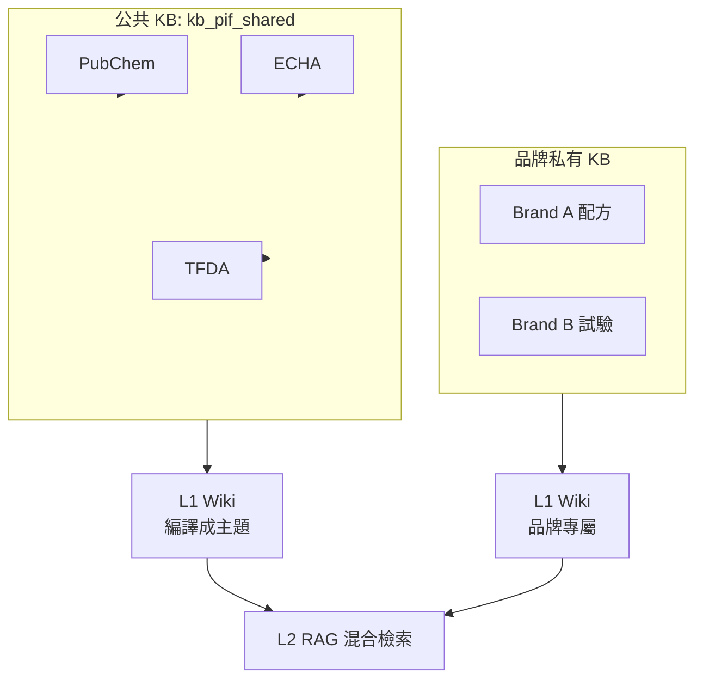
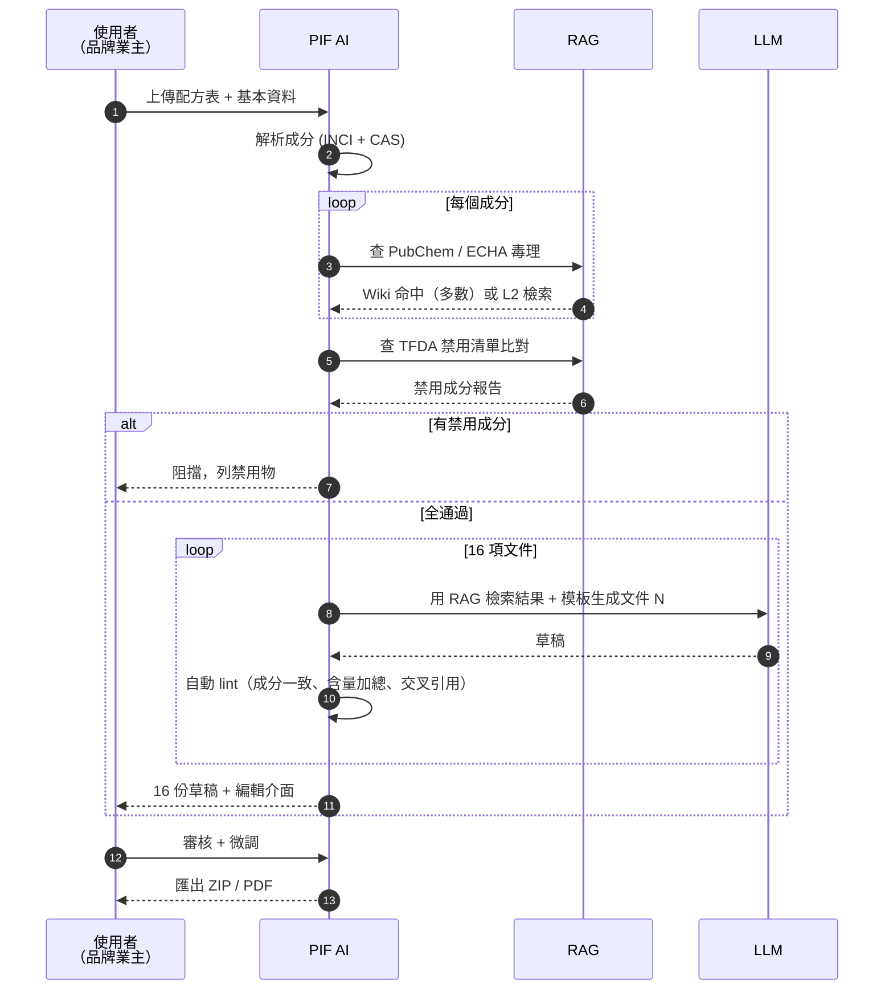

# Chapter 10 — 與 PIF AI 的整合

> 台灣化粧品業者 2026 年 7 月起必備 Product Information File。傳統人工建檔 4–8 週，PIF AI 用 RAG 做到 3–5 天。本章講為什麼做得到。

## 目錄

- [10.1 化粧品 PIF 法規背景](#101-化粧品-pif-法規背景)
- [10.2 RAG 為何是合規 SaaS 的關鍵](#102-rag-為何是合規-saas-的關鍵)
- [10.3 三大外部知識源](#103-三大外部知識源)
- [10.4 16 項 PIF 文件的生成流水線](#104-16-項-pif-文件的生成流水線)
- [10.5 可追溯引用：法規級需求](#105-可追溯引用法規級需求)
- [10.6 版本鎖定與稽核](#106-版本鎖定與稽核)

---

## 10.1 化粧品 PIF 法規背景

台灣食藥署（TFDA）依《化粧品衛生安全管理法》要求，每個化粧品產品上市前須建立 **Product Information File（PIF，產品資訊檔案）**，包含以下 16 項文件：

| # | 文件 | 重點 |
|---|------|------|
| 1 | 產品資訊摘要 | 名稱、類別、規格 |
| 2 | 成分列表 | INCI 名稱 + CAS 號 + 含量 |
| 3 | 物理化學特性 | pH、黏度、密度 |
| 4 | 微生物品質 | 測試報告 |
| 5 | 包裝材料規格 | 材質、無毒證明 |
| 6 | 品質正常控制 | 批次穩定性 |
| 7 | 安全性評估報告 | 毒理學評估 |
| 8 | 不良反應資料 | 歷史通報 |
| 9 | 證明文件（GMP） | 製造設施 |
| 10 | 外觀 / 標示審查 | 標籤合規 |
| 11 | 使用方法 | 用法、用量、對象 |
| 12 | 研發與製造資訊 | Batch size |
| 13 | 風險評估 | 敏感性、致敏原 |
| 14 | 防腐效能測試 | Challenge test |
| 15 | 重金屬/禁用物 | TFDA 禁用成分核對 |
| 16 | 動物試驗替代 | 不動物試驗聲明 |

**deadline**：2026 年 7 月 1 日後無 PIF 的產品禁止上市。市場估計受影響品牌 > 5,000 個，多數中小品牌無法負擔傳統顧問 4–8 週、USD 3,000+ 的建檔成本。

PIF AI（<https://pif.baiyuan.io>）是百原針對此市場的 SaaS：**AI 輔助 3–5 天建檔、收費 < 20% 顧問費**。

## 10.2 RAG 為何是合規 SaaS 的關鍵

法規建檔與一般 RAG 情境的差異：

| 面向 | 一般客服 RAG | 法規合規 RAG |
|-----|------------|------------|
| 幻覺容忍度 | 中（事後修正） | 零容忍（法律風險） |
| 答案長度 | 短（100–500 字） | 長（單份文件 1,000–5,000 字） |
| 引用嚴謹度 | 一般 | 必須引到段落 / 法條 / 公告號 |
| 資料更新頻率 | 月 | 每週（法規快速變動） |
| 審計需求 | 可選 | 必要，TFDA 檢查時要 show |

百原 RAG 平台本就設計為**可審計、可追溯、多版本**，天然適合法規場景。

## 10.3 三大外部知識源

PIF AI 需要把以下資料全部餵進 RAG：

### 10.3.1 PubChem（美國 NIH 化學物質資料庫）

- **內容**：1 億 5 千萬個化合物的物化性質、毒理、安全數據
- **抓取方式**：PubChem API（REST / JSON）+ 爬蟲 fallback
- **攝取頻率**：月次全量 sync、每日增量
- **Chunks 策略**：每個化合物一個 chunk + property-level 子 chunks

```python
# 週期性 sync
for cid in new_or_updated_cids:
    compound = pubchem.get_compound(cid)
    chunks = [
        {'type': 'summary', 'content': compound.summary},
        {'type': 'physical', 'content': compound.properties.physical},
        {'type': 'toxicity', 'content': compound.toxicity},
        {'type': 'safety', 'content': compound.safety_hazards},
    ]
    upsert_document(tenant='pif-shared', chunks=chunks, source_id=f'pubchem:{cid}')
```

### 10.3.2 ECHA（歐洲化學總署）

- **內容**：REACH 註冊物質、CLP 分類、SVHC 高關切物質清單
- **攝取**：每週 sync，ECHA 開放 XML dump

### 10.3.3 TFDA 公告

- **內容**：化粧品禁用／限用成分、不良反應通報、法規變動
- **攝取**：TFDA 網站爬蟲 + 人工審核新公告

三者合計約 200 萬 chunks，是 PIF AI 租戶共用的**公共知識庫**（`kb_pif_shared`）。除此之外，每個品牌仍有自己的私有 KB（配方、試驗報告），三層租戶隔離照樣適用。



*Fig 10-1: PIF AI 的公 + 私雙 KB 架構*

## 10.4 16 項 PIF 文件的生成流水線

PIF AI 生成一份完整 PIF 的流水線：



*Fig 10-2: 16 項文件生成流水線*

核心洞察：**大部分內容不需要 LLM 自己生成，只需 RAG 把已經存在的事實找出來重新排版**。

具體拆解各項文件的 RAG 依賴程度：

| 文件 | 主要依賴 | 客戶提供 | RAG 佔比 |
|-----|---------|---------|---------|
| 成分列表（#2） | 配方表 | ✅ 全部 | 0% |
| 毒理評估（#7） | PubChem + ECHA | 配方 | 80% |
| 禁用比對（#15） | TFDA 公告 | 配方 | 90% |
| 微生物品質（#4） | 實驗室報告 | ✅ 全部 | 0% |
| 防腐效能（#14） | 文獻 + 配方 | 實驗結果 | 60% |
| ... | ... | ... | ... |

平均 **50% 的 PIF 內容可以由 RAG 直接產出**。這就是把工時從 4 週壓到 3 天的關鍵。

## 10.5 可追溯引用：法規級需求

TFDA 檢查時會要求「這段聲明的出處」。RAG 答案必須帶**到段落級的引用**：

```json
{
  "answer": "苯甲醇在 pH 5.5 條件下對皮膚無刺激性。",
  "citations": [
    {
      "source": "pubchem:8773",
      "chunk_id": "c_abc123",
      "paragraph_hash": "sha256:...",
      "quote": "Benzyl alcohol shows no skin irritation at pH < 6.5...",
      "url": "https://pubchem.ncbi.nlm.nih.gov/compound/8773#section=Non-Human-Toxicity-Values",
      "accessed_at": "2026-04-18T03:22:11Z"
    }
  ]
}
```

`paragraph_hash` 是關鍵 — 即使原站段落變動，系統仍可驗證「我們引用時是這個內容」。

### 10.5.1 嚴格引用的 Prompt 設計

Wiki 編譯和 L2 答題時，PIF 租戶的 prompt 明顯比一般租戶嚴格：

```text
[PROMPT — PIF 嚴格模式]
你正在協助建立化粧品 PIF 法規文件。

規則：
1. 每個事實聲明必須以 [cite:chunk_id] 格式標註出處
2. 沒有出處的聲明不可輸出
3. 多個 chunk 支持同一聲明時，全部標註
4. 出處 chunk 未涵蓋的推論要明示「依據現有資料無法確認」
5. 用詞保守：使用「研究顯示」「依 ECHA 分類」而非「一定是」

輸入：
chunks: {chunks}
問題: {question}
```

## 10.6 版本鎖定與稽核

法規 RAG 的特殊挑戰：**答案會因為法規變動而過期**。比如 TFDA 2025/11 新增某成分為禁用，之前生成的 PIF 要追蹤能否繼續用。

百原 RAG 支援**答案版本鎖定**：

```sql
CREATE TABLE locked_answers (
    id               UUID PRIMARY KEY,
    tenant_id        UUID,
    question         TEXT,
    answer           TEXT,
    cited_chunks     UUID[],
    cited_snapshot   JSONB,    -- 引用當下的 chunk 內容快照
    locked_at        TIMESTAMPTZ,
    locked_by        TEXT,     -- user / system
    expiry_check_at  TIMESTAMPTZ
);
```

每月一次 cron 自動檢查：

```typescript
for (const la of locked_answers_due_for_check) {
  for (const chunk_id of la.cited_chunks) {
    const current = await getChunk(chunk_id);
    const snapshot = la.cited_snapshot[chunk_id];
    if (current.hash !== snapshot.hash) {
      await flagForReview(la, 'source_changed', chunk_id);
    }
  }
}
```

租戶會在 Dashboard 看到「5 份 PIF 引用的資料已更新，建議審核」。

### 10.6.1 稽核軌跡（Audit Trail）

每次 PIF 文件的每段輸出都記 log：

- 哪位使用者操作
- 輸入的配方
- RAG 檢索到哪些 chunks
- LLM 生成時的 prompt + model + temperature
- 最後輸出全文

TFDA 真來稽核時，可重現整個生成過程。這是**可審計 RAG** 的實例，非法規產品做不到。

---

## 本章要點

- PIF AI 目標：台灣化粧品業 2026/7 法規強制前，用 RAG 輔助 3–5 天建檔
- 三大公共知識源（PubChem / ECHA / TFDA）+ 品牌私有 KB 雙層
- 16 項 PIF 文件平均 50% 可由 RAG 直接產出
- 法規情境要求「段落級引用 + paragraph_hash」以供 TFDA 稽核
- 答案版本鎖定 + 來源變動自動預警
- 稽核軌跡可重現每次生成過程，是合規 RAG 的核心差異

## 參考資料

- [TFDA 化粧品衛生安全管理法][tfda-law]
- [PubChem REST API][pubchem-api]
- [ECHA REACH 資料][echa]
- [PIF AI 產品介紹][pif-ai]

[tfda-law]: https://law.moj.gov.tw/LawClass/LawAll.aspx?pcode=L0030013
[pubchem-api]: https://pubchem.ncbi.nlm.nih.gov/docs/pug-rest
[echa]: https://echa.europa.eu/information-on-chemicals
[pif-ai]: https://pif.baiyuan.io

## 修訂記錄

| 日期 | 版本 | 說明 |
|------|------|------|
| 2026-04-20 | v1.0 | 初稿 |

---

**導覽**：[← Ch 9: 與 GEO 整合](./ch09-geo-integration.md) · [📖 目次](../README.md) · [Ch 11: 真實觀察 →](./ch11-case-studies.md)
